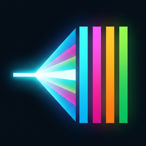
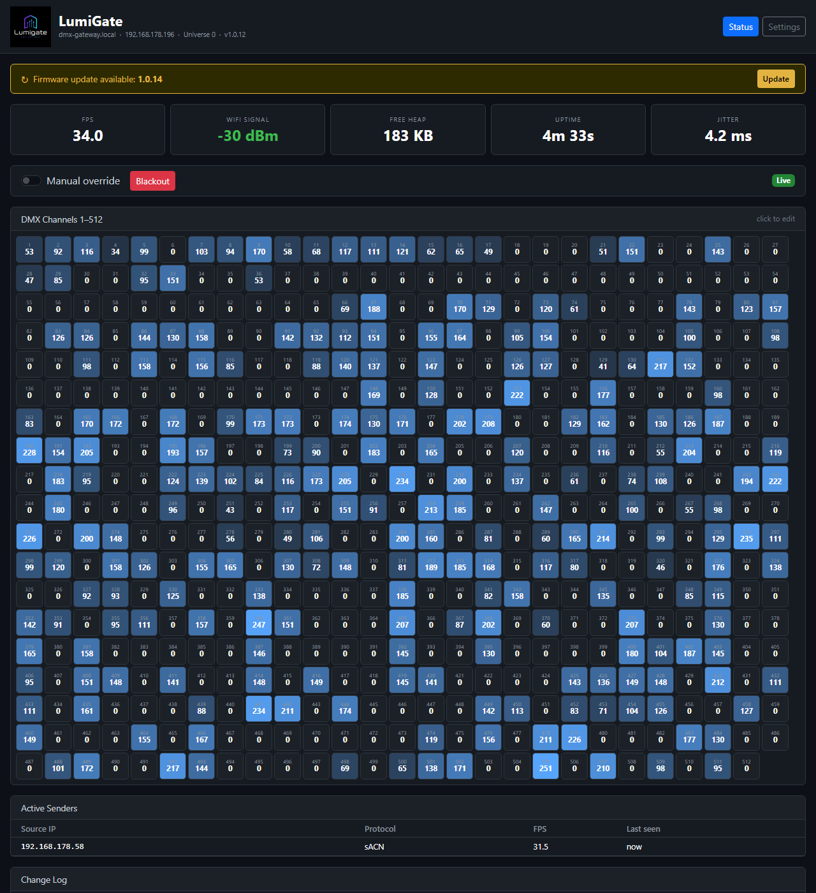
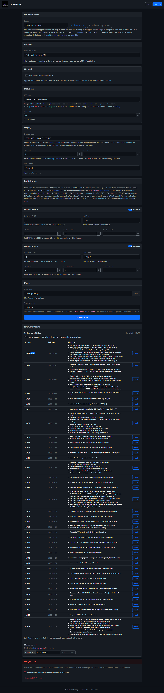
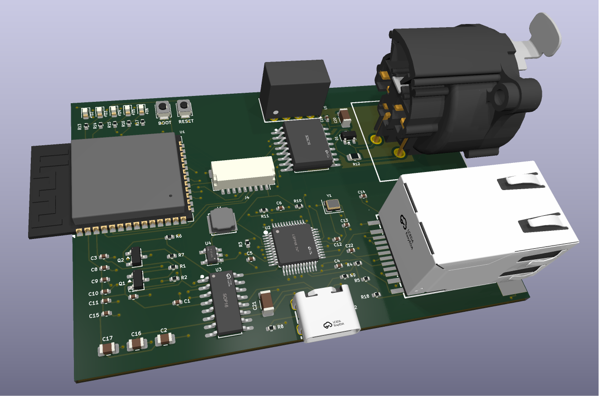
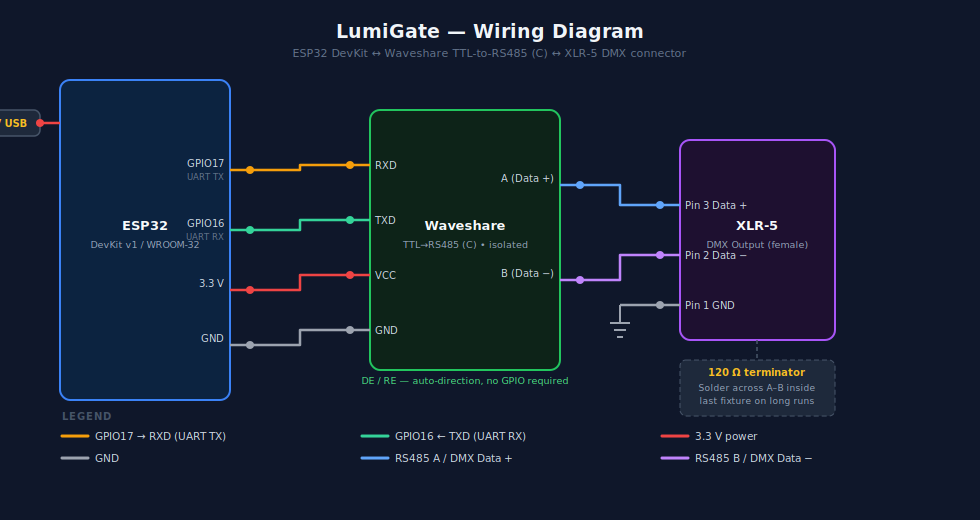
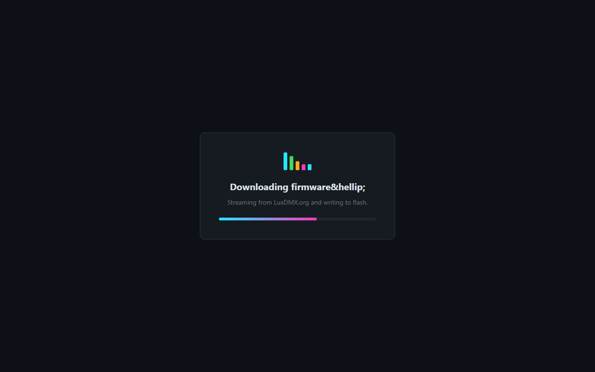
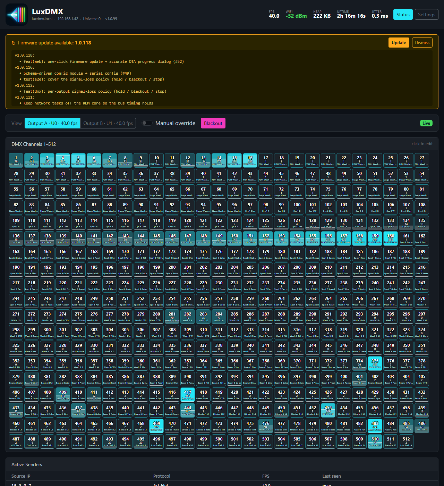
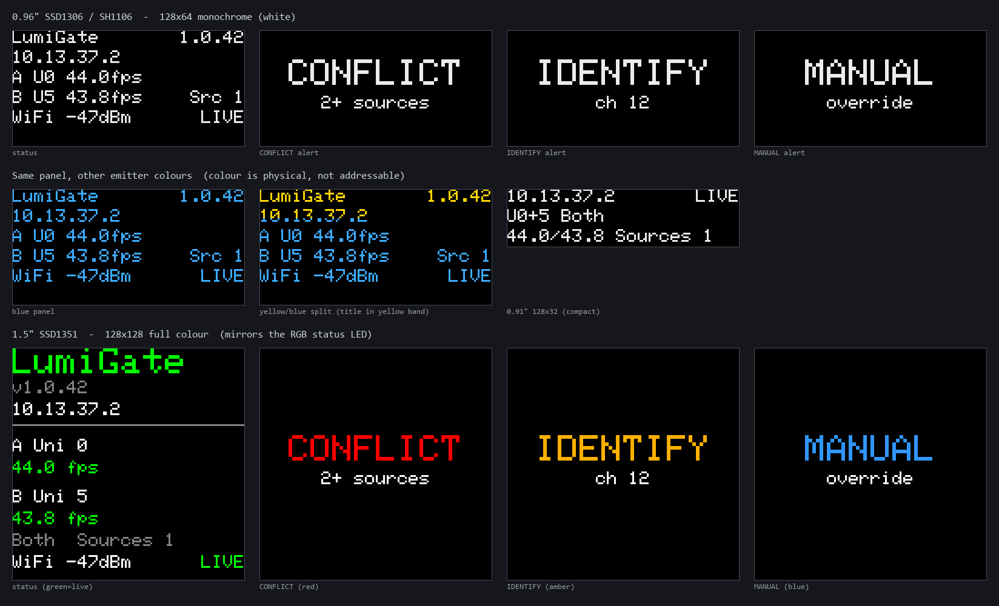

# LumiGate

**Art-Net / sACN (E1.31) → DMX512 Gateway** based on ESP32 / ESP32-S3 / WT32-ETH01 with a live web UI, WebSocket push, and manual DMX control via browser.

| Status page | Settings page |
|---|---|
|  |  |

### Web UI walkthrough

A guided tour of every control — manual channel control, labels, sparkline history, identify, blackout, and all settings:

[](https://youtu.be/up8lIbRqosQ)

▶ **[Watch the full walkthrough on YouTube](https://youtu.be/up8lIbRqosQ)** &nbsp;·&nbsp; regenerate with [`docs/screenshot.mjs`](docs/screenshot.mjs)

---

## Features

| Feature | Details |
|---|---|
| **Art-Net → DMX512** | Full 512-channel, unicast or broadcast, universe configurable (0–15) |
| **sACN / E1.31 → DMX512** | Multicast receive, universe configurable, runs alongside Art-Net |
| **Protocol selection** | Art-Net only / sACN only / Both — configurable in web UI |
| **Live Web UI** | Bootstrap 5 dark theme, WebSocket push (~10/s), all 512 channels visible |
| **Sender list** | Shows all active Art-Net / sACN senders with per-sender FPS |
| **Conflict detection** | Warning banner when multiple senders are active simultaneously |
| **Jitter stat** | Real-time inter-frame timing deviation (EMA) |
| **Change log** | Live log of DMX value changes with top-N changed channels per frame |
| **Sparkline** | Per-channel history sparkline in the channel detail modal |
| **Channel labels** | Name any channel (e.g. "Front Wash L") — shown in grid, modal, and change log |
| **Identify** | Flash a channel to full for ~1.5 s to physically locate the fixture |
| **Manual DMX control** | Click any channel in browser, set value via slider |
| **Blackout button** | Zero all channels instantly from browser |
| **Art-Net / Manual toggle** | Switch between protocol passthrough and manual override |
| **Failsafe output** | Continuous 40 Hz DMX refresh holds the last frame through brief input gaps |
| **Static IP or DHCP** | Configurable static IP/gateway/subnet/DNS, or automatic DHCP |
| **Mesh-aware WiFi** | Scans all channels and joins the **strongest** AP (multi-AP/mesh friendly) |
| **WiFi Config Portal** | First-boot AP + captive portal via WiFiManager |
| **Versioned OTA** | Pick & install any past release from a table, or auto-update to latest |
| **OTA Updates** | ArduinoOTA (IDE/CLI) + manual `.bin` upload + one-click GitHub update |
| **mDNS** | Reachable as `dmx-gateway.local` (hostname configurable) |
| **REST API** | `GET /dmx.json`, `/senders.json`, `/log.json`, `/version.json`, `/labels.json` |
| **Status LED** | Plain GPIO or WS2812 RGB NeoPixel — color codes WiFi/idle/DMX active state |
| **Status display** | Optional I²C OLED (SSD1306 / SH1106) or colour SPI OLED (SSD1351) — IP, universe, FPS, sources + auto-rotating conflict/identify/manual banners |
| **Configurable DMX pins** | TX / RX / RTS GPIO and UART port (0/1/2) set at runtime via web UI — no recompile |
| **NVS persistence** | Universe, protocol, IP config, labels, hostname, OTA password, LED/DMX pin config survive reboots |
| **Config reset** | Hold BOOT button 3 s on startup, or via `/reset` page |
| **Ethernet support** | WT32-ETH01: wired LAN via LAN8720, no WiFi required, DHCP |
| **Dual/triple target** | Builds for ESP32 (WROOM-32), ESP32-S3 (DevKitC-1), WT32-ETH01 |

---

## Hardware

> ### 🛠 Custom PCB — LumiGate v3
>
> Want the real thing instead of breadboard + modules? There's a complete **open-source 4-layer PCB**:
> ESP32-S3 with **both WiFi and wired Ethernet** (W5500), **galvanically-isolated DMX** output,
> USB-C power + flashing, status LEDs, BOOT/RST buttons, and an optional OLED/TFT display header —
> all palm-sized and fabricable at JLCPCB for a few dollars.
>
> [](hardware/README.md)
>
> **→ Full design, component rationale, BOM, gerbers & JLCPCB fab guide: [`hardware/`](hardware/README.md)**

The rest of this section covers the simpler **breadboard / module** build (an off-the-shelf ESP32 DevKit
+ an isolated RS485 module) — perfect for getting started without fabricating a board.

### Bill of Materials — WiFi build (ESP32 / ESP32-S3)

| # | Component | Description | Link |
|---|---|---|---|
| 1 | **ESP32 DevKit v1** | ESP32-WROOM-32, 30-pin, any CH340/CP2102 variant | [Amazon.de search](https://www.amazon.de/s?k=ESP32+DevKit+WROOM-32) |
| 2 | **Waveshare TTL to RS485 (C)** | Galvanically isolated RS485 transceiver, auto-direction | [Amazon.de – B0D4TZQYVG](https://www.amazon.de/dp/B0D4TZQYVG) |
| 3 | **XLR-5 female panel socket** | Standard DMX output connector (XLR-3 also works) | [Amazon.de search](https://www.amazon.de/s?k=XLR+5+Pin+Buchse+Panel) |
| 4 | **Jumper wires / dupont cables** | Male–male for breadboard, or direct solder | any |
| 5 | **USB-A to Micro-USB cable** | Power + serial flash | any |

### Bill of Materials — Ethernet build (WT32-ETH01)

| # | Component | Description | Link |
|---|---|---|---|
| 1 | **WT32-ETH01** | ESP32 + LAN8720 Ethernet PHY, built-in RJ45 | [Amazon.de search](https://www.amazon.de/s?k=WT32-ETH01) |
| 2 | **Waveshare TTL to RS485 (C)** | Same as WiFi build | [Amazon.de – B0D4TZQYVG](https://www.amazon.de/dp/B0D4TZQYVG) |
| 3 | **XLR-5 female panel socket** | Same as WiFi build | any |
| 4 | **Ethernet cable** | Cat5e or better | any |
| 5 | **5V power supply** (500 mA+) | WT32-ETH01 has no USB port — use a 5V supply on the VIN pin | any |

> The WT32-ETH01 has a built-in RJ45 jack and LAN8720 PHY soldered on-board. No additional Ethernet module needed.

**Optional for enclosure:**
- Project box / DIN-rail enclosure
- 120 Ω termination resistor across DMX A/B at the cable end (required for long runs)

---

### The RS485 Module: Waveshare TTL to RS485 (C)

This module is the key interface between the ESP32's UART and the DMX RS485 bus.

| Property | Value |
|---|---|
| Product name | Waveshare TTL to RS485 (C) |
| Isolation | Galvanic, 2500 V RMS (SP3485 + isolation transformer) |
| Direction control | Automatic — no DE/RE pin needed |
| TTL voltage | 3.3 V or 5 V (VCC selects level) |
| Max baudrate | ≥ 250 kbps (verified working at DMX rate) |
| Connector (TTL side) | 6-pin 2.54 mm header: VCC / GND / RXD / TXD / (unused) / (unused) |
| Connector (RS485 side) | Screw terminal: A / B / GND |
| Dimensions | ~38 × 14 mm |

> **Why galvanic isolation?**  
> DMX fixtures are often powered from separate circuits or have ground loops. The isolated module prevents ground noise from corrupting the signal and protects the ESP32 from voltage spikes.

> **Why auto-direction?**  
> Standard RS485 requires toggling a DE/RE pin to switch between transmit and receive. The Waveshare (C) variant handles this internally based on line activity — no GPIO needed, firmware is simpler. Trade-off: RDM (which requires half-duplex arbitration) is not supported by this module.

---

### Pinout Reference

**Waveshare TTL to RS485 (C) — TTL header (left side):**

```
Pin 1  VCC   → ESP32 3.3V
Pin 2  GND   → ESP32 GND
Pin 3  RXD   → ESP32 GPIO17  (default TX pin — configurable in web /config)
Pin 4  TXD   → ESP32 GPIO16  (default RX pin — configurable in web /config)
Pin 5  —     (not connected)
Pin 6  —     (not connected)
```

> **Different hardware?** If your RS485 module or ESP32 board uses different GPIO pins, change TX/RX under **Settings → DMX Output Pins** in the web UI. No recompile needed.

**Waveshare TTL to RS485 (C) — RS485 screw terminal (right side):**

```
A  →  DMX XLR pin 3  (Data+)
B  →  DMX XLR pin 2  (Data–)
GND→  DMX XLR pin 1  (Shield/Ground)  [optional but recommended]
```

---

### Wiring Diagram



**Connection table:**

| ESP32 pin | → | Module pin | → | XLR pin |
|---|---|---|---|---|
| GPIO17 (TX) | → | RXD | — | — |
| GPIO16 (RX) | ← | TXD | — | — |
| 3.3V | → | VCC | — | — |
| GND | → | GND | — | — |
| — | — | A (RS485+) | → | Pin 3 |
| — | — | B (RS485–) | → | Pin 2 |
| GND | — | GND | → | Pin 1 (optional) |

#### WT32-ETH01 wiring (different pins — GPIO16 used by LAN8720)

| WT32-ETH01 pin | → | Module pin | → | XLR pin |
|---|---|---|---|---|
| GPIO4 (TX) | → | RXD | — | — |
| GPIO5 (RX) | ← | TXD | — | — |
| 3.3V | → | VCC | — | — |
| GND | → | GND | — | — |
| — | — | A (RS485+) | → | Pin 3 |
| — | — | B (RS485–) | → | Pin 2 |

> **Do not use GPIO16 or GPIO17 on the WT32-ETH01** — they are connected to the LAN8720 Ethernet PHY (power and RMII).

---

### Assembly Guide

#### Step 1 — Prepare the ESP32

No soldering required if using a DevKit with pre-soldered headers. Place it on a breadboard or in your enclosure.

#### Step 2 — Connect ESP32 ↔ RS485 module

Using dupont jumper wires:

| Color convention | From | To |
|---|---|---|
| Red | ESP32 **3.3V** | Module **VCC** |
| Black | ESP32 **GND** | Module **GND** |
| Yellow | ESP32 **GPIO17** (TX) | Module **RXD** |
| Green | ESP32 **GPIO16** (RX) | Module **TXD** |

> Use **3.3V**, not 5V — the ESP32's GPIOs are not 5V tolerant.

#### Step 3 — Wire the XLR connector

The DMX standard uses XLR-5 (5-pin), but most DMX fixtures also accept XLR-3. Pin numbering is the same:

| XLR Pin | Signal | RS485 module |
|---|---|---|
| 1 | Shield / GND | Module GND (optional) |
| 2 | DMX Data– | Module **B** |
| 3 | DMX Data+ | Module **A** |
| 4 | (unused in DMX) | — |
| 5 | (unused in DMX) | — |

Screw the wires into the RS485 module's terminal block firmly.

#### Step 4 — Termination resistor (for longer cable runs)

For DMX cable runs over ~10 m, solder a **120 Ω resistor** between pins 2 and 3 (A and B) at the **far end** of the DMX chain (i.e., inside the last fixture's XLR input). Most professional fixtures include this internally.

#### Step 5 — Power

The ESP32 DevKit is powered via its **Micro-USB port**. Any 5V USB power supply works (500 mA is sufficient). The RS485 module draws its power from the ESP32's 3.3V rail.

---

### Notes

- **Do not connect DE/RE** — the Waveshare (C) handles direction automatically. Connecting them will break transmission.
- **Keep TTL wires short** (< 20 cm). Long unshielded wires on the TTL side pick up noise; the RS485 side handles long distances natively.
- **XLR gender:** Use a **female** XLR panel socket for the DMX output. DMX sources (transmitters) use female XLR; receivers use male XLR. LumiGate is a source.

---

## Software Stack

| Library | Purpose |
|---|---|
| `someweisguy/esp_dmx ^4.1` | DMX512 transmit via UART |
| `rstephan/ArtnetWifi ^1.5` | Art-Net UDP receiver (port 6454) |
| `tzapu/WiFiManager ^2.0` | WiFi config portal |
| `ESP32Async/ESPAsyncWebServer` | Non-blocking HTTP server + WebSocket (port 80) |
| `ESP32Async/AsyncTCP` | Async TCP backend (runs networking off the main loop) |
| `adafruit/Adafruit NeoPixel ^1.12` | WS2812 RGB status LED support |
| `ArduinoOTA` | OTA firmware updates |
| `ESPmDNS` | mDNS (`dmx-gateway.local`) |
| `Preferences` | NVS persistent config |
| *(built-in UDP)* | sACN / E1.31 multicast receive (port 5568) |

---

## Flashing Pre-built Firmware

No toolchain needed. GitHub CI builds the firmware on every push to master.

**[Download latest release](https://github.com/tombueng/LumiGate/releases/tag/latest)** — includes `firmware.bin`, `bootloader.bin`, `partitions.bin`, `boot_app0.bin`.

### Boot mode (required for all methods)

You must manually enter download mode before flashing:

1. Hold **BOOT** button
2. Press and release **EN** (or **RST**) while keeping BOOT held
3. Release BOOT — the chip is now in download mode
4. Run the flash command

> **ESP32-S3 DevKitC-1:** use the **USB-UART** port (labeled on the board), not the native USB port. The native USB port cannot be used with esptool.

### Windows — one-liner (PowerShell)

Downloads and runs [`flash.ps1`](flash.ps1), which installs Python + esptool automatically:

```powershell
Set-ExecutionPolicy -Scope Process Bypass; irm https://raw.githubusercontent.com/tombueng/LumiGate/master/flash.ps1 | iex
```

Or save and run it manually:

```powershell
# Download
Invoke-WebRequest https://raw.githubusercontent.com/tombueng/LumiGate/master/flash.ps1 -OutFile flash.ps1
# Run
Set-ExecutionPolicy -Scope Process Bypass
.\flash.ps1
```

The script: installs Python 3 via `winget` if missing → installs `esptool` via pip → downloads the four firmware blobs from the latest GitHub release → lets you pick a COM port → guides you through boot mode → flashes.

### macOS / Linux — ESP32 (WROOM-32)

```bash
pip install esptool

REPO=tombueng/LumiGate
for f in firmware.bin bootloader.bin partitions.bin boot_app0.bin; do
  curl -sL "$(curl -s https://api.github.com/repos/$REPO/releases/tags/latest \
    | python3 -c "import sys,json; assets=json.load(sys.stdin)['assets']; \
      print(next(a['browser_download_url'] for a in assets if a['name']=='$f'))")" -o $f
done

# Enter boot mode first (see above), then:
esptool.py --chip esp32 --port /dev/ttyUSB0 --baud 460800 \
  --before default_reset --after hard_reset \
  write_flash -z --flash_mode dio --flash_freq 80m \
  0x1000 bootloader.bin 0x8000 partitions.bin \
  0xe000 boot_app0.bin 0x10000 firmware.bin
```

### macOS / Linux — ESP32-S3 (DevKitC-1)

> **Important:** bootloader goes at `0x0000` on S3 (not `0x1000` like the original ESP32).

```bash
pip install esptool

REPO=tombueng/LumiGate
for f in firmware-esp32s3.bin bootloader-esp32s3.bin partitions-esp32s3.bin boot_app0.bin; do
  curl -sL "$(curl -s https://api.github.com/repos/$REPO/releases/tags/latest \
    | python3 -c "import sys,json; assets=json.load(sys.stdin)['assets']; \
      print(next(a['browser_download_url'] for a in assets if a['name']=='$f'))")" -o $f
done

# Enter boot mode first, use the USB-UART port, then:
esptool.py --chip esp32s3 --port /dev/ttyUSB0 --baud 921600 \
  --before default_reset --after hard_reset \
  write_flash -z --flash_mode dio --flash_freq 80m \
  0x0000 bootloader-esp32s3.bin 0x8000 partitions-esp32s3.bin \
  0xe000 boot_app0.bin 0x10000 firmware-esp32s3.bin
```

> Replace `/dev/ttyUSB0` with your port (`/dev/tty.usbserial-*` on macOS).

### macOS / Linux — WT32-ETH01

```bash
pip install esptool

REPO=tombueng/LumiGate
for f in firmware-wt32eth01.bin bootloader-wt32eth01.bin partitions-wt32eth01.bin boot_app0.bin; do
  curl -sL "$(curl -s https://api.github.com/repos/$REPO/releases/tags/latest \
    | python3 -c "import sys,json; assets=json.load(sys.stdin)['assets']; \
      print(next(a['browser_download_url'] for a in assets if a['name']=='$f'))")" -o $f
done

# Enter boot mode (hold BOOT + press RST), then:
esptool.py --chip esp32 --port /dev/ttyUSB0 --baud 460800 \
  --before default_reset --after hard_reset \
  write_flash -z --flash_mode dio --flash_freq 80m \
  0x1000 bootloader-wt32eth01.bin 0x8000 partitions-wt32eth01.bin \
  0xe000 boot_app0.bin 0x10000 firmware-wt32eth01.bin
```

---

## Build & Flash

### Requirements

- [PlatformIO](https://platformio.org/) with VS Code extension
- ESP32 connected via USB (CH340 or CP2102)

### Project Structure

```
LumiGate/
├── src/
│   ├── main.cpp          ← firmware logic
│   ├── pages/            ← edit web UI here (plain HTML)
│   │   ├── index.html
│   │   ├── config.html
│   │   ├── config_saved.html
│   │   ├── reset.html
│   │   └── reset_done.html
│   ├── assets/           ← images served by the ESP32
│   │   └── logo.png      ← 96×96 px, replaces itself on rebuild
│   └── generated/        ← auto-created at build time, gitignored
├── docs/                 ← documentation assets (README images)
├── extra_scripts.py      ← PlatformIO pre-build hook
└── platformio.ini
```

### How the build pipeline works

Before every `pio run`, PlatformIO executes `extra_scripts.py`, which:

1. Reads every `src/pages/*.html` file
2. Reads every `src/assets/*.png` file
3. Converts them to C `PROGMEM` arrays / string literals and writes them to `src/generated/*.h`
4. `main.cpp` `#include`s those headers — the HTML and images become part of the firmware binary

**To change the web UI**, edit the HTML files in `src/pages/` and rebuild — no C++ changes needed.  
**To replace the logo**, drop a new 96×96 PNG into `src/assets/logo.png` and rebuild.

Dynamic values (IP address, universe number, etc.) use `{{PLACEHOLDER}}` tokens in the HTML; `main.cpp` substitutes them at request time with `String::replace()`.

### First Flash (USB)

```bash
pio run --target upload
```

> **If upload fails** ("Wrong boot mode"): Hold **BOOT** button, tap **EN/RST**, release BOOT — chip enters download mode. Then retry upload.

### OTA Updates (after first flash)

- **From browser:** open `http://dmx-gateway.local/config` → Firmware Update section → upload a `.bin` file or click "Update from GitHub"

| Downloading update | Back online |
|---|---|
|  |  |

- **From IDE:** uncomment in `platformio.ini`:
```ini
upload_protocol = espota
upload_port     = dmx-gateway.local
upload_flags    = --auth=dmxota
```

---

## First Setup

### WT32-ETH01 (Ethernet)

No configuration needed. Connect an Ethernet cable, power on — DHCP assigns an IP automatically. Open `http://dmx-gateway.local` or check your router for the assigned IP. There is no WiFi portal.

### 1. Config Portal (WiFi builds only)

On first boot (or after WiFi reset), LumiGate opens a WiFi access point:

- **SSID:** `DMX-Gateway` (no password)
- Connect with phone or PC → browser auto-opens portal (or go to `192.168.4.1`)
- Select your network, enter password, set Art-Net Universe (default: `0`)
- Click **Save** → LumiGate connects and reboots

> **Mesh / multi-AP WiFi:** LumiGate scans all channels and joins the
> **strongest** AP for your SSID (and re-picks it on reconnect), so it won't
> latch onto a distant node. The ESP32 is **2.4 GHz only** — make sure the AP
> nearest the device broadcasts 2.4 GHz. Check `rssi` on the status page: a
> healthy link is roughly −40 to −65 dBm. If it sits near −80 dBm right next to
> a router, the nearby node likely isn't offering 2.4 GHz — use a dedicated
> 2.4 GHz IoT SSID, or the **WT32-ETH01 (Ethernet) build** for a wired,
> rock-solid connection.

### 2. Status Page

Open `http://dmx-gateway.local` (or the IP shown in serial monitor at 115200 baud):

- Live stats: framerate, RSSI, uptime, free heap, jitter
- Conflict warning if multiple senders are detected
- Active sender list with per-sender protocol and FPS
- All 512 DMX channels as a color-coded grid (cyan = active)
- Click any cell → slider + sparkline history appear → set value directly
- Change log with recent DMX activity

### 3. Changing WiFi / Config Reset

To move LumiGate to a different WiFi network, clear its stored credentials — it will reopen the setup portal on next boot.

| Method | Steps |
|---|---|
| **Web** (easiest) | Open `http://dmx-gateway.local/reset` → click **Reset WiFi** → device reboots into AP mode |
| **Hardware** | Power off → hold **BOOT** → power on → keep holding for 3 seconds → release → device reboots into AP mode |

After reset, connect to the `DMX-Gateway` access point (no password) and follow the [First Setup](#1-config-portal) steps to join the new network.

---

## Web UI

The HTTP server and WebSocket are served by ESPAsyncWebServer (non-blocking),
so the web UI never stalls DMX output. Pages are gzip-compressed and dynamic
values are fetched as JSON.

| URL | Method | Function |
|---|---|---|
| `/` | GET | Live status + 512-channel DMX grid (gzip) |
| `/config` | GET / POST | Change universe, protocol, static IP, hostname, OTA password, LED config, DMX pins (gzip) |
| `/reset` | GET / POST | Clear WiFi credentials, reboot to AP mode |
| `/info.json` | GET | Current settings + status (SSID, IP, universe, version, etc.) |
| `/dmx.json` | GET | All 512 values, fps, rssi, uptime, heap, manual mode flag |
| `/senders.json` | GET | Active Art-Net / sACN senders (also pushed over the WebSocket) |
| `/log.json` | GET | Recent DMX change log entries (also pushed over the WebSocket) |
| `/labels.json` | GET | Channel labels object |
| `/labels` | POST | Store the full labels object (JSON body) |
| `/version.json` | GET | Current firmware version + update-available flag |
| `/autoupdate` | POST | Toggle auto-update (`enabled=0/1`) |
| `/ota/upload` | POST | Upload and flash a local `firmware.bin` |
| `/ota/github` | POST | Install a release from GitHub (`version=latest` or `1.0.N`) |

### WebSocket (`ws://<device>/ws`, port 80)

Binary status/DMX frame pushed ~10×/s (528 bytes):

```
Bytes  0–1    fps × 10           uint16 big-endian
Bytes  2–3    RSSI (dBm)         int16  big-endian
Bytes  4–7    free heap          uint32 big-endian
Bytes  8–11   uptime (s)         uint32 big-endian
Byte   12     active sender count uint8
Byte   13     conflict flag       uint8 (1 = multiple senders)
Bytes  14–15  jitter × 10 (ms)   uint16 big-endian
Bytes  16–527 DMX ch 1–512       uint8[512]
```

A JSON **text** frame with the sender list + change log is pushed every 2 s
(`{"meta":1,"senders":[…],"log":[…]}`) so the browser never has to poll.

Browser → ESP32 (JSON text):
```json
{ "type": "set",      "ch": 1,  "val": 200 }
{ "type": "mode",     "manual": true       }
{ "type": "blackout"                       }
{ "type": "identify", "ch": 5              }
```

Channel labels are managed over REST (`GET /labels.json`, `POST /labels`).

---

## QLC+ Setup

1. Open **Eingänge/Ausgänge** tab
2. Click in the output area right of **Universe 1** → select **ArtNet** → interface = your PC's IP
3. Configure: Output IP = LumiGate's IP, Art-Net Universe = `0`
4. Set transmission mode to **Full** (sends all 512 channels continuously at ~40 fps)
5. Test with **Einfaches Mischpult** → move fader → grid lights up cyan

> **Universe mapping:** QLC+ "Universe 1" = Art-Net Universe `0`. LumiGate defaults to Universe `0`.  
> **Tip:** if "Standard" mode shows ~0.4 fps and values don't update, restart QLC+ or switch to "Full" mode.

### Ready-made demo shows

Two QLC+ workspaces are included to test fixtures and show off the gateway — open with **File → Open**, map Universe 1 → ArtNet (above), switch to **Operate** mode, and press the Virtual Console buttons:

| File | Description |
|---|---|
| [`docs/qlcplus-demo.qxw`](docs/qlcplus-demo.qxw) | Small 6-channel demo: fade, blink, running light |
| [`docs/qlcplus-show.qxw`](docs/qlcplus-show.qxw) | **30-minute, 20-channel show** — sine waves, comets, sparkle, VU bounce, crossfades, strobes, build-ups and more, sequenced into an intro→build→peak→groove→outro arc. Press **GREAT SHOW**. |

The big show is generated by [`docs/make_show.py`](docs/make_show.py) — edit the `arc` list and re-run to customize.

---

## Status LED

LumiGate supports two LED types, configurable in the web UI:

| State | WS2812 RGB | Plain GPIO |
|---|---|---|
| Booting | white | on |
| Connecting to WiFi | blue blink | blink |
| Config portal / AP active | purple | on |
| No WiFi (lost) | red blink (fast) | off |
| Idle (connected, no DMX) | amber heartbeat (½ s on/off) | pulse |
| DMX active | solid green | solid |

The "DMX active" green is held through brief input gaps (continuous 40 Hz
output), so momentary multicast loss doesn't flicker the LED. The LED runs on
its own task, so serving the web UI never freezes it.

Default GPIO: `2` (ESP32 DevKit on-board LED). ESP32-S3 DevKitC-1 uses GPIO `48` (built-in WS2812).

---

## Display (OLED / colour OLED)

LumiGate can drive an **optional status display** that shows the gateway's live state
without a browser — IP, universe, protocol, frame rate, source count and link / DMX
activity — and **auto-switches to a full-screen alert** when something needs attention
(two consoles fighting over the universe, identify, or manual override). It's **off by
default**; enable and pin it under **Settings → Display**.



*Rendered from the firmware's own layout code with the real display font. **Top:** 0.96″ /
1.3″ mono OLED (status, then the conflict / identify / manual banners). **Middle:** the same
panel in blue and yellow/blue-split, and the 0.91″ 128×32 compact layout. **Bottom:** the
1.5″ SSD1351 colour panel, which mirrors the RGB status-LED language (green = live,
amber = idle, red = conflict).*

### Supported panels

| Panel | Controller | Bus | Pins | Boards |
|---|---|---|---|---|
| 0.96″ / 1.3″ OLED 128×64 | SSD1306 / SH1106 | I²C | 2 | all |
| 0.91″ OLED 128×32 | SSD1306 | I²C | 2 | all |
| 1.5″ colour OLED 128×128 | SSD1351 | SPI | ~5 | ESP32 / ESP32-S3 (not the Ethernet boards) |

Mono panels are 1-bit — white, blue and yellow/blue-split versions all behave identically
(the colour is the physical emitter, not addressable). The I²C address is auto-detected
(`0x3C` / `0x3D`). SPI colour panels need ~5 pins, so they only fit the non-Ethernet boards.

### Settings (Settings → Display)

| Field | Notes |
|---|---|
| Display type | off / SSD1306 128×64 / SSD1306 128×32 / SH1106 128×64 / SSD1351 colour |
| SDA, SCL | I²C pins (mono panels). Avoid strapping pins like GPIO12; WT32-ETH01 → `14` / `15` |
| CS, DC, RST, SCK, MOSI | hardware-SPI pins (colour panel) |
| Orientation | normal / flipped 180° |

See [docs/display.md](docs/display.md) for the full design — per-board pin tables and layout details.

---

## DMX Output Pins

All DMX hardware settings are configurable at runtime under **Settings → DMX Output Pins** — no recompile needed.

| Setting | Default | Description |
|---|---|---|
| UART port | `1` | Which ESP32 UART peripheral to use (0 / 1 / 2). UART1 is recommended; UART0 conflicts with Serial. |
| TX pin | `17` (GPIO17) | ESP32 GPIO that drives the RS485 module's RXD input |
| RX pin | `16` (GPIO16) | ESP32 GPIO connected to the RS485 module's TXD output |
| RTS / DE pin | `−1` (disabled) | RS485 direction-control pin. Set to −1 for auto-direction modules (Waveshare C). Required for RDM. |

**Board defaults** (applied on first boot; overrideable in the web UI):

| Board | TX | RX | RTS |
|---|---|---|---|
| ESP32 DevKit / ESP32-S3 | GPIO17 | GPIO16 | −1 |
| WT32-ETH01 | GPIO4 | GPIO5 | −1 |

> GPIO16 is used by the LAN8720 Ethernet PHY on the WT32-ETH01, so the default pins are shifted.

**Using a different RS485 module?** Connect your module's RXD (data-in) pin to the TX GPIO and its TXD (data-out) pin to the RX GPIO, then update Settings → DMX Output Pins to match.

---

## Persistent Configuration (NVS)

| Key | Default | Change via |
|---|---|---|
| Art-Net Universe | `0` | Web `/config` or portal |
| Protocol | `Both (Art-Net + sACN)` | Web `/config` |
| Static IP / gateway / subnet / DNS | DHCP | Web `/config` (Network) |
| Auto-update | off | Web `/config` (Firmware) |
| Channel labels | — | Status page (channel modal) |
| Hostname | `dmx-gateway` | Web `/config` |
| OTA Password | `dmxota` | Web `/config` |
| LED type / GPIO pin | board default | Web `/config` (Status LED) |
| Display type / pins | off | Web `/config` (Display) |
| UART port | `1` | Web `/config` (DMX Output Pins) |
| DMX TX / RX / RTS pins | board default (TX=17, RX=16, RTS=−1) | Web `/config` (DMX Output Pins) |
| WiFi credentials | — | Config portal or `/reset` |

---

## Roadmap / Ideas

- [ ] Scenes / presets (save & recall DMX snapshots)
- [ ] Fade engine (smooth transitions between scenes)
- [ ] Failsafe scene (auto-load when Art-Net / sACN signal lost)
- [ ] MQTT integration (Home Assistant / Node-RED)
- [x] Channel labels / fixture naming
- [ ] RDM support (requires module with controllable DE/RE pin, e.g. SP3485)
- [ ] Multi-universe (multiple RS485 ports)

---

## License

MIT — do whatever you want, attribution appreciated.
