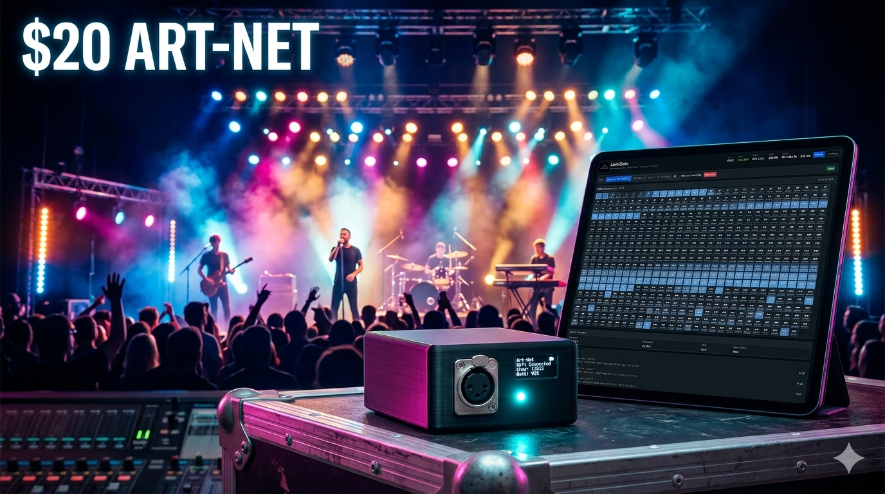
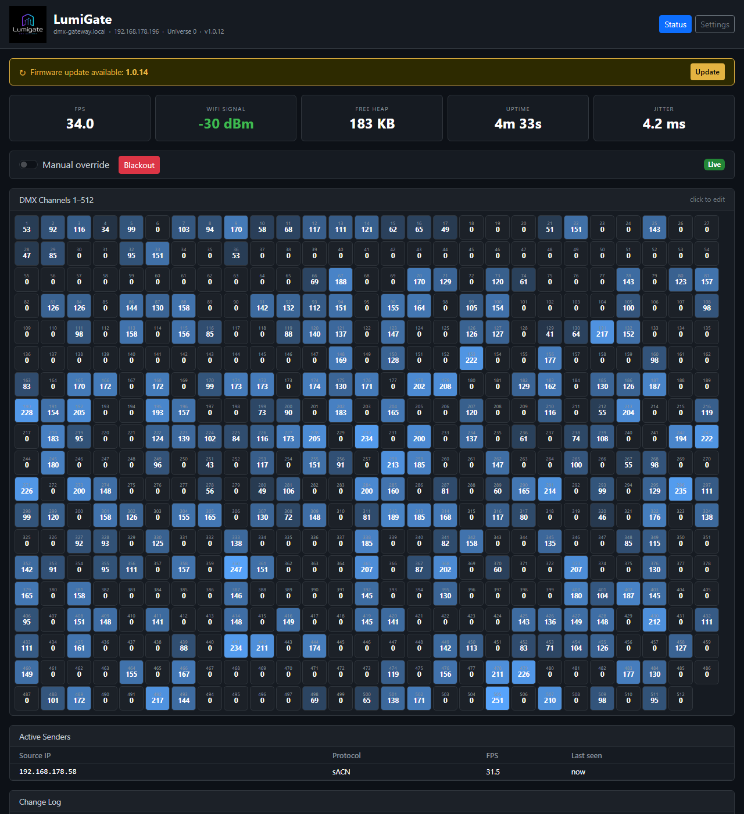
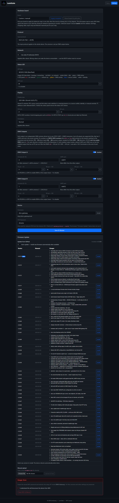
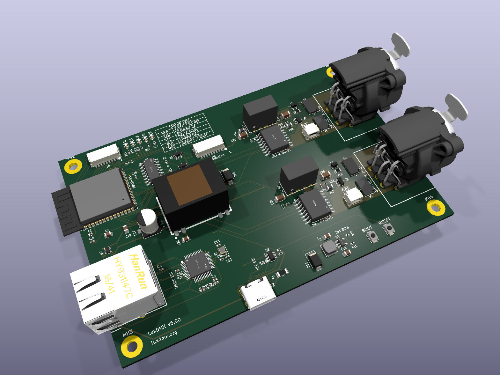
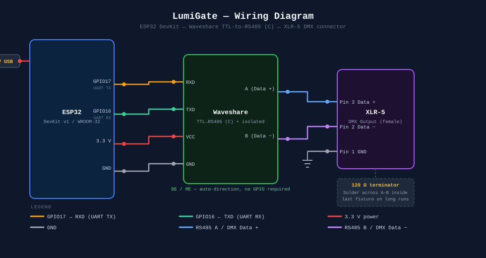
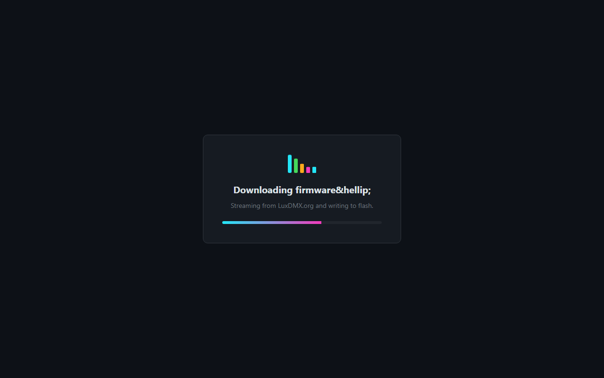
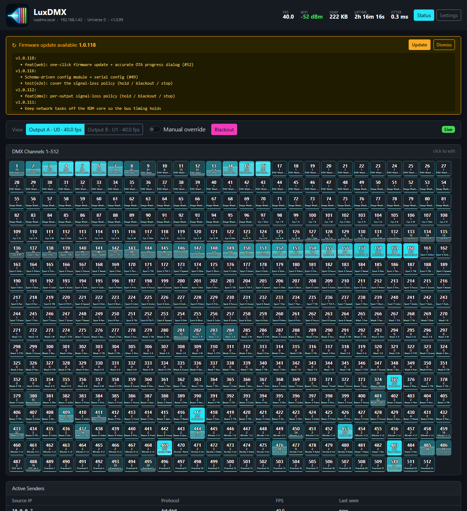
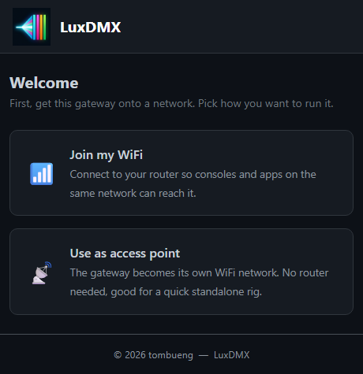
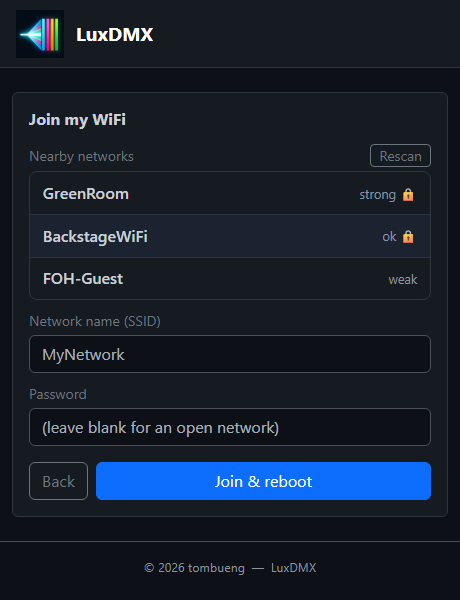
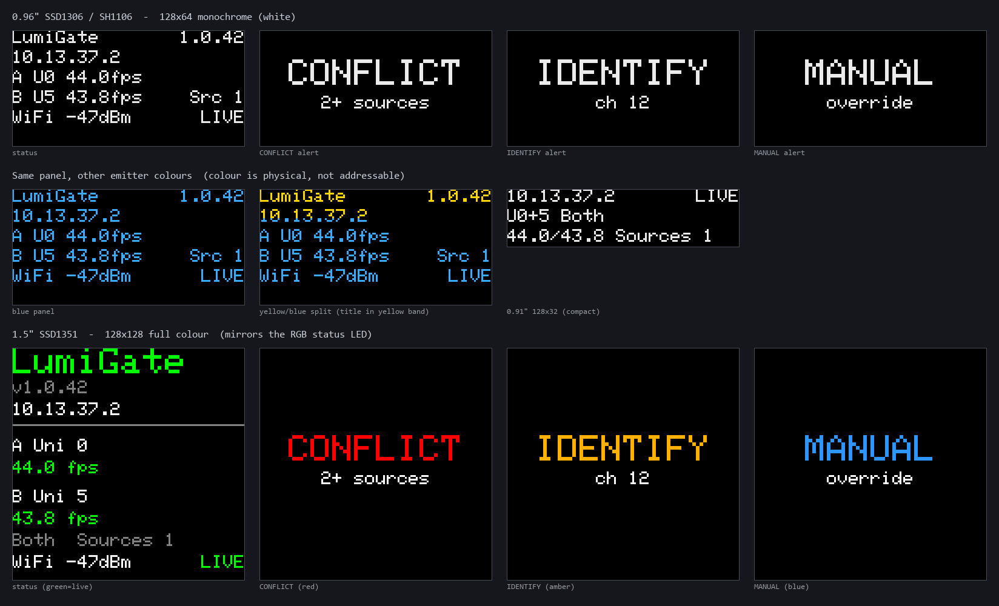

<p align="center">
  <a href="https://luxdmx.org/video"></a>
</p>

<p align="center">
  
</p>

<h1 align="center">LuxDMX</h1>

<p align="center">
  <b>Open-source Art-Net / sACN (E1.31) &rarr; DMX512 gateway for ESP32 / ESP32-S3 / Ethernet.</b>
</p>

<p align="center">
  Not just another Art-Net node &mdash; a network DMX node <i>and</i> a live diagnostic tool.<br>
  Watch all 512 channels update in real time in your browser, get warned the instant
  <b>two consoles fight over a universe</b>, see per-sender FPS and frame jitter, and drive
  <b>galvanically-isolated</b> DMX out. Builds for a few dollars.
</p>

<p align="center">
  <a href="https://tombueng.github.io/LuxDMX/"></a>
  <a href="https://github.com/tombueng/LuxDMX/actions/workflows/build.yml"></a>
  <a href="https://github.com/tombueng/LuxDMX/releases"></a>
  
</p>

<p align="center">
  <a href="https://tombueng.github.io/LuxDMX/"><b>⚡ Flash from your browser</b></a> &nbsp;·&nbsp;
  <a href="https://luxdmx.org/video"><b>▶ Watch the demo</b></a> &nbsp;·&nbsp;
  <a href="hardware/README.md"><b>🛠 Custom PCB</b></a> &nbsp;·&nbsp;
  <a href="#flashing-pre-built-firmware"><b>Install</b></a>
</p>

| Status page | Settings page |
|---|---|
|  |  |

### Web UI walkthrough

A guided tour of every control — manual channel control, labels, sparkline history, identify, blackout, and all settings:

[](https://luxdmx.org/video)

▶ **[Watch the full walkthrough on YouTube](https://luxdmx.org/video)** &nbsp;·&nbsp; regenerate with [`docs/screenshot.mjs`](docs/screenshot.mjs)

---

## Features

| Feature | Details |
|---|---|
| **Art-Net → DMX512** | Full 512-channel, unicast or broadcast, universe configurable (0–15) |
| **sACN / E1.31 → DMX512** | Multicast receive, universe configurable, runs alongside Art-Net |
| **Protocol selection** | Art-Net only / sACN only / Both — configurable in web UI |
| **Live Web UI** | Bootstrap 5 dark theme, WebSocket push (~10/s), all 512 channels visible |
| **Sender list** | Shows all active Art-Net / sACN senders with per-sender FPS |
| **Conflict detection** | Warning banner when multiple senders are active simultaneously |
| **Source merging** | Per-output HTP (highest takes precedence) / LTP (latest wins) / off, honouring the sACN priority field |
| **Jitter stat** | Real-time inter-frame timing deviation (EMA) |
| **Change log** | Live log of DMX value changes with top-N changed channels per frame |
| **Sparkline** | Per-channel history sparkline in the channel detail modal |
| **Channel labels** | Name any channel (e.g. "Front Wash L") — shown in grid, modal, and change log |
| **Identify** | Flash a channel to full for ~1.5 s to physically locate the fixture |
| **Manual DMX control** | Click any channel in browser, set value via slider |
| **Blackout button** | Zero all channels instantly from browser |
| **Art-Net / Manual toggle** | Switch between protocol passthrough and manual override |
| **Signal-loss policy** | Per-output choice when the source stops: hold last frame (default), blackout, or stop sending. Continuous 40 Hz refresh bridges brief input gaps either way |
| **Static IP or DHCP** | Configurable static IP/gateway/subnet/DNS, or automatic DHCP |
| **Mesh-aware WiFi** | Scans all channels and joins the **strongest** AP (multi-AP/mesh friendly) |
| **First-run setup portal** | On first boot (or BOOT-button held) LuxDMX opens its own `LuxDMX-setup` access point with a captive portal. The on-brand page (served from the same web UI) lets you either join your WiFi or run the device as its own access point, no router needed |
| **Selectable network mode** | Pick the interface (WiFi or wired Ethernet) and WiFi mode (client/STA or standalone AP) in the web UI, on boards that have both |
| **Standalone AP mode** | LuxDMX hosts its own WiFi network so a phone/tablet/console connects directly and sends Art-Net with no router (reachable at `192.168.4.1`) |
| **Wired link-loss policy** | Pick what happens if wired Ethernet is selected but the link is down: keep retrying (default, never opens a hotspot), a standalone WPA2 AP, reboot, or fall back to your saved WiFi network. A runtime watchdog applies it even if the cable is pulled mid-run, and the fallback AP never opens *unsecured*. The WiFi setup portal is BOOT-button-only (physical access), never an automatic fallback |
| **Versioned OTA** | Pick & install any past release from a table, or auto-update to latest |
| **OTA Updates** | ArduinoOTA (IDE/CLI) + manual `.bin` upload + one-click update from luxdmx.org |
| **mDNS + DHCP hostname** | Reachable as `dmx-gateway.local` via mDNS, *and* the device sends its hostname over DHCP (option 12) so your router registers it by plain name. Clients without mDNS (e.g. Windows) can then reach it as `dmx-gateway` / `dmx-gateway.fritz.box`. Hostname configurable |
| **REST API** | `GET /dmx.json`, `/senders.json`, `/log.json`, `/version.json`, `/labels.json` |
| **Status LED** | Plain GPIO, WS2812 RGB NeoPixel, or 5-LED panel (v6 board) — one status language: green = up (stays on; slow blink = DMX coming in), blue = RDM/identify **added on top of green** (both LEDs on the panel, cyan on a single RGB LED), orange = Ethernet-on-WiFi-fallback, red = no network, Knight-Rider boot |
| **Up to 3 DMX outputs** | Three independent universes, each its own RS485 transceiver (the same universe on several = splitter). All three are RDM-capable |
| **Pixel output (WS281x)** | Drive addressable LED strip from Art-Net or sACN alongside DMX: up to 5 ports, multi-universe per port, WS2812/2815/2811 and SK6812 RGBW, colour order, brightness, gamma, per-port power cap with a live and all-white estimate, and ArtSync / E1.31 sync. Nothing is allocated for a port that is off. See [docs/pixels.md](docs/pixels.md) |
| **RDM (E1.20)** | Discover and configure fixtures on the wire: DISC_UNIQUE_BRANCH discovery, GET/SET DEVICE_INFO / DMX start address / identify / sensors, on an RDM-capable output (one with a DE/RE pin). esp_dmx-free RMT-TX + UART-RX engine |
| **RDM over Art-Net** | Full Art-Net 4 RDM output gateway (ArtPoll / ArtTodRequest / ArtTodControl / ArtRdm) so a console (DMX-Workshop, MagicQ, grandMA3, OLA) does RDM to the fixtures over the network. Discovery is scheduled one transaction per DMX frame, so RDM never stalls the DMX output. See [docs/rdm.md](docs/rdm.md) |
| **Remote IP config (ArtIpProg)** | A controller can read and set the node's IP / mask / gateway (or switch it to DHCP) over the network with Art-Net `ArtIpProg`, so a box that landed on an unreachable address is recoverable without the BOOT button or a serial cable. **Off by default** (Art-Net has no auth, so on = anyone on the wire can renumber it); the new address applies on the next boot. See [Remote IP config over Art-Net](#remote-ip-config-over-art-net-artipprog-off-by-default) |
| **Status display** | Optional I²C OLED (SSD1306 / SH1106) or colour SPI OLED (SSD1351) — IP, universe, FPS, sources + auto-rotating conflict/identify/manual banners |
| **On-unit controls** | Optional rotary encoder and/or up to 4 buttons drive a small on-display menu to set the universe (and protocol) without a phone or PC, and the choice persists. Works with any mix of inputs — encoder-only, one button, or the lot. See [docs/controls.md](docs/controls.md) |
| **Configurable DMX pins** | Per output: universe, UART port, TX / RX / RTS GPIO — set at runtime via web UI, no recompile |
| **NVS persistence** | Universe, protocol, IP config, labels, hostname, OTA password, LED/DMX pin config survive reboots |
| **Config reset** | Hold BOOT button 3 s on startup, or via `/reset` page |
| **Remote restart** | Restart the box from the web UI (**Device → Restart device**) or `POST /reboot`, without changing a setting. Useful when a long-running gateway needs a nudge, or to free up memory before a firmware update |
| **Ethernet support** | WT32-ETH01 (LAN8720) and the v6 board (W5500) run wired LAN *or* WiFi, switchable at runtime; any ESP32 / ESP32-S3 + an external SPI module (W5500 or DM9051) works too, and a **classic ESP32 can pick a SPI chip (W5500 / DM9051) or the built-in MAC + an RMII PHY** (LAN8720, IP101, RTL8201, DP83848, KSZ8081, JL1101) in `/config`; DHCP or static |
| **Dual/triple target** | Builds for ESP32 (WROOM-32), ESP32-S3 (DevKitC-1), WT32-ETH01 |

---

## Hardware

> ### 🛠 Custom PCB — LuxDMX v6
>
> Want the real thing instead of breadboard + modules? There's a complete **open-source 4-layer PCB**:
> ESP32-S3 with **both WiFi and wired Ethernet** (W5500), **two galvanically-isolated DMX universes**
> (two XLR-5 outputs), **802.3af PoE** or USB-C power + flashing, a 5-LED status panel, BOOT/RST buttons,
> and an optional OLED/TFT display header. All palm-sized and fabricable at JLCPCB for a few dollars.
>
> **v6 is DMX512-A Protected** (ANSI E1.11 Annex C): each DMX output survives a sustained fault on the data
> pins — someone plugging mains (30 VAC) or up to ±42 VDC into the XLR — without damage. A series Bourns TBU
> high-speed protector blocks the fault in <1 µs and the board self-recovers when it's removed. Full
> [E1.11 / DMX512-A compliance breakdown →](hardware/E1.11_COMPLIANCE.md)
>
> [](hardware/README.md)
>
> **→ Full design, component rationale, BOM, gerbers & JLCPCB fab guide: [`hardware/`](hardware/README.md)**

The rest of this section covers the simpler **breadboard / module** build (an off-the-shelf ESP32 DevKit
+ an isolated RS485 module) — perfect for getting started without fabricating a board.

### Bill of Materials — WiFi build (ESP32 / ESP32-S3)

| # | Component | Description | Link |
|---|---|---|---|
| 1 | **ESP32 DevKit v1** | ESP32-WROOM-32, 30-pin, any CH340/CP2102 variant | [Amazon.de search](https://www.amazon.de/s?k=ESP32+DevKit+WROOM-32) |
| 2 | **Waveshare TTL to RS485 (C)** | Galvanically isolated RS485 transceiver, auto-direction | [Amazon.de – B0D4TZQYVG](https://www.amazon.de/dp/B0D4TZQYVG) |
| 3 | **XLR-5 female panel socket** | Standard DMX output connector (XLR-3 also works) | [Amazon.de search](https://www.amazon.de/s?k=XLR+5+Pin+Buchse+Panel) |
| 4 | **Jumper wires / dupont cables** | Male–male for breadboard, or direct solder | any |
| 5 | **USB-A to Micro-USB cable** | Power + serial flash | any |

### Bill of Materials — Ethernet build (WT32-ETH01)

| # | Component | Description | Link |
|---|---|---|---|
| 1 | **WT32-ETH01** | ESP32 + LAN8720 Ethernet PHY, built-in RJ45 | [Amazon.de search](https://www.amazon.de/s?k=WT32-ETH01) |
| 2 | **Waveshare TTL to RS485 (C)** | Same as WiFi build | [Amazon.de – B0D4TZQYVG](https://www.amazon.de/dp/B0D4TZQYVG) |
| 3 | **XLR-5 female panel socket** | Same as WiFi build | any |
| 4 | **Ethernet cable** | Cat5e or better | any |
| 5 | **5V power supply** (500 mA+) | WT32-ETH01 has no USB port — use a 5V supply on the VIN pin | any |

> The WT32-ETH01 has a built-in RJ45 jack and LAN8720 PHY soldered on-board. No additional Ethernet module needed.

**Optional for enclosure:**
- Project box / DIN-rail enclosure
- 120 Ω termination resistor across DMX A/B at the cable end (required for long runs)

---

### The RS485 Module: Waveshare TTL to RS485 (C)

This module is the key interface between the ESP32's UART and the DMX RS485 bus.

| Property | Value |
|---|---|
| Product name | Waveshare TTL to RS485 (C) |
| Isolation | Galvanic, 2500 V RMS (SP3485 + isolation transformer) |
| Direction control | Automatic — no DE/RE pin needed |
| TTL voltage | 3.3 V or 5 V (VCC selects level) |
| Max baudrate | ≥ 250 kbps (verified working at DMX rate) |
| Connector (TTL side) | 6-pin 2.54 mm header: VCC / GND / RXD / TXD / (unused) / (unused) |
| Connector (RS485 side) | Screw terminal: A / B / GND |
| Dimensions | ~38 × 14 mm |

> **Why galvanic isolation?**  
> DMX fixtures are often powered from separate circuits or have ground loops. The isolated module prevents ground noise from corrupting the signal and protects the ESP32 from voltage spikes.

> **Why auto-direction?**  
> Standard RS485 requires toggling a DE/RE pin to switch between transmit and receive. The Waveshare (C) variant handles this internally based on line activity — no GPIO needed, firmware is simpler. Trade-off: RDM (which requires half-duplex arbitration) is not supported by this module.

---

### Pinout Reference

**Waveshare TTL to RS485 (C) — TTL header (left side):**

```
Pin 1  VCC   → ESP32 3.3V
Pin 2  GND   → ESP32 GND
Pin 3  RXD   → ESP32 GPIO17  (default TX pin — configurable in web /config)
Pin 4  TXD   → ESP32 GPIO16  (default RX pin — configurable in web /config)
Pin 5  —     (not connected)
Pin 6  —     (not connected)
```

> **Different hardware?** If your RS485 module or ESP32 board uses different GPIO pins, change TX/RX under **Settings → DMX Output Pins** in the web UI. No recompile needed.

**Waveshare TTL to RS485 (C) — RS485 screw terminal (right side):**

```
A  →  DMX XLR pin 3  (Data+)
B  →  DMX XLR pin 2  (Data–)
GND→  DMX XLR pin 1  (Shield/Ground)  [optional but recommended]
```

---

### Wiring Diagram



**Connection table:**

| ESP32 pin | → | Module pin | → | XLR pin |
|---|---|---|---|---|
| GPIO17 (TX) | → | RXD | — | — |
| GPIO16 (RX) | ← | TXD | — | — |
| 3.3V | → | VCC | — | — |
| GND | → | GND | — | — |
| — | — | A (RS485+) | → | Pin 3 |
| — | — | B (RS485–) | → | Pin 2 |
| GND | — | GND | → | Pin 1 (optional) |

#### WT32-ETH01 wiring (different pins — GPIO16 used by LAN8720)

| WT32-ETH01 pin | → | Module pin | → | XLR pin |
|---|---|---|---|---|
| GPIO4 (TX) | → | RXD | — | — |
| GPIO5 (RX) | ← | TXD | — | — |
| 3.3V | → | VCC | — | — |
| GND | → | GND | — | — |
| — | — | A (RS485+) | → | Pin 3 |
| — | — | B (RS485–) | → | Pin 2 |

> **Do not use GPIO16 on the WT32-ETH01** — it gates the LAN8720's 50 MHz oscillator (the Arduino core declares it as `ETH_PHY_POWER`), so driving it kills the Ethernet link. GPIO0 is the RMII reference clock and is equally off-limits.
>
> GPIO17 **is** free to use — it's plain `TXD2` on this board and has no Ethernet role. (An earlier version of this page said otherwise; that was wrong.) Note it also drives the on-board TX activity LED, so expect a few mA of extra load and a flickering LED while DMX is clocking.

---

### Assembly Guide

#### Step 1 — Prepare the ESP32

No soldering required if using a DevKit with pre-soldered headers. Place it on a breadboard or in your enclosure.

#### Step 2 — Connect ESP32 ↔ RS485 module

Using dupont jumper wires:

| Color convention | From | To |
|---|---|---|
| Red | ESP32 **3.3V** | Module **VCC** |
| Black | ESP32 **GND** | Module **GND** |
| Yellow | ESP32 **GPIO17** (TX) | Module **RXD** |
| Green | ESP32 **GPIO16** (RX) | Module **TXD** |

> Use **3.3V**, not 5V — the ESP32's GPIOs are not 5V tolerant.

#### Step 3 — Wire the XLR connector

The DMX standard uses XLR-5 (5-pin), but most DMX fixtures also accept XLR-3. Pin numbering is the same:

| XLR Pin | Signal | RS485 module |
|---|---|---|
| 1 | Shield / GND | Module GND (optional) |
| 2 | DMX Data– | Module **B** |
| 3 | DMX Data+ | Module **A** |
| 4 | (unused in DMX) | — |
| 5 | (unused in DMX) | — |

Screw the wires into the RS485 module's terminal block firmly.

#### Step 4 — Termination resistor (for longer cable runs)

For DMX cable runs over ~10 m, solder a **120 Ω resistor** between pins 2 and 3 (A and B) at the **far end** of the DMX chain (i.e., inside the last fixture's XLR input). Most professional fixtures include this internally.

#### Step 5 — Power

The ESP32 DevKit is powered via its **Micro-USB port**. Any 5V USB power supply works (500 mA is sufficient). The RS485 module draws its power from the ESP32's 3.3V rail.

---

### Notes

- **Do not connect DE/RE** — the Waveshare (C) handles direction automatically. Connecting them will break transmission.
- **Keep TTL wires short** (< 20 cm). Long unshielded wires on the TTL side pick up noise; the RS485 side handles long distances natively.
- **XLR gender:** Use a **female** XLR panel socket for the DMX output. DMX sources (transmitters) use female XLR; receivers use male XLR. LuxDMX is a source.

---

## Software Stack

LuxDMX is built entirely on free and open-source software: firmware, web UI, tests, and
the hardware design tooling. Firmware versions are pinned in `platformio.ini`; everything
below is what we actually pull in and what each piece does for us.

### Firmware, third-party libraries

| Library | Version | License | What we use it for |
|---|---|---|---|
| [rstephan/ArtnetWifi](https://github.com/rstephan/ArtnetWifi) | `^1.5.0` | MIT | Art-Net receiver: parses ArtDMX/ArtPoll on UDP 6454. |
| [ESP32Async/ESPAsyncWebServer](https://github.com/ESP32Async/ESPAsyncWebServer) | git | LGPL-3.0 | The whole HTTP side: web UI, REST API, WebSocket live channels, OTA upload, and the first-run setup portal. All non-blocking, so DMX keeps clocking while someone browses the config page. |
| [ESP32Async/AsyncTCP](https://github.com/ESP32Async/AsyncTCP) | git | LGPL-3.0 | TCP backend for the above. We give it a bigger stack/queue and pin it to core 0 (see the build flags in `platformio.ini`) so it can't preempt the RDM bus timing on core 1. |
| [Adafruit NeoPixel](https://github.com/adafruit/Adafruit_NeoPixel) | `^1.12.3` | LGPL-3.0 | Drives the WS2812 RGB status LED (DevKit boards, and any DIY build with an addressable LED). |
| [Adafruit GFX Library](https://github.com/adafruit/Adafruit-GFX-Library) | `^1.11.11` | BSD | Shared drawing primitives and fonts behind every supported display panel. |
| [Adafruit SSD1306](https://github.com/adafruit/Adafruit_SSD1306) | `^2.5.13` | BSD | 128×64 / 128×32 mono I²C OLEDs. |
| [Adafruit SH110X](https://github.com/adafruit/Adafruit_SH110X) | `^2.1.12` | BSD | SH1106 / SH1107 mono OLEDs (the 1.3" panels). |
| [Adafruit SSD1351](https://github.com/adafruit/Adafruit-SSD1351-library) | `^1.3.2` | BSD | 128×128 colour SPI OLED. |
| [Adafruit BusIO](https://github.com/adafruit/Adafruit_BusIO) | transitive | MIT | I²C/SPI abstraction the Adafruit display drivers sit on. |

> The two `ESP32Async` libraries and Adafruit NeoPixel are **LGPL-3.0**. We link them
> unmodified, which is what the LGPL asks for; the LuxDMX source itself stays MIT.

There is no DMX or RDM library. Both protocols are ours: `dmx_rmt.h` clocks DMX512 out of
the RMT peripheral, and `rdm_rmt.h` is an RDM E1.20 controller on RMT-TX plus a RX-only
UART, with the E1.20 types declared in `rdm_types.h`. This used to be
[someweisguy/esp_dmx](https://github.com/someweisguy/esp_dmx); we moved off its UART driver
when Ethernet DMA contention started tearing frames (issue #64) and dropped the dependency
entirely once nothing but its type declarations was left.

### Firmware, platform and built-ins

[arduino-esp32 v3](https://github.com/espressif/arduino-esp32) (LGPL-2.1) on top of
[ESP-IDF 5.x](https://github.com/espressif/esp-idf) (Apache-2.0), delivered by the
[pioarduino](https://github.com/pioarduino/platform-espressif32) platform fork (the
mainline PlatformIO platform is stuck on v2.x, which has no W5500 Ethernet).

| Component | What we use it for |
|---|---|
| RMT peripheral | DMX512 transmit clocked out in hardware, immune to the core-0 network DMA contention behind issue #64, plus the TX half of the RDM controller. |
| `WiFi.h` / `ETH.h` | WiFi STA/AP, and wired Ethernet on both paths: W5500 over SPI and LAN8720 over RMII. |
| built-in UDP | sACN / E1.31 receive on port 5568. |
| `ArduinoOTA`, `Update`, `HTTPUpdate`, `HTTPClient`, `WiFiClientSecure` | OTA updates: the Arduino OTA path, web upload, and the self-update check against the GitHub release. |
| `ESPmDNS` | `dmx-gateway.local` discovery. |
| `Preferences` | NVS-backed persistent config. |
| `DNSServer` | Captive-portal DNS while the device is in setup-AP mode. |
| `Wire` / `SPI` | I²C and SPI buses for the displays and the W5500. |
| `driver/uart.h` | The RX-only UART that catches RDM responses. |
| FreeRTOS | Tasks, queues, and the core pinning that keeps network work off the DMX/RDM core. |

### Web UI

| Library | Version | License | What we use it for |
|---|---|---|---|
| [Bootstrap](https://getbootstrap.com/) (CSS only) | 5.3.3 | MIT | Layout and styling for every page. Vendored at `src/assets/bootstrap.min.css` and served gzipped from flash, so the UI works on a device with no internet. |
| [esp-web-tools](https://github.com/esphome/esp-web-tools) | 10 | Apache-2.0 | The browser flasher on the project page (`web/index.html`), so nobody needs a toolchain to install firmware. |

No JS framework. The pages are plain ES6, and the board pin-picker and the RDM sensor
charts are hand-rolled SVG. It all has to fit in flash next to the firmware.

### Build, CI, and tests

| Tool | License | What we use it for |
|---|---|---|
| [PlatformIO Core](https://platformio.org/) | Apache-2.0 | Build system, dependency pinning, and flashing. |
| [esptool](https://github.com/espressif/esptool) | GPL-2.0 | Serial flashing and merging the factory image. |
| [Playwright](https://playwright.dev/) (`@playwright/test ^1.60`) | Apache-2.0 | The end-to-end suite in [docs/tests/](docs/tests/): drives a live device with real Art-Net/sACN and asserts the REST API, WebSocket, and web UI. |
| [Pillow](https://python-pillow.org/) | MIT-CMU | Renders the display previews in [docs/](docs/) from the firmware's own layout math. |
| [GitHub Actions](https://github.com/actions) (`checkout`, `cache`, `setup-python`, `upload-artifact`, `*-pages`) | MIT | Builds every push, publishes the OTA release, deploys the Pages site. |

The native config round-trip test (`test/native/`) deliberately uses no framework: it
compiles the config engine on the host against small `Arduino.h` / `Preferences.h` shims.

### Hardware design tooling

| Tool | License | What we use it for |
|---|---|---|
| [KiCad 9](https://www.kicad.org/) + the `pcbnew` Python API | GPL-3.0 | The board itself, and the scripts under [hardware/scripts/](hardware/scripts/) that place parts, fix planes, and gate the design on DRC. |
| `kicad-cli` | GPL-3.0 | Gerber/drill export, DRC runs, schematic PDF, all scripted with no GUI in the loop. |
| [SKiDL](https://github.com/devbisme/skidl) | MIT | Schematic-as-code: `hardware/scripts/luxdmx.py` generates the netlist the schematic and board are built from. |
| [Freerouting 2](https://github.com/freerouting/freerouting) | GPL-3.0 | Autorouting passes (the jar lives in `hardware/tools/`, not in git). |
| [openpyxl](https://openpyxl.readthedocs.io/) | MIT | Real `.xlsx` BOM and CPL files; JLCPCB rejects hand-rolled ones. |

### RDM test fixture (separate sub-project)

[RDM/](RDM/) is a standalone RP2350 (Pico Plus 2 W) DMX/RDM responder used to test this
controller's on-wire timing. It builds on [arduino-pico](https://github.com/earlephilhower/arduino-pico)
(LGPL-2.1) and [Pico-DMX](https://github.com/jostlowe/Pico-DMX) (BSD-3-Clause) for the PIO
DMX engine.

---

## Flashing Pre-built Firmware

> ### ⚡ Flash from your browser — no install, no command line
>
> Open **[the web flasher](https://tombueng.github.io/LuxDMX/)** in desktop **Chrome or Edge**,
> plug in your board over USB, pick your model, and click flash. That's it — no Python, no esptool,
> no toolchain. It always installs the latest release.
>
> The manual / scripted methods below still work if you prefer them, or for the WT32-ETH01 (which has no USB port).

No toolchain needed. GitHub CI builds the firmware on every push to master.

**[Download latest release](https://github.com/tombueng/LuxDMX/releases/tag/latest)** — includes `firmware.bin`, `bootloader.bin`, `partitions.bin`, `boot_app0.bin`.

### Boot mode (required for all methods)

You must manually enter download mode before flashing:

1. Hold **BOOT** button
2. Press and release **EN** (or **RST**) while keeping BOOT held
3. Release BOOT — the chip is now in download mode
4. Run the flash command

> **ESP32-S3 DevKitC-1:** use the **USB-UART** port (labeled on the board), not the native USB port. The native USB port cannot be used with esptool.

### Windows — one-liner (PowerShell)

Downloads and runs [`flash.ps1`](flash.ps1), which installs Python + esptool automatically:

```powershell
Set-ExecutionPolicy -Scope Process Bypass; irm https://raw.githubusercontent.com/tombueng/LuxDMX/master/flash.ps1 | iex
```

Or save and run it manually:

```powershell
# Download
Invoke-WebRequest https://raw.githubusercontent.com/tombueng/LuxDMX/master/flash.ps1 -OutFile flash.ps1
# Run
Set-ExecutionPolicy -Scope Process Bypass
.\flash.ps1
```

The script: installs Python 3 via `winget` if missing → installs `esptool` via pip → downloads the four firmware blobs from the latest GitHub release → lets you pick a COM port → guides you through boot mode → flashes.

### macOS / Linux — ESP32 (WROOM-32)

```bash
pip install esptool

REPO=tombueng/LuxDMX
for f in firmware.bin bootloader.bin partitions.bin boot_app0.bin; do
  curl -sL "$(curl -s https://api.github.com/repos/$REPO/releases/tags/latest \
    | python3 -c "import sys,json; assets=json.load(sys.stdin)['assets']; \
      print(next(a['browser_download_url'] for a in assets if a['name']=='$f'))")" -o $f
done

# Enter boot mode first (see above), then:
esptool.py --chip esp32 --port /dev/ttyUSB0 --baud 460800 \
  --before default_reset --after hard_reset \
  write_flash -z --flash_mode dio --flash_freq 80m \
  0x1000 bootloader.bin 0x8000 partitions.bin \
  0xe000 boot_app0.bin 0x10000 firmware.bin
```

### macOS / Linux — ESP32-S3 (DevKitC-1)

> **Important:** bootloader goes at `0x0000` on S3 (not `0x1000` like the original ESP32).

```bash
pip install esptool

REPO=tombueng/LuxDMX
for f in firmware-esp32s3.bin bootloader-esp32s3.bin partitions-esp32s3.bin boot_app0.bin; do
  curl -sL "$(curl -s https://api.github.com/repos/$REPO/releases/tags/latest \
    | python3 -c "import sys,json; assets=json.load(sys.stdin)['assets']; \
      print(next(a['browser_download_url'] for a in assets if a['name']=='$f'))")" -o $f
done

# Enter boot mode first, use the USB-UART port, then:
esptool.py --chip esp32s3 --port /dev/ttyUSB0 --baud 921600 \
  --before default_reset --after hard_reset \
  write_flash -z --flash_mode dio --flash_freq 80m \
  0x0000 bootloader-esp32s3.bin 0x8000 partitions-esp32s3.bin \
  0xe000 boot_app0.bin 0x10000 firmware-esp32s3.bin
```

> Replace `/dev/ttyUSB0` with your port (`/dev/tty.usbserial-*` on macOS).

### macOS / Linux — WT32-ETH01

```bash
pip install esptool

REPO=tombueng/LuxDMX
for f in firmware-wt32eth01.bin bootloader-wt32eth01.bin partitions-wt32eth01.bin boot_app0.bin; do
  curl -sL "$(curl -s https://api.github.com/repos/$REPO/releases/tags/latest \
    | python3 -c "import sys,json; assets=json.load(sys.stdin)['assets']; \
      print(next(a['browser_download_url'] for a in assets if a['name']=='$f'))")" -o $f
done

# Enter boot mode (hold BOOT + press RST), then:
esptool.py --chip esp32 --port /dev/ttyUSB0 --baud 460800 \
  --before default_reset --after hard_reset \
  write_flash -z --flash_mode dio --flash_freq 80m \
  0x1000 bootloader-wt32eth01.bin 0x8000 partitions-wt32eth01.bin \
  0xe000 boot_app0.bin 0x10000 firmware-wt32eth01.bin
```

---

## Build & Flash

### Requirements

- [PlatformIO](https://platformio.org/) with VS Code extension
- ESP32 connected via USB (CH340 or CP2102)

### Project Structure

```
LuxDMX/
├── src/
│   ├── main.cpp          ← firmware logic
│   ├── config/
│   │   └── config_schema.cpp  ← THE field table: one row per setting
│   ├── pages/            ← edit web UI here (plain HTML)
│   │   ├── index.html
│   │   ├── config.html
│   │   ├── config_saved.html
│   │   ├── reset.html
│   │   └── reset_done.html
│   ├── assets/           ← images served by the ESP32
│   │   └── logo.webp     ← 256×256 WebP (~5 KB), embedded into the firmware on build
│   └── generated/        ← auto-created at build time, gitignored
├── include/              ← config_schema.h (Config struct) + config_enums.h
├── lib/EmbeddedConfig/   ← reusable schema-driven config engine (NVS + serial console)
├── templates/            ← per-board default VALUES (esp32dev.ini, luxdmx_v6.ini, ...)
├── docs/                 ← documentation assets (README images)
├── extra_scripts.py      ← PlatformIO pre-build hook
└── platformio.ini
```

Config is schema-driven: every persisted setting is described once as a row in
`src/config/config_schema.cpp`, and that one table drives NVS load/save, the
`/config` web form, and the serial console. Defaults live in `templates/*.ini`
(picked per build with `-DDEFAULT_TEMPLATE=...`), not as `-D` macros. The engine
itself is a standalone PlatformIO library under `lib/EmbeddedConfig/`.

### How the build pipeline works

Before every `pio run`, PlatformIO executes `extra_scripts.py`, which:

1. Reads every `src/pages/*.html` file
2. Reads every image/CSS in `src/assets/` (`*.png`, `*.webp`, `*.svg`, `*.css`)
3. Converts them to C `PROGMEM` arrays / string literals and writes them to `src/generated/*.h`
4. `main.cpp` `#include`s those headers — the HTML and images become part of the firmware binary
5. Embeds the board default `templates/*.ini` into `src/generated/config_templates.cpp` (via `tools/gen_config_templates.py`), so a build's defaults come from a data file, not hand-edited macros

**To change the web UI**, edit the HTML files in `src/pages/` and rebuild — no C++ changes needed.  
**To replace the logo**, drop a new `src/assets/logo.webp` (or re-run `artwork/derive-logos.sh`) and rebuild. WebP keeps the embedded logo around 5 KB instead of ~117 KB for the equivalent PNG, and it is served straight from flash so it costs no heap.

Dynamic values (IP address, universe number, etc.) use `{{PLACEHOLDER}}` tokens in the HTML; `main.cpp` substitutes them at request time with `String::replace()`.

### First Flash (USB)

```bash
pio run --target upload
```

> **If upload fails** ("Wrong boot mode"): Hold **BOOT** button, tap **EN/RST**, release BOOT — chip enters download mode. Then retry upload.

### OTA Updates (after first flash)

- **From browser:** open `http://dmx-gateway.local/config` → Firmware Update section → upload a `.bin` file or click "Update from LuxDMX.org". (The home page also has an **Update** button when a newer release is out, which installs the latest straight away.)
- **From a URL (works when the upload doesn't):** same section → **Install from a URL**. The device reboots and fetches the file itself with a fresh heap, instead of you pushing it into a running system. That matters because a gateway that has been up a while fragments its heap, and a push upload can then die partway with nothing but a dropped connection to show for it. Serve your build off the machine you built it on and paste the URL:

  ```bash
  cd .pio/build/esp32s3dev && python -m http.server 8000
  # then: http://<your-ip>:8000/firmware.bin
  ```

  Use `http://`, not `https://` — a TLS handshake wants ~50 KB of *contiguous* heap, which is usually the exact thing you have run out of. Plain HTTP streams straight into flash and needs almost none.

> When you install from LuxDMX.org, the device reboots into a dedicated update mode and pulls the new firmware there, then reboots again into it. This is deliberate: the HTTPS download needs a large block of free RAM that the fully running gateway (DMX, RDM, Art-Net, web UI) no longer leaves free, so it does the download early at boot when the RAM is untouched. The device is offline for about a minute during the install; the progress page waits for it to come back. The local `.bin` upload doesn't need this and flashes directly.

| Downloading update | Back online |
|---|---|
|  |  |

- **From IDE:** uncomment in `platformio.ini`:
```ini
upload_protocol = espota
upload_port     = dmx-gateway.local
upload_flags    = --auth=dmxota
```

> The **OTA Password** (Settings → Device) guards **only** this IDE / PlatformIO
> `espota` path. The browser "Firmware Update" above (`.bin` upload + luxdmx.org install)
> is **not** protected by it.

---

## First Setup

### WT32-ETH01 (Ethernet)

Out of the box, connect an Ethernet cable and power on — DHCP assigns an IP automatically. Open `http://dmx-gateway.local` or check your router for the assigned IP. WT32-ETH01 also has WiFi: you can switch it to WiFi client or a standalone access point in **`/config` → Network** (see [Network mode](#network-mode-wifi-ethernet-or-standalone-ap) below).

### 1. Setup portal (first run)

|  |  |
|---|---|

On first boot (or after a WiFi reset, or with the BOOT button held at power-up), LuxDMX
opens its own setup access point and a captive portal:

- **SSID:** `LuxDMX-setup` (open, no password — it's first-run physical-access setup)
- Connect with a phone or PC → the "sign in to WiFi" sheet auto-opens the on-brand setup
  page (or browse to `192.168.4.1`)
- Pick one of two paths:
  - **Join my WiFi** — choose your network from the scanned list (or type the name),
    enter the password.
  - **Use as access point** — the device becomes its own WiFi network, no router needed.
    Set an optional AP password (8+ chars for WPA2), or leave it open.
- The device saves your choice and reboots into it. The confirmation page then waits for
  the device to come back on its new network and jumps to it automatically: `http://<hostname>.local`
  (default `dmx-gateway.local`) after joining your WiFi, or `192.168.4.1` in access-point mode.
  Reconnect this phone/PC to the same network and it'll open on its own.

The setup AP is named `LuxDMX-setup` on purpose, so it doesn't collide with the device
hostname that the **standalone AP mode** broadcasts.

> **Mesh / multi-AP WiFi:** LuxDMX scans all channels and joins the
> **strongest** AP for your SSID (and re-picks it on reconnect), so it won't
> latch onto a distant node. The ESP32 is **2.4 GHz only** — make sure the AP
> nearest the device broadcasts 2.4 GHz. Check `rssi` on the status page: a
> healthy link is roughly −40 to −65 dBm. If it sits near −80 dBm right next to
> a router, the nearby node likely isn't offering 2.4 GHz — use a dedicated
> 2.4 GHz IoT SSID, or the **WT32-ETH01 (Ethernet) build** for a wired,
> rock-solid connection.

### Network mode: WiFi, Ethernet, or standalone AP

Choose how LuxDMX connects in **`/config` → Network**. Changes apply after a reboot.

- **Interface** (boards with wired Ethernet — WT32-ETH01, v3, or **any board with a W5500 / DM9051 SPI module** picked under *Wired Ethernet*): **WiFi** or **wired Ethernet**. WT32-ETH01/v3 default to Ethernet/DHCP; turn off "Use wired Ethernet" to run on WiFi. On a plain ESP32/ESP32-S3, first pick the SPI chip (W5500 or DM9051) under *Wired Ethernet* and set its pins, then enable "Use wired Ethernet".
- **WiFi mode:**
  - **Client (STA)** — join your existing 2.4 GHz network (the default; set the SSID + password via the setup portal above, or right here in **`/config` → Network**).
  - **Standalone AP** — LuxDMX hosts its own WiFi network, so a phone, tablet, or console joins it directly with **no router required**. SSID = the device hostname (`dmx-gateway` by default); set a password of 8+ characters for WPA2, or leave it empty for an open network. The device is reachable at **`192.168.4.1`**.
- **Wired link-loss policy** (boards on wired Ethernet), for when *the wired Ethernet link is down*:
  - **Keep retrying the wired link** (default): never opens a hotspot, reconnects on its own when the cable is back. Best on a show.
  - **Standalone WiFi AP**: the device becomes its own network (needs an **AP password**; it refuses to open an *unsecured* AP).
  - **Reboot and retry**: power-cycle to re-attempt the link.
  - **Join WiFi**: fall back to the saved WiFi network (STA) when there is no wired link — handy for a board that is sometimes wired and sometimes not. Needs stored WiFi credentials; a link drop while running reboots (a clean boot then joins WiFi), and the next boot prefers wired again if the cable is back. It only ever joins the *already-saved* network, so a dropped link can't move the device somewhere new.

  A runtime watchdog applies the policy even if the cable is pulled while running (the old fallback only ran at boot, so a mid-show unplug used to strand the device). There is **no automatic WiFi setup portal** on link loss, on purpose: that would let anyone who can drop the link force the device onto their own WiFi. To move the device to a new WiFi, hold the **BOOT button** at power-up for the setup portal (physical access required).

**Using AP mode with an iPad / console app** (Luminair, Photon, etc.): set WiFi mode to Standalone AP and reboot, join the `dmx-gateway` network, then point the app's Art-Net output at **`192.168.4.1`** (or broadcast `192.168.4.255`).

> **AP-mode caveats:** the joined device has **no internet** while on LuxDMX's AP; it is **2.4 GHz only** with a small client limit; and **Art-Net** (unicast/broadcast) is more reliable than **sACN** multicast over a SoftAP, so prefer Art-Net in this mode.

#### Remote IP config over Art-Net (ArtIpProg): off by default

A node that ends up with an address that doesn't work on the network it's plugged into normally needs
the **BOOT button** or a serial cable to fix. Art-Net has an answer for exactly this: **ArtIpProg**
(opcode `0xf800`). A controller (e.g. DMX-Workshop's node list, right-click, *Configure IP Address*)
reads the node's IP / mask / gateway and can set a new one, or switch it to DHCP. LuxDMX applies the
change, persists it, and replies with **ArtIpProgReply** (`0xf900`).

This is **off by default** (`ipprog` in **`/config` → Network**), and for good reason: the Art-Net
protocol has **no authentication or rate limiting**, so while it is on, *anyone who can send a UDP
packet to the device can change its network address*, including onto an address you can't reach it at.
Turn it on only on a trusted network, when you actually need it. While it's off, the device does not
reply to ArtIpProg at all, which is the spec's own way of declaring "not supported".

A programmed address is **stored and applied on the next reboot**, not slammed onto the running
interface, so a controller can't knock a live node off the wire mid-frame. The reply confirms what was
stored, and the change takes effect cleanly at the next boot.

### 2. Status Page

Open `http://dmx-gateway.local` (mDNS), or `http://dmx-gateway/` if your router resolves DHCP hostnames (handy on Windows, which has no mDNS), or the IP shown in serial monitor at 115200 baud:

- Live stats: framerate, link (**WiFi** signal in dBm, **LAN** with link speed, or **AP**), uptime, free heap, jitter
- Conflict warning when sources clash on a universe, or a "merging" indicator when HTP/LTP merging is enabled for that output
- Active sender list with per-sender protocol and FPS
- All 512 DMX channels as a live grid — each cell shows the channel number large,
  its current value small, a value-proportional brightness, **and** a bottom-to-top
  gauge fill so levels read at a glance
- Hover any cell for an instant (no-delay) 2.5× zoomed preview of that cell
  (channel number, value, gauge and label)
- Click any cell → slider + sparkline history appear → set value directly
- Change log with recent DMX activity

### 3. Changing WiFi / Config Reset

The quickest way to move LuxDMX to a different WiFi network is **`/config` → Network**:
set the new SSID + password and save. If you can't reach the web UI, clear the stored
credentials instead and the device reopens the setup portal on next boot.

| Method | Steps |
|---|---|
| **Web** (easiest) | Open `http://dmx-gateway.local/reset` → click **Reset WiFi** → device reboots into the `LuxDMX-setup` portal |
| **Hardware** | Power off → hold **BOOT** → power on → keep holding for 3 seconds → release → device reboots into the `LuxDMX-setup` portal |

After reset, connect to the open `LuxDMX-setup` access point and follow the
[First Setup](#1-setup-portal-first-run) steps to join the new network.

### Serial configuration (USB)

Mostly a recovery and scripting hatch. If a board can't get on the network, plug
it in over USB, open a serial monitor at 115200 baud, and type `help`. It's a tiny
key=value interface using the same field names as the web form:

| Command | What it does |
|---|---|
| `dump` | print every setting as `key=value` (passwords masked) |
| `key=value [key=value ...]` | set one or more fields (partial: only the keys you list change) |
| `get <key>` / `set <key> <value>` | read / write a single field |
| `save [reboot]` | persist to NVS, optionally reboot to apply |
| `wifi <ssid> [pass]` | set WiFi credentials and reconnect (the usual "it's stuck offline" fix) |
| `reboot` / `factory` | restart / wipe config and restart |

`dump` and the bare `key=value` write round-trip: dump the config, change a couple
of lines, paste them back, `save`. For everyday setup use the web UI; the serial
path is there for headless tweaks and getting a stranded board back online.

---

## Web UI

The HTTP server and WebSocket are served by ESPAsyncWebServer (non-blocking),
so the web UI never stalls DMX output. Pages are gzip-compressed and dynamic
values are fetched as JSON.

The settings page has grown a lot, so every section on it (Hardware board,
Protocol, Network, Wired Ethernet, Status LED, Display, Controls, each DMX output,
Device, Firmware Update, Danger Zone) **folds away from its own header**, and the
page **opens with everything folded**. What you get is a one-screen overview: each
header carries a one-line summary of what is set inside it, e.g.

```
Network            WiFi client · Studio · DHCP
Status LED         5-LED status panel (LuxDMX v5)
Controls           encoder · 2 buttons
DMX Output A       universe 0 · UART1 · TX 17 · RDM · 40 fps
```

Click a header to unfold that section; **Expand all** at the top opens the lot. Which
sections you keep open is remembered in your browser, so the page comes back the way
you left it. Folding is purely visual: a folded section still saves its values with
the rest of the form, and a section holding a rejected pin pops back open by itself so
a blocking error can't hide behind a fold.

| URL | Method | Function |
|---|---|---|
| `/` | GET | Live status + 512-channel DMX grid (gzip) |
| `/config` | GET / POST | Change universe, protocol, per-output merge mode (off/HTP/LTP) and signal-loss policy (hold/blackout/stop), static IP, hostname, OTA password, LED config, DMX pins, on-unit controls (rotary encoder + buttons) (gzip) |
| `/reset` | GET / POST | Clear WiFi credentials, reboot to AP mode |
| `/reboot` | POST | Restart the device, changing nothing. **POST only** — a GET would let a link prefetch or a crawler drop the DMX output of a live rig. Also in the UI: **`/config` → Device → Restart device** |
| `/info.json` | GET | Current settings + status (SSID, IP, universe, version, detected `board`/`mcu` id, picked `boardSel`, etc.) |
| `/dmx.json` | GET | All 512 values, fps, rssi, uptime, heap, manual mode flag |
| `/i2cscan` | GET | Scans the display header's I2C bus on the configured pins: idle line levels, whether an external pull-up is present, and every address that answers. Tells a dead panel from a wiring fault when the screen stays black, see [docs/display.md](docs/display.md) |
| `/senders.json` | GET | Active Art-Net / sACN senders (also pushed over the WebSocket) |
| `/log.json` | GET | Recent DMX change log entries (also pushed over the WebSocket) |
| `/labels.json` | GET | Channel labels object |
| `/labels` | POST | Store the full labels object (JSON body) |
| `/rdm.json` | GET | RDM controller state + discovered fixtures (TOD), incl. the Art-Net RDM node state (`artnetRdm`, `artPort`, `discovering`) + request counters |
| `/rdm/discover` | GET | Trigger an RDM discovery sweep on the bus (`{ok,op}`) |
| `/rdm/setaddr` | GET | Set a fixture's DMX start address — `?uid=MMMM:DDDDDDDD&addr=1..512` |
| `/rdm/identify` | GET | Toggle a fixture's identify — `?uid=MMMM:DDDDDDDD&on=0/1` |
| `/rdm/bqp` | GET | Set the Art-Net BackgroundQueuePolicy (background RDM status harvest), `?p=1..3` severity, `4` off |
| `/rdm/merge` | GET | Set an output's merge mode, `?out=<index>&mode=0/1/2` (off/HTP/LTP), applied live + persisted |
| `/led/bright` | GET | 5-LED panel per-colour brightness (`?r=&g=&y=&b=&w=`, 0-255), applied live; `&save=1` persists to NVS, `&test=1` lights all five for calibration (10-min window) |
| `/version.json` | GET | Current firmware version + update-available flag. `latest` is `null` when the check hasn't succeeded (it is never faked to equal `current`). The device checks `http://luxdmx.org/firmware/version.txt` over **plain HTTP** — no TLS at runtime, because a handshake needs ~40 KB of contiguous heap that a running gateway doesn't have. The old code used `setInsecure()` (no cert validation), so this gives up no authenticity that existed; the firmware image itself is the thing worth signing |
| `/autoupdate` | POST | Toggle auto-update (`enabled=0/1`) |
| `/ota/upload` | POST | Upload and flash a local `firmware.bin` |
| `/ota/github` | POST | Install a release (downloaded via luxdmx.org; `version=latest` or `1.0.N`) |
| `/ota/url` | POST | Install a `.bin` from any URL the device can reach (`url=http://host/firmware.bin`). Reboots first and downloads with a fresh heap, so it works where a push upload fails; `http://` needs no TLS and therefore almost no contiguous memory |
| `/ota/status` | GET | Live progress of an in-flight install (`{phase,pct}`) — the update page polls it |

### WebSocket (`ws://<device>/ws`, port 80)

Binary status/DMX frame pushed ~10×/s (528 + 2 bytes per output):

```
Bytes  0–1    fps × 10           uint16 big-endian (aggregate, all inputs)
Bytes  2–3    link metric        int16  big-endian (≤0 = WiFi RSSI dBm,
                                   ≥10 = wired link speed Mbps, 1 = standalone AP)
Bytes  4–7    free heap          uint32 big-endian
Bytes  8–11   uptime (s)         uint32 big-endian
Byte   12     active sender count uint8
Byte   13     source status       uint8 (0 = normal, 1 = conflict, 2 = merging)
Bytes  14–15  jitter × 10 (ms)   uint16 big-endian
Bytes  16–527 DMX ch 1–512       uint8[512] (the viewed output)
Bytes  528…   per-output fps × 10 uint16 big-endian × number of outputs
```

The web UI shows the **viewed output's** frame rate in the navbar and each output's own
rate on its selector button. `GET /dmx.json` also carries `"outfps":[…]` alongside `"fps"`.

### Source merging (HTP / LTP)

When more than one console targets the same universe, pick a per-output **merge mode** in `/config`
(or remotely from a console over Art-Net, where an `ArtAddress` `AcMergeHtp`/`AcMergeLtp`/`AcCancelMerge`
is applied live and persisted):

- **Off** — last frame wins; a clash raises the conflict warning.
- **HTP** (highest takes precedence) — each channel is the maximum across the active sources.
- **LTP** (latest takes precedence) — the most recently seen source drives the output.

The **sACN priority** field is honoured first: a higher-priority source wins outright, and equal priority falls back to the mode above (Art-Net joins at the default priority of 100). A source that stops sending drops out of the mix after ~4 s (long enough to ride out a console that throttles to a ~1 Hz keep-alive on a static look, which both sACN and most consoles do). While an output is actively merging, the status page shows a green "merging" indicator instead of the conflict banner.

### Signal-loss behaviour

DMX512 is a continuously-refreshed stream, so LuxDMX keeps clocking the line at its configured rate (40 fps by default) even when the values never change. That's normal, and it's what fixtures expect (a receiver that stops seeing frames runs its own loss timeout). What should happen once **every** source for a universe has gone quiet (no Art-Net/sACN for ~4 s) is a per-output choice in `/config`:

- **Hold last frame** (default): keep refreshing the last values, so a brief network drop or a lost multicast packet never disturbs the look.
- **Blackout**: drive every channel to 0 (still transmitted at the normal rate), so the rig goes dark when the source disappears.
- **Stop sending**: idle the line entirely, letting each fixture fall back to its own DMX-loss behaviour.

Manual control and identify always keep transmitting, whatever the policy. A freshly booted node with no source yet follows the same rule, so an output set to **stop** stays dark until a source appears.

A JSON **text** frame with the sender list + change log is pushed every 2 s
(`{"meta":1,"senders":[…],"log":[…]}`) so the browser never has to poll.

Browser → ESP32 (JSON text):
```json
{ "type": "set",      "ch": 1,  "val": 200 }
{ "type": "mode",     "manual": true       }
{ "type": "blackout"                       }
{ "type": "identify", "ch": 5              }
```

Channel labels are managed over REST (`GET /labels.json`, `POST /labels`).

### Saving settings (and when it restarts)

The save button says **Save**, not "Save & Restart", because most settings no longer need one. The
running firmware re-reads them on every use, so a universe, merge mode, signal-loss policy, output
rate, transmit style, LED brightness, encoder or button role takes effect the moment you save. The
DMX line keeps clocking through it.

Settings bound to a **GPIO** or to a **driver set up at boot** still need a restart: pin
assignments, UART port, LED and display type, and the whole network block (interface, PHY, WiFi,
static IP). When a save touches one of those, the device tells the page which ones, and you get a
dialog naming them rather than an unannounced reboot.

### Output rate and transmit style

A DMX gateway has to decide how fast to clock the wire. Until v1.0.216 LuxDMX free-ran at a fixed
40 fps no matter what the console sent, and that is fine only when the console happens to sit near
40. It isn't always: **MagicQ runs a 33.3 fps engine and MADRIX ships a 33.3 fps default**, and a
fixed 40 fps sampler fed 33.3 fps has to emit roughly one frame in six twice. Measured against a
DMX analyzer, the share of repeated frames tracks `(40 - input) / 40` almost exactly. On a 16-bit
fade that reads as stepping (issue #93).

Both settings are **per output** and apply the moment you save, without a restart.

| Transmit style | What the wire does |
|---|---|
| **Continuous** (default) | Free-runs at the rate below, whatever the source does. Predictable, and what most nodes ship. |
| **Delta** | One DMX frame per received Art-Net/sACN packet, so the wire follows your console exactly and nothing is repeated. Falls back to free-running after 800 ms of silence, so a held look keeps being refreshed. |

| Rate | Period | Use it when |
|---|---|---|
| 40 fps | 25 ms | default; QLC+, FreeStyler and most software sit here |
| 41.7 fps | 24 ms | fastest we offer; a full 513-slot frame already occupies 22.76 ms |
| **33.3 fps** | 30 ms | **MagicQ and MADRIX** |
| 25 fps | 40 ms | older or fussy fixtures |
| 20 fps | 50 ms | very old gear |

Two ways to fix stepping, then: set the rate to match your console, or switch that output to Delta
and stop thinking about it. Delta is the more general answer but it does hand your console's timing
jitter straight to the fixtures, which is why it isn't the default (ELC and Swisson both warn about
the same thing on their own sync modes).

There is no third option where the console tells us its rate: **neither Art-Net nor sACN has a field
for that**. A node can advertise the rate it accepts (we do, in `ArtPollReply` `RefreshRate`), but
nothing flows the other way. The rate is only ever inferred from how fast packets arrive, which is
what the **In FPS** readout in the navbar shows.

The navbar carries it too: a `C` or `D` per output (continuous or delta), with a dot on any style a
controller pushed over Art-Net, and the full wording in the tooltip. So you can see at a glance
whether a port is free-running or following the console, without opening `/config`.

A console can select the style remotely with Art-Net `ArtAddress` (`AcStyleDelta` / `AcStyleConst`).
When that happens the `/config` page labels the setting **set over Art-Net** instead of *set here*,
so a mode you did not pick doesn't look like your own doing. Changing it in the web UI takes it back.

---

## Visual pin configuration (board picker)

LuxDMX has a lot of GPIOs to set (status LED, 5-LED panel, OLED, two DMX outputs).
To make this idiot-proof, **Settings → Hardware board** offers:

- **Templates** — pick your board and click **Apply template** to fill every LED /
  display / DMX pin with the tested map in one step. Selecting the *LuxDMX v6*
  board applies the exact pin map of the open-hardware PCB. Your pick is saved with
  the rest of the settings, so it survives reboots and firmware updates. The v6 runs
  the generic ESP32-S3 firmware and can't be told apart from a DevKit by the firmware
  alone, so the page trusts what you picked over what it detects.
- **Click pins on a board diagram** — the pick button next to each GPIO field opens an
  interactive board so you click the actual pin instead of guessing GPIO numbers. The
  diagram colour-codes pins (free / caution / do-not-use) and shows your current
  assignments right on the board. The common dev boards (DevKitC, NodeMCU-32S, DOIT v1,
  S3 DevKitC-1) draw their **real physical header** — USB on the correct edge, every pin
  in its true row with the board's own silk, and the 3V3 / 5V / GND / EN pins shown (greyed,
  so you can wire VCC/GND by it) rather than only the GPIO pins.
- **Pick pins on the connectors too**: a board with wirable connectors (the LuxDMX board's J4
  display and J6 expansion headers) draws each one as a connector strip below the diagram:
  pins in their real order, pin 1 marked, rails greyed and inert, and every signal pin
  clickable. So you can assign display SCL by clicking J6 pin 5 rather than looking up which
  GPIO that is. Each GPIO field also carries a `J4.3` tag telling you which hole it comes
  out of.
- **Live validation** — duplicate pins, strapping/flash/input-only pins and
  Ethernet-reserved pins are flagged in red/amber before you can save.

Five boards are built into the firmware and work fully offline, covering the common
variants (which are **not** all the same pinout):

| Board | Notes |
|---|---|
| LuxDMX v6 | our board (ESP32-S3 + W5500); preset generated from the PCB source |
| ESP32 DevKitC (WROOM-32, 38-pin) | breaks out the flash pins too |
| ESP32 DevKit v1 (DOIT, 30-pin) | narrower, no flash pins on the header |
| ESP32-S3 DevKitC-1 (44-pin) | GPIO33-37 only free on no-PSRAM modules |
| Seeed XIAO ESP32-S3 | tiny board, D0-D10 silk |

The full catalog covers **33 boards** spanning every esp32 / esp32s3 board the firmware
runs on (DevKit / DOIT / NodeMCU, WEMOS LOLIN, Adafruit Feather / QtPy / HUZZAH32 / Metro,
Heltec OLED, Olimex PoE / Gateway / wESP32 Ethernet, Unexpected Maker, M5Stack, LilyGO,
SparkFun ...). The boards beyond the five built-ins are pulled lazily from the online
catalog ([web/boards/](web/boards/), served via GitHub Pages) and cached in your browser;
no network means you still get the built-ins plus manual entry. You can switch boards from
a dropdown inside the pin-picker popup itself.

All descriptors are generated from authoritative pinout data
(`hardware/scripts/gen_board_descriptor.py`, which doubles as a drift check over the committed
catalog): `hardware/scripts/luxdmx.py` for our own board, published header
pinouts for the hand-tuned dev boards, and the Arduino core `variants/<dir>/pins_arduino.h`
for the rest, so the GPIO numbers and reserved/strapping/flash flags are accurate per
variant (e.g. the PICO-based Feather V2 frees GPIO6-11 and reserves 16/17 instead). The
picker draws its own horizontal **diagram** for every board; there are no board photos or
realistic graphics.

See [docs/pin-picker.md](docs/pin-picker.md) for the design, the descriptor schema and
how to add a board.

---

## QLC+ Setup

1. Open **Eingänge/Ausgänge** tab
2. Click in the output area right of **Universe 1** → select **ArtNet** → interface = your PC's IP
3. Configure: Output IP = LuxDMX's IP, Art-Net Universe = `0`
4. Set transmission mode to **Full** (sends all 512 channels continuously at ~40 fps)
5. Test with **Einfaches Mischpult** → move fader → grid lights up cyan

> **Universe mapping:** QLC+ "Universe 1" = Art-Net Universe `0`. LuxDMX defaults to Universe `0`.  
> **Tip:** if "Standard" mode shows ~0.4 fps and values don't update, restart QLC+ or switch to "Full" mode.

### Ready-made demo shows

Two QLC+ workspaces are included to test fixtures and show off the gateway — open with **File → Open**, map Universe 1 → ArtNet (above), switch to **Operate** mode, and press the Virtual Console buttons:

| File | Description |
|---|---|
| [`docs/qlcplus-demo.qxw`](docs/qlcplus-demo.qxw) | Small 6-channel demo: fade, blink, running light |
| [`docs/qlcplus-show.qxw`](docs/qlcplus-show.qxw) | **30-minute, 20-channel show** — sine waves, comets, sparkle, VU bounce, crossfades, strobes, build-ups and more, sequenced into an intro→build→peak→groove→outro arc. Press **GREAT SHOW**. |

The big show is generated by [`docs/make_show.py`](docs/make_show.py) — edit the `arc` list and re-run to customize.

---

## Status LED

LuxDMX supports three LED types, configurable in the web UI. All three speak the **same
status language** — the single LED shows it as one colour at a time, the 5-LED panel lights
the matching LED:

| State | WS2812 RGB | 5-LED panel | Plain GPIO |
|---|---|---|---|
| Booting / connecting | white blink | Knight-Rider sweep | blink |
| Up, idle (no DMX in) | green (solid) | green (solid) | on |
| DMX coming in (Art-Net / sACN) | green, slow 2 s blink | green, slow 2 s blink | slow blink |
| RDM discovery / identify / RDM traffic | **green + blue = cyan** | **green stays + blue lights too** | on |
| Ethernet configured but on WiFi/AP fallback | orange (solid) | amber (solid) | on |
| No network at all | red (solid) | red (green off) | off |
| Setup portal / config AP active | purple | purple (blue + white) | on |

A few deliberate choices:

- **Green means "up and running", and it stays on.** RDM does **not** replace it — blue is *added*
  on top. On the panel that's literally two LEDs lit at once (green + blue); on the single RGB LED
  they mix to cyan. So "board is alive **and** doing RDM" reads at a glance, instead of the green
  vanishing whenever a sensor poll fires.
- **DMX *output* is not signalled.** A gateway transmits continuously, so a "DMX out" light is on
  all the time and tells you nothing. The green LED tracks DMX *coming in* from the network instead
  (a slow blink while frames arrive, solid when idle) — and blue can ride on top of that too.
- **Blue is RDM.** On whenever an RDM identify is active or RDM frames moved on the wire in the last
  second (discovery, sensor polling, or a fixture answering).
- **Only health replaces green.** Red (no network) and orange (running on the WiFi fallback because
  the wired link is down) turn the green off, because those aren't "up". Everything else keeps green.

The LED runs on its own task, so serving the web UI never freezes it.

**5-LED status panel** (`ledType 3`, the LuxDMX v6 board) — five discrete LEDs (R G Y B W). Because
they're independent, green (up) and blue (RDM) light **together**; on the single RGB LED the same
pair mixes to cyan. There is no discrete orange LED, so the panel's amber (Y) LED carries the
Ethernet-on-fallback state; purple (setup portal) lights blue + white together.

**Per-colour brightness (PWM).** The five LEDs are driven with PWM, not plain on/off, because
green and white are far brighter per mA than the others — left raw they wash the panel out. Each
colour has its own duty (`ledbrr`/`ledbrg`/`ledbry`/`ledbrb`/`ledbrw`, 0-255) so the panel looks
even; the v6 board defaults dim green/white hard. Tune it live (no reboot) via `/led/bright`
(`?g=8&w=17…`, `&save=1` to persist) — `?test=1` lights all five at once so you can balance them
by eye. **Boot/connecting** runs a Knight-Rider sweep back and forth across the five LEDs; a
single LED shows a white "working" blink instead.

Default GPIO: `2` (ESP32 DevKit on-board LED). ESP32-S3 DevKitC-1 uses GPIO `48` (built-in WS2812).
The v6 board uses **R=1 G=2 Y=6 B=7 W=15**.

---

## Display (OLED / colour OLED)

LuxDMX can drive an **optional status display** that shows the gateway's live state
without a browser — IP, output universe(s), protocol, frame rate, source count and link / DMX
activity — and **auto-switches to a full-screen alert** when something needs attention
(two consoles fighting over the universe, identify, or manual override). It's **off by
default**; enable and pin it under **Settings → Display**.



*Rendered from the firmware's own layout code with the real display font &nbsp;·&nbsp; regenerate
with [`docs/make_display_preview.py`](docs/make_display_preview.py). **Top:** 0.96″ /
1.3″ mono OLED (status, then the conflict / identify / manual banners). **Middle:** the same
panel in blue and yellow/blue-split, and the 0.91″ 128×32 compact layout. **Bottom:** the
1.5″ SSD1351 colour panel, which mirrors the RGB status-LED language (green = live,
amber = idle, red = conflict).*

The status screen adapts to the number of outputs: a single output shows `Uni 0` with one frame
rate, while **two enabled outputs get a row each** (`A`/`B`) with their own universe and **own
FPS** (shown above). The source count is labelled **Sources** (active Art-Net / sACN senders).

### Supported panels

| Panel | Controller | Bus | Pins | Boards |
|---|---|---|---|---|
| 0.96″ / 1.3″ OLED 128×64 | SSD1306 / SH1106 | I²C | 2 | all |
| 0.91″ OLED 128×32 | SSD1306 | I²C | 2 | all |
| 1.5″ colour OLED 128×128 | SSD1351 | SPI | ~5 | ESP32 / ESP32-S3 (not the Ethernet boards) |

Mono panels are 1-bit — white, blue and yellow/blue-split versions all behave identically
(the colour is the physical emitter, not addressable). The I²C address is auto-detected
(`0x3C` / `0x3D`). SPI colour panels need ~5 pins, so they only fit the non-Ethernet boards.

> **Two identical headers, and either cable fits.** The board has **J4 (display)** and **J6
> (expansion)** side by side, same JST SH 9-pin part. They deliberately share the same power pins
> (`1=+3V3 2=GND`), so plugging a cable into the wrong one does nothing worse than leave the display
> sitting in reset. A hard validator fails the fab export if that ever stops being true —
> [docs/display.md → Header safety](docs/display.md#header-safety-j4-vs-j6).

### Settings (Settings → Display)

| Field | Notes |
|---|---|
| Display type | off / SSD1306 128×64 / SSD1306 128×32 / SH1106 128×64 / SSD1351 colour |
| SDA, SCL | I²C pins (mono panels). Avoid strapping pins like GPIO12; WT32-ETH01 → `14` / `15` |
| CS, DC, RST, SCK, MOSI | hardware-SPI pins (colour panel) |
| Orientation | normal / flipped 180° |

See [docs/display.md](docs/display.md) for the full design — per-board pin tables and layout details.

---

## DMX Outputs

LuxDMX drives up to **2 independent DMX outputs** — each its own universe, UART port and
RS485 transceiver — configurable at runtime under **Settings → DMX Outputs** (no recompile).
The 2-output ceiling is a hardware limit: the ESP32 / ESP32-S3 expose 3 UARTs and UART0 is the
serial console, leaving UART1 + UART2. **Output B ships disabled**, so single-universe setups are
unchanged, and devices updated from older firmware keep their existing output as Output A.

Per output:

| Setting | Default (Output A / B) | Description |
|---|---|---|
| Enabled | A on / B off | Whether this output drives a DMX line |
| Universe | `0` / `1` | Art-Net universe (sACN universe = this + 1). Range 0–15 |
| UART port | `1` / `2` | Which ESP32 UART drives the line. Each enabled output needs a **distinct** port |
| TX pin | `17` (GPIO17) | ESP32 GPIO that drives the RS485 module's DI (data-in) |
| RX pin | `16` (GPIO16) | ESP32 GPIO connected to the RS485 module's RO (data-out); needed for RDM |
| RTS / DE pin | `−1` (disabled) | RS485 direction-control pin. −1 for auto-direction modules (Waveshare C). Required for RDM. |

Setting **both outputs to the same universe** turns LuxDMX into a 1-in / 2-out DMX splitter.
**RDM** runs on the first enabled output with an RTS pin set (one output at a time). For
multi-universe input, **Art-Net is recommended** (single UDP socket, no IGMP); sACN works too
(one multicast group joined per universe).

> **WT32-ETH01:** the Ethernet PHY consumes most GPIOs, so a second output is best run
> output-only (TX, no RX/RDM).

### Per-board defaults & capabilities

Applied on first boot; everything is overrideable in the web UI (no recompile).

| Board | Build env | Net | Outputs | Output A — TX / RX / RTS | Suggested Output B | Notes |
|---|---|---|---|---|---|---|
| ESP32 DevKit (WROOM-32) | `esp32dev` | WiFi | 2 | GPIO17 / 16 / −1 | UART2, TX 32, RX 33 | Plenty of free GPIO; RDM possible on both |
| ESP32-S3 DevKitC-1 | `esp32s3dev` | WiFi | 2 | GPIO17 / 16 / −1 | UART2, TX 18 (RX −1) | LED = WS2812 on GPIO48; v3 build disables the brownout detector (`CONFIG_ESP_BROWNOUT_DET=n`, a from-source build) to avoid an S3 boot-loop |
| WT32-ETH01 | `wt32eth01` | Ethernet | 2 | GPIO4 / 5 / −1 | UART2, TX-only | GPIO16 = LAN8720 PHY power, so pins are shifted; 2nd output best TX-only (no RX/RDM) |
| LuxDMX v6 (ESP32-S3 + W5500) | `esp32s3dev` + **LuxDMX v6** template | Ethernet (W5500 SPI) | 2 | GPIO17 / 18 / 8 | UART2 | Open-hardware board ([hardware/](hardware/)). No dedicated build — flash `esp32s3dev` and apply the **LuxDMX v6** template in `/config` for the fixed pin map. 5-LED status panel; W5500 on SPI3 (CS=10/INT=14/RST=9); RTS/EN=8 for RDM direction |
| ESP32-S3 with PSRAM (WROOM-1-N8R8 / N16R8) | `esp32s3_psram` | WiFi | 2 | GPIO17 / 16 / −1 | UART2, TX 18 | Enables the 8 MB octal PSRAM: the RDM device tables and the WiFi/lwIP buffers move to PSRAM, so the RDM cap auto-detects to 64 and the internal heap stays wide open (measured ~150 KB free vs ~88 KB on an N8). From-source build; still boots on a non-PSRAM S3, it just won't use PSRAM there. PSRAM occupies GPIO33-37, DMX on 16/17 is clear |

**Any ESP32 / ESP32-S3 build can add wired Ethernet with an external SPI module**: the W5500 and
DM9051 drivers are compiled into every build. In **`/config` &rarr; Wired Ethernet** pick the chip
(**W5500** or **DM9051**), set its pins, then enable **Use wired Ethernet**. The two share the same
SPI wiring, so one pin card serves both. Pins default to the classic-ESP32 VSPI set (CS=5 / SCK=18 /
MOSI=23 / MISO=19 / INT=4 / RST=25) and are fully configurable (with the on-board pin-picker). The
**SPI clock** is set by **W5500 SPI MHz** (`ethfreq`, default **20**, range 1 to 80); 20 MHz is fine
on a real board, but drop it to ~8 MHz if the module is on long flying leads and is not detected (the
bring-up can otherwise hang). No special build is needed.

The **DM9051** is a W5500 alternative (sometimes easier to source). It's wired in and selectable, but
nobody's had one on the bench yet, so it's **untested on real hardware** so far. The W5500 path is
unchanged.

On a **classic ESP32** the card also lists the **ESP32 built-in MAC + RMII PHY** options (the
WT32-ETH01 style) alongside the SPI modules. The S3 has no internal MAC, so it only offers the SPI
modules (W5500 / DM9051).

When **RMII** is selected you can set the **PHY family** (LAN8720/LAN8742, IP101, RTL8201, DP83848,
KSZ8081, JL1101), the **PHY address**, the **MDC / MDIO / PHY-power** GPIOs and the **REF_CLK mode**
(GPIO0 in, or GPIO0 / 16 / 17 out). Defaults match the WT32-ETH01 (LAN8720) wiring, so a board wired
that way needs no changes. The RMII **data lines are fixed by the EMAC** (TXD0 19, TXD1 22, TX_EN 21,
RXD0 25, RXD1 26, RX_DV 27) and can't be moved; the pin-picker reserves those plus your configured
management / clock / power pins, so a DMX or LED pin that lands on one is flagged.

> **Not supported: ENC28J60.** The old blue ENC28J60 SPI modules don't work here. arduino-esp32's
> `ETH` library has no driver for them (its SPI options are W5500 / W6100 / DM9051), so there's
> nothing to call. They're also only 10 Mbit with an 8 KB buffer and no hardware TCP/IP stack, which
> is the wrong end of the trade for Art-Net/sACN under full DMX load. Use a **W5500** instead: same
> SPI bus, costs about the same, full hardware stack, and it's already built in.

> **All boards drive two outputs.** A 2nd output used to panic on the ESP32-S3 back when DMX went
> out over the UART: a latent **esp_dmx 4.1.0 bug** where the UART2 entry was guarded by an enum the
> preprocessor reads as 0, so it was compiled out (null peripheral pointer), and it needed a
> build-time patch to work at all. DMX is clocked out of the **RMT** peripheral now (`dmx_rmt.h`),
> and esp_dmx is gone from the project entirely, so neither the bug nor the patch exists any more.

**ESP32-S3 — safe GPIOs for a 2nd output:** free choices are **5, 6, 7, 8, 15, 18, 21**. Avoid
**26–37** (SPI flash / octal PSRAM — *will* crash), **19/20** (USB), **43/44** (serial console),
**0/45/46** (strapping), **48** (WS2812 LED), and Output A's **16/17**.

**Using a different RS485 module?** Wire your module's DI (data-in) to the TX GPIO and RO (data-out)
to the RX GPIO, then set the pins under Settings → DMX Outputs.

### Upgrade & crash safety

- **Existing single-universe devices are unaffected by the update.** Migration maps the old
  single-output config to **Output A** and leaves **Output B disabled**, so exactly one driver is
  installed on UART1 — byte-for-byte the same path as before.
- **No configuration can brick the device.** A safe-boot guard persists a crash counter around DMX
  init; if init ever panics (a bad pin/port), the next boots progressively disable outputs (keep
  A → all off) until the web UI is reachable. An enabled output with no TX pin is sanitized off
  automatically (firmware + a client-side check).

---

## Persistent Configuration (NVS)

| Key | Default | Change via |
|---|---|---|
| Art-Net Universe | `0` | Web `/config` or portal |
| Protocol | `Both (Art-Net + sACN)` | Web `/config` |
| Static IP / gateway / subnet / DNS | DHCP | Web `/config` (Network) |
| Art-Net remote IP config (`ipprog`) | **off** | Web `/config` (Network) |
| Auto-update | off | Web `/config` (Firmware) |
| RDM over Art-Net (`artrdm`) | on | Web `/config` (RDM) |
| RDM device limit (`rdmmaxdev`) | `0` (auto: **64** on ESP32-S3 / PSRAM, **16** on the classic ESP32) | Web `/config` (RDM) |
| Channel labels | — | Status page (channel modal) |
| Hostname | `dmx-gateway` | Web `/config` |
| OTA Password (IDE `espota` only) | `dmxota` | Web `/config` |
| LED type / GPIO pin | board default | Web `/config` (Status LED) |
| Per-output: enabled / universe / UART port / TX / RX / RTS | A on (uni 0, UART1, TX=17, RX=16, RTS=−1); B off | Web `/config` (DMX Outputs) |
| Display type / pins | off | Web `/config` (Display) |
| WiFi credentials | — | Setup portal, Web `/config` (Network), or `/reset` |

---

## Testing

End-to-end Playwright tests drive a **live device** — they inject real Art-Net and sACN/E1.31
packets over the network and assert the REST API, WebSocket and web UI react correctly (Art-Net/sACN
→ DMX, sender tracking, conflict banner, change log, manual override + blackout, labels, and the
2-output feature). See [`docs/tests/README.md`](docs/tests/README.md).

```bash
cd docs && npm install && npx playwright install chromium
LUXDMX_HOST=dmx-gateway.local npm test
```

---

## License

MIT — do whatever you want, attribution appreciated.
