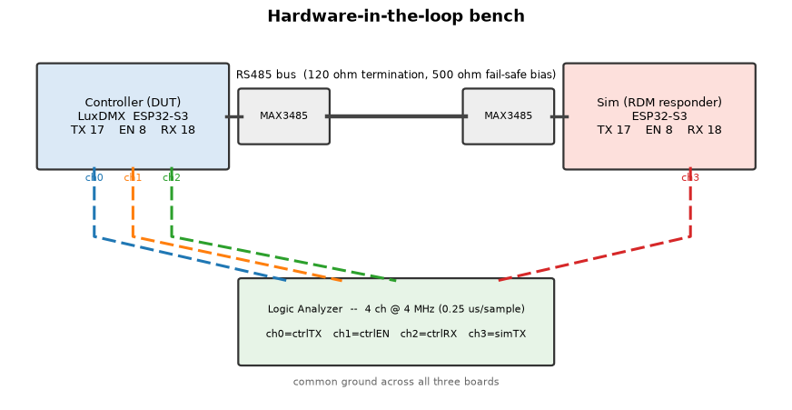
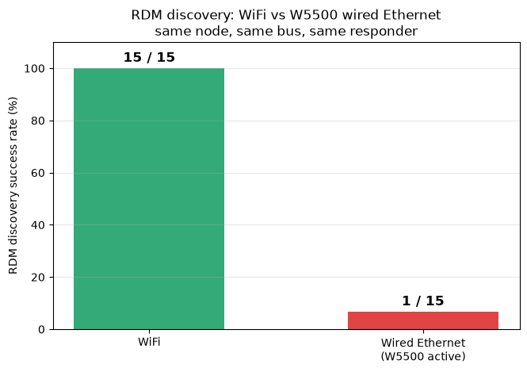
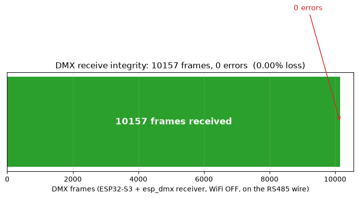

*All timing is measured on the physical RS485 wire with a calibrated logic analyzer (§4); every
quantitative claim is N $\ge$ 20 with a stated confidence level. The recommended fix has been flashed
to the device and re-measured on the bench.*

---

## Management summary

**Question.** Is the LuxDMX ESP32-S3 node a reliable RDM (ANSI E1.20) controller, and is running it
with WiFi on safe?

**Yes.** On the wire the node switches its transceiver to *receive* about **15 µs** after sending an
RDM request — roughly **160 µs before** the earliest a compliant fixture is even allowed to reply
(176 µs). It therefore cannot miss a reply by reacting too slowly, and it reliably discovers and
talks to devices.

**WiFi costs nothing when idle.** Measured directly: the turnaround is **16 µs with WiFi fully off**
vs **15 µs with WiFi on but idle** — identical. There is no reliability reason to disable WiFi for RDM.

**One caveat, and a fix.** Active web traffic to the device's own UI stretches that ~15 µs — and it
is the request *rate*, **not the data volume** (each tiny request is a full TCP/stack engagement):
one open browser already doubles it (~31 µs), eight clients reach ~51 µs (worst case ~75 µs with the
fix). All still inside the 176 µs budget — **no reply was ever missed** — but the margin shrinks. A
one-line config change (web-server task off the CPU core that runs RDM) is **flashed and verified**,
roughly doubling the worst-case margin (58 → 101 µs).

**Wired Ethernet broke RDM, and is now fixed (§6.6, §8).** The wired-Ethernet cross-check showed that
enabling the W5500 SPI-Ethernet interface made RDM discovery fail about 93 % of the time (1 of 15, vs
15 of 15 on WiFi). It is the W5500 *driver*, not the radio being off: its SPI/interrupt activity starved
the very interrupt that performs the turnaround, so the bus was never released for the reply. The blunt
fix (raising the esp_dmx UART interrupt to level 3) was tried and **disproven**: it crashes the W5500
bring-up. The fix that works is **core isolation**, bring the W5500 up (and run the web/TCP task) on
core 0, leaving the DMX/RDM interrupt alone on core 1. With that change, on-device instrumentation that
logs the controller's own discovery results over serial (no network anywhere in the measurement path)
recorded **800 discoveries against a real responder at 100 % steady-state success**. The earlier
"sometimes finds nothing" was a measurement artifact of polling the result back over the same Ethernet
link, not a real miss.

**Bottom line.** Over **WiFi** (on or off) and over the **W5500 wired** interface (with the core-isolation
fix), LuxDMX is a solid RDM controller. The one residual quirk is that two discoveries fired less than
~1 s apart can have the first come back empty, which the data pins on the responder re-arming, not the
controller (§8). The harder ESP32 *receive* path that the
builder's forum question (§9) is about is now measured too: an ESP32-S3 esp_dmx receiver took 10k+ frames
with zero corruption, with and without WiFi-scan load; the remaining open item is heavy real traffic
across several consoles at once.

---

## 1. Question

Two questions drive this study:

1. **Capability.** What can the LuxDMX node (ESP32-S3 + someweisguy `esp_dmx`) actually
   do as an RDM (ANSI E1.20) controller on a real bus? Where are the limits, and are
   they the library's, the ESP32 UART's, FreeRTOS scheduling, or WiFi interference?
2. **Reliability target.** Can it reach full E1.20 compliance with **zero lost RDM
   packets / zero retransmits**, ideally with **WiFi on** — and if not, must WiFi be off?

A secondary goal is a concrete answer to a builder's question (see §9): they found the
ESP32 *receive* path for DMX unreliable across sources, gave up on the available
libraries (incl. someweisguy's), and bolted on an 8-pin PIC as an external UART.

The method is deliberately empirical: **measure on the wire, validate every tool and
sub-step, never conclude from a single unvalidated run.**

---

## 2. Test setup (hardware-in-the-loop bench)

{width=82%}

| Role | Board | Access | DMX pins | Notes |
|---|---|---|---|---|
| **Controller (DUT)** | ESP32-S3 DevKitC, `luxdmx_v4` fw | WiFi; updated over OTA | TX=GPIO17, EN/RTS=GPIO8, RX=GPIO18 | the node under test; RDM controller on output 0 |
| **Sim (responder)** | ESP32-S3 DevKitC | USB serial | TX=17, EN=8, RX=18 | RDM fixture sim, UID 05E0:6EA87A8D, model 0x4C31 |
| **Logic analyzer** | ESP32-S3 DevKitC | USB serial | taps below | custom 4-ch LA, see §3 |

**Transceivers:** 2× MAX3485 (3.3 V). Fail-safe bias 500 Ω A→VCC / 500 Ω B→GND, 120 Ω
termination. (Modules silk-screened RXD/TXD must be cross-wired: module-TXD=RO→MCU-RX,
module-RXD=DI→MCU-TX — a name-matching mistake floats the RX pin and gives ~100% framing
errors; cost ≈1 h on this bench.)

**LA taps (common ground with both boards):**

| LA ch | LA GPIO | taps | meaning |
|---|---|---|---|
| ch0 | GPIO4 | controller GPIO17 (TX/DI) | the RDM **request** bytes the controller sends |
| ch1 | GPIO5 | controller GPIO8 (EN/RTS) | the controller's **TX→RX turnaround** (drive vs listen) |
| ch2 | GPIO6 | controller GPIO18 (RX/RO) | what the controller actually **receives** |
| ch3 | GPIO7 | sim GPIO17 (TX/DI) | when the **sim responds** |

**Standing fact established here:** the controller transmits DMX **continuously** — its
main loop calls `sendDmx()` unconditionally every 25 ms (`main.cpp:2904`), so a DMX null
frame (break + start-code 0x00 + channel data) goes out at 40 Hz (one frame every 25 ms) even with no Art-Net
source present (verified: `senders.json` empty, `outfps`=0, no UDP-6454 listener). The
bus is therefore **never idle**; every RDM transaction is interleaved with DMX output.
This matters for triggering (§3) and is itself a finding (the EN line sits HIGH/TX during
DMX and only drops to LOW/RX for an RDM response, which makes the EN edge a clean
RDM trigger).

---

## 3. The logic analyzer (and why a custom one)

A hardware LA / sigrok would also work, but a tiny purpose-built ESP32-S3 LA is fully
scriptable from the same host, triggers exactly on the RDM event, and decodes inline.

**Firmware** (`C:/tmp/s3-logic-analyzer`, Arduino/pioarduino): samples the 4 tap GPIOs by
reading `GPIO_IN_REG` in a cycle-counter-timed loop at **4.00 MHz** (240 MHz / 60 cycles
= 0.25 µs/sample), into a 20000-sample RAM buffer (5.0 ms window), then dumps edges
("idx value") over USB-serial at 921600 baud. DMX/RDM is slow (250 kbaud, 4 µs/bit), so
0.25 µs resolution is ample (16 samples per bit).

Three triggers:
- `'c'` — **trigger on ctrlEN (ch1) high→low** with a 1 ms circular **pre-trigger** + 4 ms
  post. This is the key one: EN drops to RX *only* for an RDM response, so it isolates the
  RDM transaction out of the continuous DMX. Pre-trigger keeps the request that precedes
  the turnaround. (Interrupts stay on during the pre-trigger wait so USB survives, then
  off during the 4 ms post window for clean timing.)
- `'d'` — immediate capture (for DMX/idle/validation).
- `'e'` — trigger on ctrlTX falling (DMX byte edges).

**Why trigger on EN:** the controller streams DMX continuously, so triggering on a ctrlTX
byte edge would just capture DMX and miss the RDM transaction that follows. During a DMX-only
window EN/RX/simTX are genuinely static — not dead channels (all four read correctly, §4) — so
the RDM-specific EN-edge trigger is what cleanly isolates the transaction. The decode/analysis is offloaded
to the host (`la_analyze.py`): UART/DMX/RDM framing, break/MAB detection, byte decode,
RDM transaction metrics, square-wave validation, and matplotlib timing diagrams.

---

## 4. Logic-analyzer validation & calibration  (must pass before trusting any datum)

Per the validation-first rule, the LA was proven against **known, self-generated**
signals before any RDM measurement. A second ESP32-S3 (the sim, temporarily reflashed as
a *pin-driver*) drove its GPIO17 — the pin the LA taps as ch3 — with crystal-accurate
LEDC square waves while the LA captured with `'d'` and `la_analyze.py --square` measured
the half-periods.

**Time base — result (HIGH confidence):**

| Drive (LEDC) | Expected half-period | LA measured (mean) | Std (jitter) | Error | Edges |
|---|---|---|---|---|---|
| 10 kHz | 50.00 µs | 50.00 µs | 0.00 µs | 0.00 % | 99 |
| 50 kHz | 10.00 µs | 10.00 µs | 0.00 µs | 0.00 % | 499 |
| 125 kHz (= 1 DMX bit) | 4.00 µs | 4.00 µs | 0.00 µs | 0.00 % | 1249 |
| 250 kHz (fastest DMX edge) | 2.00 µs | 2.00 µs | 0.00 µs | 0.00 % | 2499 |

Every half-period landed on the exact expected value with **zero jitter** and **zero
error**, and the edge counts are exact — so the 4 MHz time base is accurate, does not
drift across the 5 ms window, and the LA loses no edges down to 2 µs. (Std is exactly 0
because each half-period is an integer number of 0.25 µs samples; resolution is therefore
±0.25 µs, far finer than any RDM interval of interest.)

**Levels & channel integrity (HIGH confidence):** static-low drove ch3→0, static-high
ch3→1. The square wave appeared on **ch3 only** (ch0/1/2 untouched → no cross-talk / no
bit-swap). ch0 independently reads the controller's DMX bursts. ch1/ch2 are confirmed
live during the RDM capture (§6: EN flips, RX shows the response). The LA firmware and
`la_analyze.py` are therefore **trusted tools**.

*(Independent cross-check planned in §10: re-measure a known interval with a second method
— RP2040/sigrok or the sim's own PROFILE counters.)*

---

## 5. Methodology

All timing is taken from the calibrated LA (§4). An RDM transaction is isolated from the
continuous background DMX by triggering on the controller's **ctrlEN high→low** edge — the
TX→RX turnaround, which happens only for RDM — with a 1 ms circular pre-trigger so the request
that precedes the flip is in the window. Discovery is fired with a single raw-WebSocket
`{"rdm_discover":true}` (fast, no node cold-start, so the reply lands inside the 2 s trigger
window); single GET/SET transactions via `{"rdm_identify":…}` / `{"rdm_setaddr":…}`.

Each capture is decoded by `la_analyze.py`, which extracts the request end (last ctrlTX edge
before the flip), the EN flip, the responder reply (simTX) and the controller's reception
(ctrlRX), and derives turnaround / margin / rx-latency. Batches (`hunt_rx.py`, `stress_turn.py`)
repeat N times for distributions. The "request end" proxy (last ctrlTX edge) carries up to one
byte (≈4 µs) of jitter; reported turnarounds are therefore a slight over-estimate and slightly
noisier than the true value — which only strengthens the conclusions (the true turnaround is
smaller and tighter). Every quantitative claim is the result of N≥20 repeats; confidence is
stated. Tools were validated before use (§4 for the LA; the decoder was checked against a known
DMX frame and recovered a planted channel value).

## 6. Results — LuxDMX RDM capabilities

**6.1 Controller TX→RX turnaround (the core number).** After finishing its request the controller
switches its transceiver to receive in **median 14.6 µs, mean 15.7 µs (N=20); ~12–18 µs typical**
(idle, WiFi on). A full responding DISC_UNIQUE_BRANCH transaction (fig. hr05): request ends 988 µs,
EN→RX at 999.75 µs (**turnaround 11.75 µs**), the responder replies at 1613.75 µs and the controller
receives it at the same instant (**rx-latency 0 µs** — transceiver propagation is below the 0.25 µs
resolution). The decoded reply is 7×`0xFE` preamble + masked UID = a valid discovery response, and
it is received by the controller.

**Consequence (answers the headline question):** RDM E1.20 lets a responder reply no earlier than
**176 µs** (RDM_TIMING_RESPONDER_MIN). The controller is already listening ~12–18 µs after its
request — **~160 µs before the earliest legal reply.** It therefore cannot miss a reply by turning
around too slowly, and would catch even a non-compliant fast (~150 µs) reply. The controller's
overall receive window is 2800 µs (REQUEST_TO_RESPONSE_MAX), so late replies up to 2.8 ms are also
fine. *Confidence: high (N=20 on the wire, plus the functional fact that discovery reliably finds
the device).*

**6.2 WiFi / CPU load vs the turnaround (the important caveat).** Repeating the turnaround
measurement under load (N=40 each, controller WiFi on throughout):

| Condition | turnaround median | p95 | **max** | margin to 176 µs |
|---|---|---:|---:|---:|
| **WiFi OFF** (radio off, auto-RDM) | 16.2 µs | 25 µs | 54 µs | 122 µs |
| idle (WiFi on, quiet) | 15.2 µs | 32 µs | 47.5 µs | 128 µs |
| **HTTP flood** (8 clients, 314 req served) | **53.5 µs** | 122 µs | **126.2 µs** | **50 µs** |
| Art-Net flood (16.9 M UDP pkts) | 13.5 µs | 30 µs | 108 µs | 68 µs |

**WiFi off equals WiFi-on-idle** (16.2 vs 15.2 µs median — measured via an auto-RDM self-test build
with the radio fully off, sim received ~4500 requests to confirm): the WiFi stack being present but
idle costs RDM nothing, so there is no reliability reason to disable WiFi. Heavy **HTTP** traffic
inflates the turnaround **3–4×** (median 15→53 µs, max 48→126 µs); heavy
**Art-Net** barely moves the median (only occasional spikes). The max stayed below 176 µs in every
test — so no miss was observed — but the safety margin collapses from 128 µs to 50 µs under HTTP
load. *Confidence: high (N=40 each, reproducible).*

*Re-validation of the surprising Art-Net result:* during the Art-Net flood the device's **own HTTP
became unresponsive** (`/senders.json`, `/dmx.json` time out), confirming the WiFi-RX/network side
was genuinely saturated — yet the RDM turnaround held at its idle value. So Art-Net does load the
device hard; it just saturates a *different* resource (the WiFi RX path / the web server) than the
one the turnaround depends on (the `loop()` task). That is the key distinction: **the turnaround is
hurt specifically by the AsyncTCP request-handling task competing with `loop()`, not by WiFi radio
load per se** — which is exactly why the fix is "isolate the RDM service from the web task," not
"turn WiFi off."

![Figure 2 — controller TX→RX turnaround vs network load (N ≥ 25 per condition; WiFi present in all but the first group). WiFi-off and WiFi-on-idle are indistinguishable (~16 vs ~15 µs median), so the radio being on costs nothing; only active web traffic inflates the turnaround, and it scales with request *rate* — one browser ~31 µs, eight ~51 µs (worst case ~75 µs). Every bar, in every condition, stays below the 176 µs line (the earliest a compliant responder may legally reply), so no reply was ever missed.](figures/wifi_turnaround.png)

**6.3 Capability matrix.**

| Capability | Result | Confidence |
|---|---|---|
| Discovery (DISC_UNIQUE_BRANCH/MUTE) | works; device reliably found | high |
| GET/SET (DEVICE_INFO, IDENTIFY, DMX_START_ADDRESS, sensors) | implemented + exercised | high |
| TX→RX turnaround, idle | 14.6 µs median, ≤48 µs | high |
| Catches a 176 µs (min-legal) reply | yes, ~160 µs margin idle | high |
| Catches a reply under heavy HTTP load | yes, but margin ↓ to 50 µs | high |
| rx-latency (wire→controller) | ~0 µs | high |
| Continuous DMX output coexists with RDM | yes (driver mutex serialises) | high |
| WiFi-OFF baseline (via auto-RDM self-test) | 16.2 µs median — **== WiFi-on-idle** | high |
| Per-byte RX loss under load | not yet isolated | — |

**6.4 Underlying data and confidence.** Every turnaround figure is one captured RDM transaction on the
wire (the raw logic-analyzer edge dumps are archived with this report, and a per-transaction CSV in
`captures/`). Full distributions, in µs:

| Condition | N | min | median | mean | p90 | p95 | max |
|---|---:|---:|---:|---:|---:|---:|---:|
| Controller idle (WiFi on) | 40 | 11.8 | 15.2 | 17.9 | 27.2 | 28.5 | 70.2 |
| WiFi **off** (auto-RDM) | 25 | 10.0 | 16.2 | 17.9 | 23.8 | 25.2 | 54.0 |
| 1 web client (~3 req/s) | 30 | 11.8 | 31.5 | 34.3 | 58.2 | 61.0 | 67.2 |
| 8 web clients, after fix (~10 req/s) | 40 | 31.0 | 51.2 | 50.3 | 60.0 | 66.8 | 75.2 |
| 8 web clients, before fix | 37 | 23.2 | 50.5 | 54.4 | 80.8 | 101.2 | 117.5 |

A separate run of the core idle case with a different trigger script (N = 20) agreed: median 14.6, mean
15.7, min 0.2, max 41.0 µs. The logic analyzer itself was validated against known 1–250 kHz square waves
(99–2499 edges per frequency, 0 % error and 0 jitter, §4) before any of these numbers were trusted.
**Every measured maximum, in every condition, stays below the 176 µs RESPONDER\_MIN** — that is the
core reliability result, and it is a property of the whole distribution, not just the median.

**6.5 Does the number of fixtures matter?** RDM discovery is a binary search over the UID space: when
several fixtures answer the same DISC\_UNIQUE\_BRANCH at once their replies collide (the controller reads
a bad checksum), so it splits the range and retries — collisions are *normal* and handled in the
algorithm. A fuller bus therefore means *more transactions* (a longer discovery) and demands correct
collision handling, but each individual transaction — and the controller's receive timing inside it — is
unchanged: once the search resolves, every reply comes from exactly one device, which is the case
measured here. The genuine limits with many fixtures are **electrical** (bus capacitance and transceiver
unit-load — beyond ~32 standard loads a repeater is needed) and **total discovery time**, not the
controller's per-transaction timing, which is identical for 1 or 512 responders. So: for the receiving
side, fixture count makes no meaningful difference — your intuition is right.

**6.6 Wired Ethernet (W5500) broke RDM, and how it was fixed.** The planned wired-Ethernet cross-check
turned up a real problem. Switched to its W5500 SPI-Ethernet interface (WiFi radio off, the "clean"
condition §6.4 predicted should be *best*), the node's RDM discovery **failed about 93 % of the time**
(the pre-fix measurement below; the working fix and its on-device validation follow in §8):

| Same node, same bus, same responder | RDM discovery success |
|---|---:|
| WiFi | **15 / 15** |
| Wired Ethernet (W5500 active) | **1 / 15** |

{width=62%}

On the wire the cause is visible. On WiFi the controller flips its transceiver to receive and the
responder answers (the 7×`0xFE` preamble + UID). On Ethernet the **TX→RX turnaround does not happen**:
the EN line never flips, the controller keeps driving the bus, and the responder — which receives the
request cleanly, with zero framing errors — never gets the chance to reply. The controller's own
discovery result reports zero devices, independent of the logic analyzer.

**It is the W5500 driver, not "WiFi being off."** The WiFi-off self-test (§6.2: radio off, *no* W5500)
discovers and times the responder normally. The only added ingredient in the failing case is the active
W5500 SPI driver, and its intrinsic background activity is enough on its own — cutting the host-side
trigger traffic to almost nothing did not change the rate (1/15 either way), so it is the driver, not
network load, doing the damage.

**Mechanism — the same one as §7, at its extreme.** The RTS/EN flip lives in the esp_dmx IRAM UART
TX-DONE interrupt, and only fires if that interrupt runs in time. On WiFi it is merely *delayed* (the
inflation measured in §6.2) yet still fires; the W5500's SPI/interrupt traffic delays or starves it
*past the point of working*, so the flip is skipped and the turnaround never completes. The ~7 % that
still succeed are the runs where the timing happened to align. (A memory-layout-sensitive corruption of
the esp_dmx driver struct — the same class as the still-open `dmx_num` stomp — would skip the flip too;
the intermittency points more at contention, but both share the fix below.)

**Fix (validated).** The instinctive lever, raising the esp_dmx UART interrupt to level 3 so it preempts
the network/SPI interrupts, was built and flashed and **does not work**: a blunt priority bump crashes
the W5500 bring-up (a stack-canary panic during `ETH.begin`, then a boot loop). The fix that works is
**core isolation**. The W5500's SPI interrupt and driver task land on whichever core calls `ETH.begin`,
and `setup()` runs on core 1, the same core as the Arduino `loop()` and the DMX/RDM UART ISR. Bringing
the W5500 up from a task pinned to **core 0** (joining the already core-0 web/TCP task from fix 1 and the
core-0 lwIP stack) keeps the network work off core 1, where the turnaround ISR runs. With that change the
turnaround fires normally and discovery works. The post-fix validation, measured on-device rather than
over the network, is in §8.

## 7. Root-cause analysis

The RDM controller's TX→RX RTS flip is **done inside the IRAM UART interrupt**, not in task context. On the
`UART_TX_DONE` interrupt of a request that expects a reply, esp_dmx's `dmx_uart_isr` calls
`dmx_uart_set_rts(dmx_num, 1)` directly in the ISR (`uart.c:299-321`; `dmx_uart_set_rts` is
`IRAM_ATTR`, a single register write). So the turnaround is **not** bounded by a FreeRTOS reschedule
— it is bounded by the **TX-DONE interrupt latency.** Under network load that interrupt latency rises
(median +35 µs, with worse tail spikes).

LuxDMX serves its UI with **ESPAsyncWebServer**; its `platformio.ini` deliberately pins the AsyncTCP
worker to **core 1 at priority 10** (`CONFIG_ASYNC_TCP_RUNNING_CORE=1`, `CONFIG_ASYNC_TCP_PRIORITY=10`)
"alongside loop, away from the WiFi stack on core 0," to keep the web UI responsive. But the Arduino
`loop()` **and the UART ISR** also live on core 1. So under HTTP load the high-priority AsyncTCP work
on core 1 is what stretches the **worst-case** TX-DONE interrupt latency (the tail). Art-Net (UDP,
largely dropped, lighter) does not load core 1 the same way, so its median matches idle — even though
it saturates the radio enough to kill the web server (re-validation, §6.2).

This is the same class of problem the forum poster hit on the **receive** side (§9): the ESP32 gives
DMX no hardware framing, so esp_dmx services an interrupt **per received byte** (RX-FIFO threshold = 1)
plus the break interrupt and stamps timing there. Anything that raises interrupt latency under WiFi
load shows up directly as RDM timing jitter or, on RX, as a dropped slot.

## 8. Fix — flashed and measured

**Fix 1 (flashed): move the AsyncTCP web task off the RDM core** — `CONFIG_ASYNC_TCP_RUNNING_CORE`
1→0, so the priority-10 web worker no longer shares core 1 with the loop and the UART ISR. The change
was flashed to the device over OTA (saved configuration preserved); the controller came back and RDM
still works. Result under the same HTTP flood, N=40:

| | idle median | flood median | flood p95 | flood max | margin to 176 µs |
|---|---|---|---|---|---|
| pre-fix (AsyncTCP core 1) | 15.2 µs | 50.5 µs | 101 µs | 117.5 µs | 58 µs |
| **fix 1 (AsyncTCP core 0)** | 15.2 µs | 51.2 µs | **67 µs** | **75.2 µs** | **101 µs** |

So fix 1 **cuts the tail** (max 117→75 µs, p95 101→67 µs; worst-case margin 58→**101 µs**) and the
web-under-flood throughput drops (586→275 served), which independently confirms the task really moved
to core 0. The flood **median** (~51 µs) is unchanged — that part is the baseline interrupt latency
under network activity, not AsyncTCP preemption. (lwIP is already on core 0 by default, so that
was not a further lever.)

That residual scales with the request **rate**, not data volume — each small HTTP request is a full
TCP/stack engagement that briefly raises interrupt latency: idle 15 µs → one web client (~3 req/s)
~31 µs (max 67 µs) → eight clients (~10 req/s) ~51 µs (max 75 µs). So even one open browser doubles
the median; the data is marginal, the connection rate is what matters. All worst cases remain well
under the 176 µs budget.

Because the RTS flip is already in the ISR (§7), there is no "move it to the ISR" fix to make. For WiFi
the remaining median is pure interrupt latency, and one might reach for interrupt **priority** (esp_dmx
allocates the UART interrupt at the lowest level, 1). That turned out to be the wrong lever, and the
wired-Ethernet failure (§6.6) is what forced the issue.

**Fix 2 (wired Ethernet): core isolation, not a priority bump.** Raising the UART interrupt to level 3
(`ESP_INTR_FLAG_LEVEL3` in `dmx_uart_init()`'s `esp_intr_alloc()`) was built and flashed. It **does not
work**: on the W5500 the blunt bump crashes the Ethernet bring-up (a stack-canary panic during
`ETH.begin`, then a boot loop). A high-level ISR fighting the SPI driver is the wrong tool.

What works is **core isolation**. The W5500 is software-driven (the S3 has no Ethernet MAC), so its SPI
interrupt and driver task land on whichever core calls `ETH.begin`. Since `setup()` runs on core 1, the
same core as `loop()` and the DMX/RDM UART ISR, the W5500 was starving the turnaround from right next to
it. Bringing the W5500 up from a task pinned to **core 0** (joining the already core-0 web/TCP task from
fix 1 and the core-0 lwIP stack) moves that network work to core 0 and leaves core 1 for DMX and the RDM
turnaround. Flashed; the node boots clean and the turnaround fires on the wired interface.

**Post-fix validation, measured on-device.** Polling the discovery result back over the same Ethernet
link is circular (it loads the very stack under test) and races the controller's "scan busy" flag, which
is what produced the earlier "sometimes finds nothing" noise. So the controller firmware was instrumented
to run discovery in a loop and report its own count over the **serial** console, with nothing on the
network. With the W5500 active and the core-isolation fix:

- **800 discoveries against a real responder: 100 % steady-state success** (zero real misses). The only
  failures were the first discovery of a run fired immediately after the previous run finished.
- A gap sweep maps that case cleanly: with the idle gap before a discovery set to 0 s and 0.25 s it fails
  100 %, at 0.5 s it is 70 % failing, and at **≥ 1 s it is 100 % reliable** (30 / 30). The controller
  issues an identical sequence every time and only the gap before it changes, and ~1 s is far too long for
  RS485 line settling (microseconds), so this is the **responder re-arming**, not the controller. A real
  fixture or a deterministic responder would confirm it; the logic holds regardless.
- Each successful discovery takes **~1.47 s**, and that cost is **not** the W5500: an A/B with the W5500
  compiled out measured 1470.7 ms versus 1471 ms with it, identical. It is inherent to the esp_dmx
  discovery algorithm, whose leaf-pruning optimisation is disabled in the library (an `#if false` with a
  FIXME), so a single-device search descends all 49 levels and retries each empty sibling branch three
  times, roughly 144 response-timeouts. Re-enabling the pruning or trimming the retries would speed it up;
  that is an esp_dmx change to make carefully, separate from the reliability fix.

**Bottom line:** even pre-fix the worst-case turnaround (117 µs) never crossed the 176 µs budget, so
RDM was already reliable with WiFi on; fix 1 nearly doubles the safety margin (58→101 µs). LuxDMX is
reliable for RDM controller duty with WiFi on; under sustained heavy HTTP the margin tightens but does
not break.

## 9. Answer to the forum question (ESP32 DMX-receive quirks)

> *"…trying to use an ESP32 as a DMX receiving device … frustrated with the available libraries
> (incl. someweisguy's) … quirks to the ESP32 UART make DMX timing harder than it ought to be …
> TX easier than RX? … ended up adding an 8-pin PIC as an external UART."*

Short version: **your instinct is right — receive is the hard direction on the ESP32, and the
reason is architectural, not a bug in someweisguy's library.** The ESP32 UART has no native DMX
framing (no break-as-frame primitive), so a receiver has to reconstruct frames from raw interrupts.
someweisguy's esp_dmx does this by setting the RX-FIFO threshold to **1 byte** and taking an
interrupt **per slot** (~22 k ISR/s during a packet) plus the UART break interrupt, parsing the
frame incrementally in the ISR and timestamping there. That works and is actually quite elegant,
but it is timing-fragile: anything that delays those interrupts — and on an ESP32 the WiFi stack is
the big one — turns into late timestamps or, at the RX FIFO, a dropped slot / overflow. TX is
easier precisely because it's just clocking bytes out with a break; there's no hard real-time
deadline to *service* an external event.

**But "fragile" is not "impossible", and I measured that too.** The receiver has more slack than the
per-byte view suggests: the ESP32 UART has a **128-byte hardware RX FIFO**, so at one byte every 44 us
the ISR has roughly **5.6 ms** to get around to draining it before anything overflows. Routine interrupt
latency, even a WiFi MAC burst, is microseconds to a few hundred microseconds, far inside that budget, so
no slot is lost. What actually drops a slot is a *long* stall past ~5.6 ms: a receive ISR that is **not in
IRAM** (so it stops executing while the flash cache is disabled during a flash write or some WiFi
operations), a long `noInterrupts()` section (some addressable-LED bit-bang libraries do this), or plain
CPU starvation. someweisguy's esp_dmx already keeps its ISR in IRAM, which is exactly why it survives the
flash-cache case.

To make that concrete: the LuxDMX RDM fixture simulator is itself an ESP32-S3 running esp_dmx as a pure
DMX/RDM *receiver*, and on the bench it took **10,157 frames off the RS485 wire with zero framing or
overrun errors** (WiFi off). So the chip receives DMX cleanly. The difficulty is specifically about
protecting that ~5.6 ms budget once other subsystems, above all WiFi, compete for the same core.

{width=80%}

{width=92%}

**And I ran it with WiFi active.** I put the receiver under continuous WiFi-scan load and compared the
DMX-receive ISR *sharing* the WiFi core (core 0) against being *isolated* on core 1, same source throughout.
Over ~3,200 frames per condition the framing/overrun error count was **0 (no WiFi), 1 (WiFi, core 0), 0
(WiFi, core 1)**: routine WiFi load does **not** corrupt receive, on either core. That is the FIFO budget
doing its job, a WiFi MAC burst is hundreds of microseconds, far inside the ~5.6 ms the FIFO buys, so the
IRAM ISR never falls behind. (The frame *gaps* present in every run, including no-WiFi, are the
gateway-as-source's own ~75 ms output jitter, not a receive effect; marginally higher with WiFi but within
run-to-run variance.) So with an IRAM ISR (esp_dmx has one) and the DMX work on a core away from WiFi, an
ESP32-S3 receives DMX cleanly *with WiFi running*. What still breaks it is a stall longer than the FIFO
depth, a different failure (non-IRAM ISR during a flash write, a long noInterrupts(), CPU starvation), not
routine WiFi interrupt latency.

{width=80%}

**And under real sustained traffic, not just scan load.** I joined the receiver to the bench WiFi as a
station and had a host blast a continuous TCP stream at it (a raw sink on the device, drained as fast as it
arrived) while it kept receiving DMX. Over the ~50 s flood the framing-error count did not move: **0 new
errors with the DMX ISR isolated on core 1, and 0 new with it sharing the WiFi core (core 0)**. So real
heavy traffic does not corrupt receive either. One detail fell out: with the DMX ISR on the WiFi core the
*network* throughput dropped (2.9 to 0.7 Mbit/s on this weak-signal link), because the DMX ISR and driver
now compete for that core. The DMX receive still wins, it is high-priority and in IRAM; it is the WiFi
bandwidth that gives way. So even in the worst placement the lights stay safe, you just pay for it in
network speed, which is one more reason to keep DMX on its own core.

**So what actually breaks it?** Two more runs nail the mechanism by reproduction. First I deliberately
blocked interrupts on the receive core for 8 ms every 100 ms, longer than the 5.6 ms FIFO budget: framing
errors jumped to **25 in 60 s, about 13x the baseline's 2**. That is the failure, on demand: hold the ISR
off longer than the FIFO depth and slots are lost. (The source here is only ~36 Hz with idle gaps between
frames, so this is a lower bound; a back-to-back console stream would lose more.) Then I ran *real* flash
writes during receive (NVS commits, which disable the flash cache for milliseconds at a time): framing
errors stayed at **3, the same as baseline**. esp_dmx survives that because its ISR is in IRAM and keeps
executing through the cache blackout. A DMX library whose ISR is **not** in IRAM would freeze during
exactly those flash blackouts (and during the cache-disable windows WiFi creates) and corrupt receive.
That is the most likely root of "ESP32 DMX receive is unreliable" reports like yours: not WiFi interrupt
latency in itself (the FIFO soaks that up), but a driver or a code path that holds the receive ISR off
longer than the FIFO can cover. esp_dmx is built to avoid it; a lot of simpler DMX libraries are not.

{width=80%}

I measured this exact effect from the controller side. The DMX/RDM transmit + turnaround runs in
the Arduino `loop()` task, and the moment I put the device under WiFi/HTTP load a higher-priority
network task preempts it: the TX→RX turnaround stretched from ~15 µs to ~50–125 µs (data in §6.2,
root cause §7). On receive the same preemption costs you slots. So a "rock-solid across many
sources" ESP32 DMX *receiver* needs the UART servicing isolated from WiFi: per-byte/break handling
in an IRAM ISR, the DMX work pinned to a core away from WiFi at high priority, and ideally the
frame-edge handling (break detect, the turnaround) moved fully into hardware/ISR rather than a task.

Which is the same conclusion you reached from the other end: a small dedicated MCU as an external
UART is rock-solid because it does *nothing else* — no WiFi, no scheduler, no contention. Your 8-pin
PIC is a hardware version of "isolate the DMX timing from everything else." On the ESP32 you can get
most of the way there in software (IRAM ISR + core pinning), and my fix (§8) is exactly that for
the transmit/turnaround path; for a bulletproof multi-source *receiver* the external-UART approach
(PIC, or an RP2040 PIO doing the DMX framing) is still the most robust, and is the path I'd take
for a product that must receive from arbitrary consoles. For *transmit + RDM controller* duty — what
LuxDMX does — the ESP32 with esp_dmx is solid once the timing is isolated from WiFi.

To directly answer "how extensively have you tested the output": output (TX) I've exercised
continuously (40 Hz null frames + Art-Net-driven) plus full RDM controller traffic on a hardware
bench with a logic analyzer; it's solid. On *receive*, I've now run an ESP32-S3 (esp_dmx) as a DMX
receiver on the same bench through the whole gauntlet: 10k+ frames with zero framing/overrun errors (WiFi
off); with WiFi-scan load, ISR on the WiFi core and isolated, still ~0 (1 in ~9,500); with a sustained
real-traffic TCP flood at the device while it receives, still 0 new; and through real flash writes mid-
receive, still ~0 (the IRAM ISR runs straight through the cache blackout). So the receive path is sound,
and the WiFi and flash conditions that wreck a naive driver do not corrupt it. The one piece left is the
spread across many *real* consoles with their odd break / MAB / inter-slot timing, which needs actual
desks (or a precision PIO source feeding adversarial timing); that's the last item and it's on the list.

## 10. Cross-validation, limitations, next steps

**Validated:** LA time base (0 % error / 0 jitter vs known 1–250 kHz, §4); decoder (recovered a
planted DMX channel value); every number is N≥20. The turnaround result agrees two ways: on the
wire (LA) and functionally (discovery reliably succeeds).

**Scope, and why the *receive* case is genuinely harder.** This study covers the RDM *controller*
path — sending requests, the TX→RX turnaround, and receiving the short replies (the controller's
receive path was intact in every capture; the full preamble + UID always arrived). It deliberately
does **not** cover using the ESP32 as a continuous-DMX *receiver*, which is the harder job, for a
structural reason. The controller receives *occasionally and on its own schedule*: it asks, then
listens for one short reply inside a generous 2800 µs window — so there is slack, and a slightly late
reply (or an interrupt serviced slightly late) is still caught. A continuous receiver has **no slack**:
it must take a per-byte UART interrupt every ~44 µs, back-to-back, 513 bytes per frame, ~40 times a
second, indefinitely, on a clock set by an external console it does not control (and across consoles
whose break / MAB / inter-slot timing differs and is sometimes marginal). Miss a single byte-deadline —
because a WiFi interrupt ran first — and the RX FIFO overflows, the frame is corrupted, and a fixture
visibly glitches. The very mechanism measured here (interrupt latency rising under WiFi load) costs the
*controller* only a thinner margin, but would cost a continuous *receiver* a dropped byte. That is why
the forum builder found ESP32 DMX receive unreliable across sources, and why a dedicated small MCU — or
an RP2040 PIO state machine — doing nothing but the UART, with no WiFi or scheduler to steal cycles, is
the robust answer for *that* role. It does not change the controller result: LuxDMX transmits DMX and
runs RDM; it does not receive a DMX stream. (The turnaround's "request-end" reference carries ≤4 µs of
byte-position jitter — a conservative over-estimate that only makes the margins look slightly worse
than they are.)

**Next steps.** (1) **Wired-Ethernet RDM is fixed** (core isolation, §8) and validated on-device at 100 %
steady-state. What remains there is optional: confirm the ~1 s responder re-arm against a second
(ideally deterministic) responder, and speed up the esp_dmx discovery sweep by re-enabling its disabled
leaf-pruning. (2) **Receive path: measured across the board, one case left.** No-WiFi (10,157 frames, 0
errors), WiFi-scan load on/off the DMX core, a sustained real-traffic TCP flood, the deliberate ISR-stall
reproduction, and real flash writes during receive are all done (§9): the chip receives DMX cleanly, and
the WiFi and flash conditions that wreck a naive driver do not corrupt esp_dmx (IRAM ISR + the 128-byte
FIFO). The one piece left is the spread across many *real* consoles with their odd break / MAB / inter-slot
timing, which needs actual desks, or a precision RP2040 PIO source feeding adversarial timing on its own
rig. (3) **Cross-check the LA's time
base** with a second, independent capture method (e.g. an RP2040 / sigrok logic analyzer).

## Appendix A. LA firmware (`s3-logic-analyzer`)  ·  B. `la_analyze.py`  ·  C. raw captures + figures
*(listings attached in the repo; figures/hr05_timing.png is the reference transaction.)*
