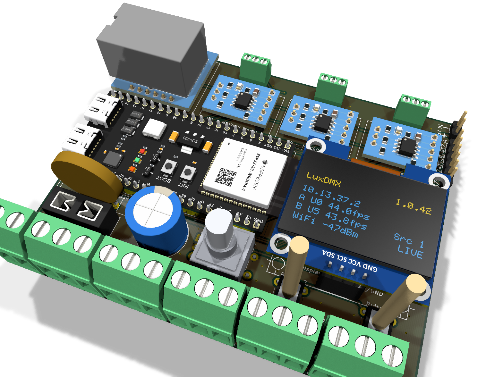

# LuxDMX carrier board

A carrier PCB for off-the-shelf modules: an ESP32-S3 dev board, up to three RS-485
transceiver modules, a W5500 Ethernet module and an OLED, all on 2.54 mm headers. The rotary
encoder is the one part that is not a module, it sits on the carrier itself. DMX and RDM on
up to three ports, WS281x pixels on up to five.

| | |
|---|---|
| Board | 100 x 80 mm, 2 layers |
| DMX / RDM | up to 3 ports, RS-485 module per port, direction pin driven |
| Pixels | up to 5 WS281x ports, buffered to 5 V |
| Network | WiFi, plus Ethernet with a W5500 module |
| Pixel supply | 12 or 24 V, screw terminal or DC jack, polyfuse |
| Logic supply | USB, external 5 V, or a buck module off the pixel rail |
| UI | 1.3" OLED, EC11 rotary encoder with push switch, two buttons, all on the board |

## Ordering

**PCB.** [`luxdmx-carrier-gerbers.zip`](production/), two layers, standard 1 oz copper, any
fab, for example <https://cart.jlcpcb.com/quote>.

There used to be a 4-layer variant with a solid power plane, and it is gone. It bought a
higher number on paper and it was the wrong answer to the question. A plane is not a
conductor of a known width: the current crowds along the shortest path through it and most of
the copper carries almost nothing, so quoting its narrowest cross-section flatters it. The
supply now runs as real tracks instead, 4.8 mm wide, and a track's width IS its
cross-section, so IPC-2221 applies to it directly and the number below means what it says.

If you want more than that on two layers, solder a wire along the rail on the top side, or
feed the strip from its own supply, which is what you would do at that current anyway.

**Parts.** [`production/BOM.md`](production/BOM.md) has LCSC part numbers, stock and prices.
[`production/BOM-LCSC-upload.csv`](production/) can be dropped straight into
<https://www.lcsc.com/bom>. Also as `.csv` and `.xlsx`.

The 74HCT541 buffer and the TVS diodes are not stocked at LCSC; the BOM lists marketplace
sources and search terms for those, and for all six modules.

## Assembly

[`ASSEMBLY.md`](ASSEMBLY.md) lists every position with the condition under which it is
fitted, per DMX port, per pixel port and per supply option. A two-port DMX node without
pixels leaves more than half the board empty.

Solder the back side first, the small parts sit under the modules. Then the headers, then plug
the modules in.

**The lands take whatever is in your drawer.** Every resistor and capacitor position runs from
0.30 to 2.30 mm off centre, so 0402, 0603, 0805 and 1206 all land on copper, and a 1210 works
with its width overhanging the pad. The six TVS positions go out to 2.90 mm and additionally
take SOD-123, SOD-123F, SOD-123FL and SMA, so an SMF12CA and an SMAJ12CA are both a proper fit.
The catch: none of this reflows. The lands are much longer than the parts, so nothing
self-aligns. Hand soldering only, which is what the board is for.

Two positions are shaped for the iron rather than for a stencil. The 74AHCT541 is in SOIC-20W
because there is no wider-pitch SMD package for a 20-pin part, so its pads reach 0.80 mm
further out than the standard land, 2.72 mm clear of the body, which is where the tip goes.
And the buck module's four landing zones are 12 x 5 mm of copper under a solder mask GRID,
7 x 3 windows of 1.1 mm each. The copper is continuous, only the mask is broken up: solder
stands in the windows instead of running out flat across 60 mm2, and whichever of the
22 x 18 to 30 x 18 mm modules you have, its pins come down on one of them.

## Connectors

| Header | Pins, left to right | Goes to |
|---|---|---|
| `DMX n` | GND / B / A | XLR pin 1 / 2 / 3 |
| `Pixel n` | V+ / DATA / GND | strip |
| `12-24V IN` | + / - | pixel supply |
| `5V IN` | + / - | logic supply, optional |
| `Display` | SDA / SCL / 3V3 / GND | 1.3" OLED |
| `EXP` | 3V3 / GND / 47 / 48 / 43 / 44 | spare, unbuffered |

The encoder is a bare EC11 with a push switch, the part that sits under every KY-040 module.
The module's three 10k pullups are not needed: ENC_A is GPIO42, ENC_B GPIO41 and ENC_SW
GPIO21, all ordinary pins with internal pullups. It used to be a 5-pin header at the board
edge, which cost three signals a trip right across the board, and ENC_SW would not route at
all. On the carrier it is a 4 mm run.

The two buttons sit on **IO3 and IO46** and go straight to GND, no resistors. Those two are
what is left once the pins that cannot take a button are struck off: IO35, IO36 and IO37 are
the octal PSRAM on any R8 part, IO45 is the flash-voltage strapping pin and a pull-up there
means 1.8 V and no boot, IO19 and IO20 are USB D- and D+, and IO0 is BOOT. IO3 and IO46 are
strapping pins too, for JTAG source select and ROM message printing, but neither stops the
chip booting whichever way it is left. Both do internal pull-ups: this SoC has no input-only
pins and IO46 has an ordinary IO_MUX register.

The land is the usual 6 x 6 mm tact switch, so the plunger length is yours to pick - 5 to
30 mm off the same footprint. The encoder shaft stands 20 mm off the board, so anything much
shorter than that disappears behind the same front panel. Both buttons sit 4.6 mm clear of
the display module's outline, so a long plunger has somewhere to go.

The DMX rows are 2.54 mm pitch drilled 1.20 mm, so a 2.54 mm screw terminal goes in as
readily as a pin header: Phoenix MPT 0,5/3-2,54, TE 282834-3 or Xinya XY308-2.54-3P. The row
sits far enough towards the board edge to leave the 6.60 mm a horizontal terminal of that
pitch is deep.

The pixel and 12/24 V positions are 3.60 x 3.30 mm pads on 1.30 mm holes. Fit the screw
terminal, or leave it out and solder the wire flat onto the pad, which beats threading it
through a hole.

## Current rating

The pixel supply is laid as tracks, 4.8 mm wide, from the input terminal through the fuse and
along the row of outputs. Every branch gets the full width rather than tapering, because any
one output has to be able to take the whole current on its own. Both fuse options, the
polyfuse and the blade holder, sit on 4.8 mm too, whichever one you fit.

The two columns are how much warmer than the surrounding air you are willing to let the
copper get. **10 K** is the conservative figure, the board stays hand-warm. **20 K** is the
same board run warmer, which FR4 does not mind at all, in exchange for more current. Neither
is a safety limit, it is a choice.

| 1 oz copper, 2 layers | 10 K warmer | 20 K warmer | at 24 V | per port with 5 ports |
|---|---:|---:|---:|---:|
| Pixel rail, fuse to the outputs | 7.2 A | **9.8 A** | 170 - 235 W | about 2 A |
| Pixel rail, input to the fuse | 7.3 A | 9.9 A | | |
| Every single output, on its own | 7.2 A | 9.8 A | | |
| GND back from each output | 7.4 A | 10.1 A | | |
| GND overall | 46.3 A | 62.8 A | | |

Two GND figures, because they answer different questions. The overall one is the pour, and
the same caveat applies to it as to any plane: it is the narrowest cross-section of a lot of
copper, not a wire of that width.

The per-output one is a real track. Each pixel terminal's GND pad gets a 4.8 mm run of its
own, laid before the router and going straight up on the front, so the return of an output
matches its feed. Both of those numbers were once wrong. The pour was the return path to
begin with, and on one build it left Pixel1's GND on a 17 mm2 island with no way off it on
either layer - an output whose V+ is sized for 10 A, with its return sitting on nothing, and
DRC mentioning it only as two zones being unconnected. The track fixed that but went down at
2.0 mm, because it had been hung off the same cap as the spurs to the bulk capacitor and the
buck; 5.3 A against 9.8 on the plus side, and not even a geometric limit - 6.8 mm fits there.
Thanks to mdethmers on the forum for pushing on exactly this. The pour is still there and
still carries most of it; the 4.8 mm is what is guaranteed.

What two layers cannot give you is a return that runs directly underneath the feed. The
supply bus is on the back along the terminal row, and a mirror of it on the front would seal
the row off on both layers: the five data lines come down from the buffer and have to cross
that line, and crossing one bus is unavoidable while crossing two costs every one of them a
pair of vias through a slot in both references. So the loop between out and back is as wide
as the terminal pitch, 10.2 mm, and that is the price of the second layer not existing.

Two things on that rail are deliberately thin. The bulk capacitor and the buck module hang
off 2.0 mm spurs, 5.3 A, because one sees ripple and the other draws about an amp; neither is
a load path. The polyfuse's solder-bridge pads, the pair you blob across INSTEAD of fitting a fuse, run
from the 0.30 mm seam straight into their own through-holes and overlap them, so there is no
track in that path at all and the narrowest cross-section is the pad's own 4.00 mm height:
8.8 A. If you want more than that with no fuse, bridge the through-holes with a piece of
wire, they sit on the 4.8 mm copper.

**It is plenty as a DMX node**, where the pixel rail carries nothing at all. A 5 m WS2815 run
draws about 5 A at full white, so plan on two such runs. Beyond that, inject power at the
strip instead of pulling it through the
carrier.

## Pixel data lines

Each of the five data lines has a 330 R in series at the buffer, and that is not optional
politeness. The 74AHCT541 switches in 3 to 5 ns into whatever length of unterminated wire you
screw onto the terminal; that edge rings, overshoots into the first LED's input and radiates
on the way out. 330 R overdamps it on purpose: a bit is 300 ns at 800 kHz, so a slower edge
costs nothing, and the same resistor limits the current if a data pin meets 5 V or GND. It is
the same part as the RS-485 fail-safe bias, so it adds no line to the order. 220 R to 470 R
all work.

The return path is the part two layers cannot fully solve, and here is what it measures over
the 341 mm of data line on the board:

| | |
|---|---:|
| ground directly opposite, on the other layer | 60 % |
| none opposite, but ground alongside within 1.5 mm | 31 % |
| no ground within reach | **9 %** |

The middle case is fine on two layers, the return simply runs beside the track instead of
under it. The last 9 % is 29 mm spread over five lines, in short pieces where each line
crosses the supply bus, plus one 8.5 mm stretch on the back under the ESP module where other
tracks have cut the pour up.

Stitching vias do not fix that: a via ties the two layers together, it does not create copper
where the pour has been squeezed out. On two layers at this density, 91 % of the run having a
usable return is what comes out. The remaining 9 % is the honest argument for a fourth layer,
not for more vias, and for a DIY node with a few metres of strip it does not matter - which is
also why the series resistors are the measure that actually earns its place here.

## Before you power it

**One 5 V source at a time.** USB, the 5 V header and the buck share a rail with no ORing
diode. Two of them connected at once means they fight each other.

**Set the buck to 5.0 V before soldering it in.** The trimmer position out of the bag is
arbitrary, and 12 V on that rail takes out the ESP32, the W5500 and the display.

**Fit the 120 R terminator only at the end of a bus.** Check the RS-485 module first, most
carry 120 R and bias already; a second one puts 60 R on the bus.

**The W5500 has its own decoupling, and it is worth fitting.** Three lands sit under the
module on the back, 100 nF / 1 uF / 22 uF in ascending order away from its 3V3 pin. The whole
board runs off the dev module's 800 mA regulator, which is enough on current - 269 mA for a
fully populated carrier, and the two heavy loads do not coincide, since a board using the
W5500 has WiFi off - but that rail reaches the module through 62 mm of 0.60 mm track, about
62 nH. DC is a non-issue at 6.6 mV; a 50 mA step in 10 ns is not, and the far-end bulk is
54 mm away.

**Check the OLED module's pin order against its own silk.** The 1.3" boards ship with VCC and
GND in either order.

**Polyfuse or solder bridge, never both.** The bridge is a pad pair on the back inside the
polyfuse footprint.

## Credits

One 3D model in the renders comes from the GrabCAD Community Library, used under GrabCAD's
non-commercial sharing terms: the ESP32-S3 dev board,
[YD-ESP32-S3](https://grabcad.com/library/yd-esp32-s3-1). The model file itself is not part
of this repository. Selling boards built from this design would make that use commercial,
which needs the original designer's explicit permission.

The OLED module model is a third-party one whose licence has not been established. It is not
part of this repository either, and it only affects how the renders look, not the board.

Everything else in the renders is drawn from KiCad's own libraries.

Hobby project, no certification claimed.
