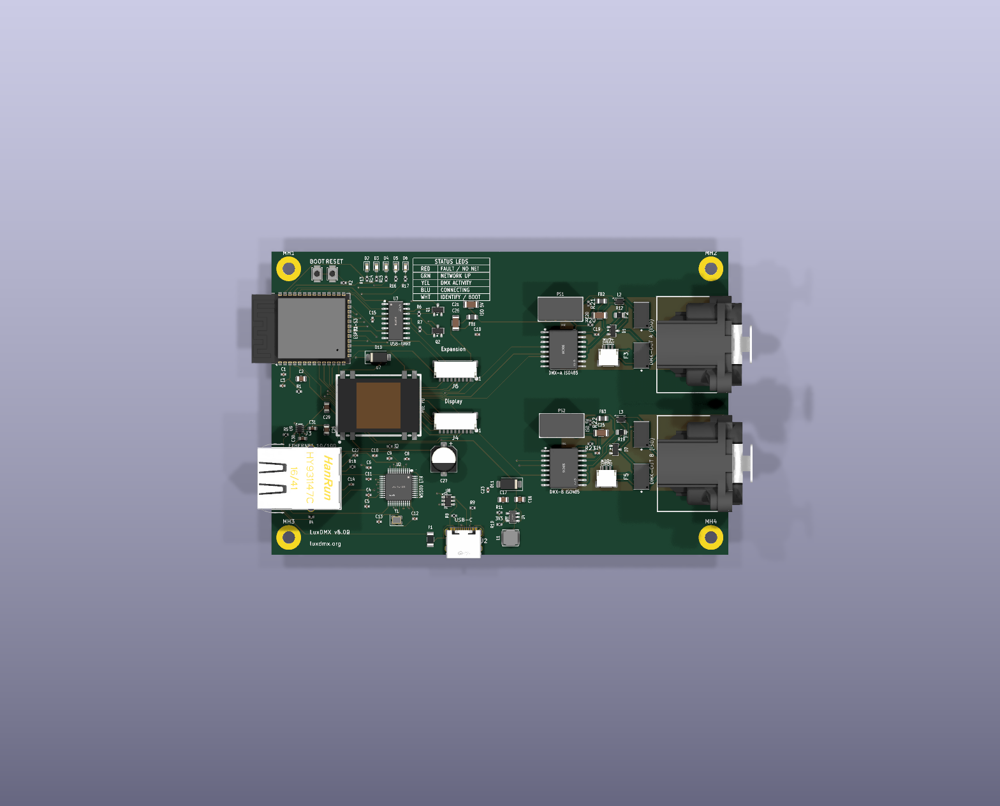
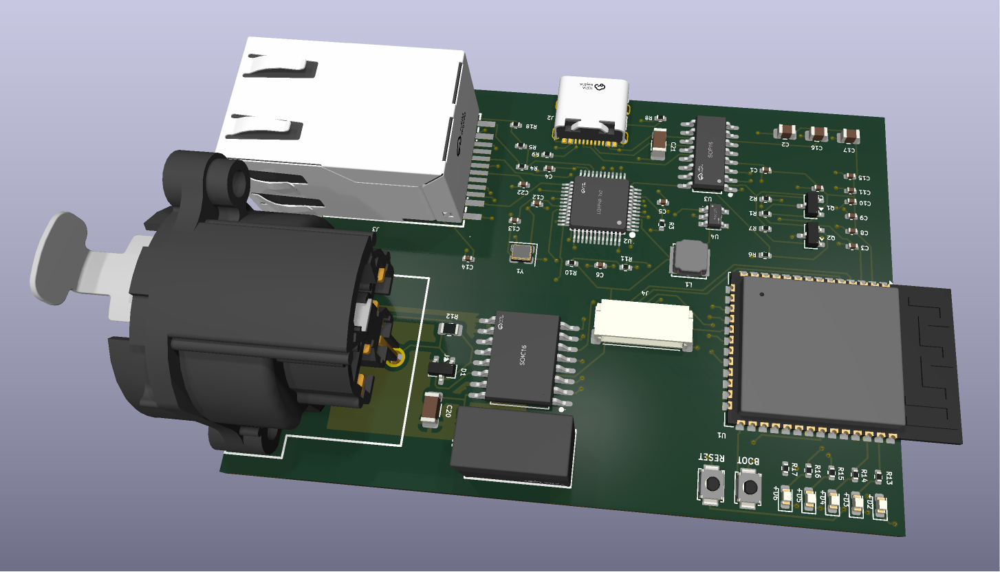

# LumiGate v3 — hardware

> [!WARNING]
> **Work in progress, not yet fully tested. Use at your own risk for now!**
> This board has **not yet been fabricated or verified in hardware** — the design is provided for experimentation only. The proven, supported path is the firmware on a plain ESP32 + an isolated RS-485 module (see the main README).

A compact, open-source **Art-Net / sACN → galvanically-isolated DMX512 gateway**, built around
an ESP32-S3 with **both** WiFi *and* wired Ethernet. Designed entirely as code (SKiDL netlist) and
routed by a fully-scripted, placement-driven pipeline — so the board regenerates itself from your
component placement, isolation barrier and all.



<p align="center">
  
  
</p>

---

## What problem does it solve?

Lighting consoles and media servers speak **Art-Net** or **sACN (E1.31)** over a network. Fixtures —
dimmers, moving heads, hazers, LED bars — speak **DMX512** over an isolated RS-485 bus. LumiGate sits
between them: it receives Art-Net/sACN over WiFi or Ethernet and emits a clean, **opto-isolated DMX512**
signal. It's the box that lets you drive a rack of conventional stage gear from QLab, a grandMA, or any
Art-Net source — without dragging a laptop and a USB-DMX dongle around backstage.

The whole device runs on a single ESP32-S3, fits on a board you can hold in your palm, and costs a few
dollars to fabricate at JLCPCB.

---

## Headline design decisions (the "why")

| Decision | Why |
|---|---|
| **ESP32-S3** as the MCU | Plenty of GPIO, fast dual-core, native USB, mature Arduino/IDF support, and cheap. The N8 variant (no PSRAM) **frees up GPIO33–37**, which we need for the LEDs + display. |
| **W5500 SPI Ethernet** (not the ESP's RMII) | The S3 has **no built-in Ethernet MAC** (unlike the original ESP32), so RMII/LAN8720 is physically impossible. The W5500 is a self-contained TCP/IP-offload Ethernet controller on SPI — the *only* practical wired-Ethernet path for the S3. Wired Ethernet matters: a packed venue's 2.4 GHz band is hostile, and a show can't drop frames. |
| **Galvanically-isolated DMX** | DMX runs long cables between gear sitting on different mains circuits with different ground potentials. Without isolation you get **ground loops** (noise, flicker) and, worse, **fault currents** that can destroy the gateway when something downstream shorts. Pro DMX gear is *always* isolated. We isolate both the data (ISO3086) and the power feeding it (B0505S DC-DC), so the DMX domain shares **no copper** with the logic side. |
| **USB-C** | Reversible, modern, and carries both **power and native flashing** — one cable to power and program. |
| **4-layer PCB** | A solid inner ground plane gives the W5500's Ethernet pairs a 100 Ω reference, tames EMI, and makes the dense routing actually fit. (More below.) |

---

## The components, in detail

### Brains & networking
- **U1 — ESP32-S3-WROOM-1-N8** *(LCSC C2913198)* — the MCU + 2.4 GHz WiFi radio. Runs the Art-Net/sACN
  receiver, the web UI, OTA updates, and the DMX engine. The PCB antenna hangs over the left board edge
  (no copper underneath it — intentional, for radiation efficiency).
- **U2 — WIZnet W5500** *(C32843)* + **Y1 — 25 MHz crystal** + **J3 — HR961160C RJ45 MagJack** *(C55683)* —
  a complete 10/100 wired-Ethernet subsystem on SPI. The magjack integrates the isolation magnetics and
  the link/activity LEDs. (Ethernet is isolated by the magjack's transformers; the W5500's current-mode
  TX center-tap is correctly biased to 3V3.)

### Isolated DMX output
- **U5 — TI ISO3086DWR** *(C183095)* — an **isolated RS-485 transceiver**. The DMX driver and the logic
  that controls it are separated by a silicon isolation barrier rated for kilovolts. Wired 2-wire
  (Y↔A, Z↔B bridged) for standard DMX512.
- **PS1 — B0505S-1W** *(C7465127)* — an **isolated 5 V→5 V DC-DC** module that powers the *secondary*
  side of U5. Because both the data path **and** its power are isolated, the DMX connector shares no
  ground with the rest of the board.
- **D1 — SM712 TVS** *(C404012)* + **R12 — 120 Ω termination** — surge protection clamped to the DMX-side
  ground, and the standard RS-485 line termination.
- **J1 — XLR-3** *(C309326)* — the DMX output connector, living entirely on the isolated domain.

### Power
- **U4 — SY8089 buck** *(C78988)* + **L1 — 2.2 µH** — steps the USB-C 5 V down to **3.3 V**. The feedback
  divider is **R10 = 45.3 kΩ / R11 = 10 kΩ → 3.318 V** (SPICE-verified). Powers everything on the logic side.

### Programming & USB
- **U3 — CH340C** *(C84681)* + **J2 — USB-C** *(C165948)* — USB-to-UART for flashing, plus the power inlet.
- **Q1/Q2 — MMBT3904** *(C20526)* — the classic **2-transistor auto-reset** circuit: the CH340's DTR/RTS
  toggle EN and IO0 so `esptool` can drop the chip into the bootloader automatically — no button-dance.

### User interface & features
- **D2–D6 — 5 status LEDs** (red/green/yellow/blue/white) wired straight to GPIOs (IO1/2/6/7/15): network
  state, DMX activity, source-conflict, identify — at-a-glance status without a screen.
- **SW1 (BOOT) / SW2 (RST)** — `B3U-1000P` tact switches *(C231329)*. BOOT doubles as the config-portal /
  factory-reset button in firmware; RST is a hard reset.
- **J4 — JST SH 1.0 mm 9-pin display header** — an **optional on-board OLED/TFT status panel** connector.
  Carries **both** I²C (SDA/SCL → for SSD1306/SH1106 mono OLEDs) **and** SPI (SCK/MOSI/CS/DC/RST → for
  SSD1351 colour OLED / ST7789 TFT) on free, non-strapping GPIOs. JST SH is tiny and uses widely-available
  pre-crimped cables. *(Optional — populate only if you want the panel.)*

---

## Feature summary

- 🎛 **Art-Net + sACN (E1.31)** input, configurable universe
- 🌐 **Dual connectivity** — WiFi (captive-portal setup) *and* wired Ethernet (W5500)
- ⚡ **Galvanically-isolated DMX512 output** (RDM-capable transceiver)
- 🖥 **Optional OLED/TFT status display** (I²C or SPI, via the JST header)
- 💡 **5 status LEDs** + BOOT/RST buttons
- 🔌 **USB-C** — single-cable power + native flashing, plus **OTA** updates
- 🟢 Open hardware, ~palm-sized, JLCPCB-assemblable for a few dollars

---

## The 4-layer board & the isolation barrier

**Stack-up:** 4-layer, JLCPCB's standard **JLC04161H-3313** (1.6 mm). The two inner layers are
**ground-filled signal layers** — not classic "power planes". That's deliberate: as signal layers the
autorouter will happily route ground (and fine-pitch escapes) to the inner copper, while the fill still
gives every trace a solid 0.21 mm-away reference. The result: clean ~100 Ω Ethernet pairs and good EMI.

**Isolation:** the DMX domain (`GNDISO`, `VISO`, `DMX_A`, `DMX_B`) is held **≥ 4 mm** from all other
copper by a net-based rule in [`lumigate.kicad_dru`](lumigate.kicad_dru). The two isolation parts whose
own pins are inherently close — **PS1** (B0505S, 2.5 mm pin pitch) and **U5** (ISO3086) — are
*courtyard-exempted* (their isolation is internal/rated), exactly as the USB-C connector's fine-pitch
pads are. The inner ground planes are **notched** away from the isolated region so no inner copper ever
crosses the barrier.

---

## Design-as-code & the routing pipeline

The board is **generated, not hand-drawn**. [`lumigate.py`](lumigate.py) is a [SKiDL](https://github.com/devbisme/skidl)
netlist — the single source of truth for every part and connection. From a placement, the rest is scripted
and **adapts to wherever you put the parts**:

```text
1. place / move parts in KiCad   →  save
2. python rebuild_iso.py         # regenerates inner GND planes + GNDISO pour + iso keepout
                                 #   from the LIVE part positions — no hardcoded coordinates
3. python escape_connectors.py   # escapes the few fine-pitch connector pins to LOCKED vias
4. python autoroute_fr2.py       # Freerouting 2.2.4 routes the whole board, keeping locked escapes
5. python cleanup_pads.py        # mounting posts → NPTH, widen tight THT annular rings
```

Run everything with the **KiCad 10 bundled Python** (it ships `pcbnew`). `autoroute_fr2.py` drives
**Freerouting 2.2.4**, which needs **Java 25+**; the jar and a portable JDK live in `tools/` (git-ignored).
Locked tracks survive every re-route (KiCad exports them as DSN `(type fix)`), so connector escapes only
get done once. Move a part, re-run — done.

---

## Fabricating it at JLCPCB

Everything you upload is already generated in this folder.

### 1 — Bare PCB
1. Go to [jlcpcb.com](https://jlcpcb.com) → **Add gerber file** → upload **`lumigate_gerbers.zip`**.
2. It auto-detects **4 layers**. Set: **Layers = 4**, Thickness **1.6 mm**, Impedance control =
   **JLC04161H-3313** stackup (the one this board is designed for). Surface finish your choice (ENIG
   recommended for the fine-pitch parts).

### 2 — Assembly (SMT)
3. Enable **PCB Assembly**, then upload:
   - **BOM** → `lumigate_BOM_jlcpcb.csv`
   - **CPL / pick-and-place** → `lumigate_CPL.csv`
4. In the BOM matching step, confirm each LCSC part (they're pre-filled). **J4** (the optional display
   header) has no LCSC assigned — either pick a JST SH 9-pin part there or mark it **Do Not Populate**.
5. **Review the placement preview** — the CPL is rotation/position-corrected by `gen_cpl.py`, so parts
   should sit correctly. The ESP32-S3's antenna intentionally overhangs the left edge.

### 3 — Through-hole parts
The XLR (J1), USB-C (J2), MagJack (J3) and B0505S (PS1) are through-hole. Either add JLCPCB's through-hole
assembly or hand-solder them — they're all large, easy joints.

### Cost ballpark
4-layer, this size, 5 pcs ≈ **a few dollars** for the bare boards; SMT assembly adds the parts + a setup
fee. A complete, assembled prototype lands well under typical hobby budgets.

---

## Files

| File | What |
|---|---|
| `lumigate.py` | **SKiDL source** — authoritative netlist (`python lumigate.py` → `lumigate.net`) |
| `lumigate.kicad_pcb` / `.kicad_pro` | the board + KiCad project |
| `lumigate.kicad_dru` | custom design rules — the 4 mm DMX isolation + connector exemptions |
| `rebuild_iso.py` · `escape_connectors.py` · `autoroute_fr2.py` · `cleanup_pads.py` | the routing pipeline |
| `route.py` · `autoroute.py` | older Freerouting-1.9 fallbacks (no Java 25 needed) |
| `gen_bom_from_board.py` → `lumigate_BOM_jlcpcb.csv` | JLCPCB assembly BOM |
| `gen_cpl.py` → `lumigate_CPL.csv` / `.xlsx` | JLCPCB pick-and-place (corrected) |
| `lumigate_gerbers.zip` | 4-layer gerbers + PTH/NPTH drill — the fab upload |
| `easyeda/` | LCSC/easyeda footprints + 3D models for the specific parts |
| `tools/` | Freerouting 2.2.4 jar + portable JDK 25 *(git-ignored — see Toolchain)* |
| `board-pcb-1.png` · `board3d-1.png` · `board3d-2.png` | layout + 3D renders |
| [`case/`](case/) | **3D-printable enclosure** (parametric OpenSCAD; openings + retention derived from this PCB) — see [`case/README.md`](case/README.md) |

## Enclosure

A fully parametric, code-defined 3D-printable housing lives in [`case/`](case/). It is
a two-part clamshell (base tray + deep cover) with a **flush snap-fit closure** (no
external screws). Connector openings (XLR/DMX round hole + flange screws, RJ45, USB-C),
front-wall LED windows and board retention (ledge + snap clamps + cover hold-down lip)
are all **extracted from this board** — re-run `case/extract_case_params.py` after a
layout change and re-export the STLs. Connector opening sizes/heights were **measured
at the wall plane** from the populated `kicad-cli` GLB (`case/measure_connectors.py`),
and `case/validate_fit.py` cross-checks the case against the live PCB (28 assertions,
incl. the board drop-in path). Closure is a **flush snap-fit** with rounded outer edges
(no external screws). The ESP32 antenna overhang is fully enclosed; outer ≈ 87 × 57 × 40 mm.
`case/lumigate_case_assembly.glb` opens the whole thing in any 3D viewer.
See [`case/README.md`](case/README.md).

## Status

**Electrically production-ready & validated:** 0 unconnected, 0 shorts, **0 isolation (4 mm) violations**,
SPICE-validated analog (buck 3.318 V, EN reset-RC 13.9 ms, auto-reset sequence, LED currents). A handful
of minor connector/edge DRC warnings remain (J3 magjack mask slivers, USB-C unused-pad clearance) — these
are inherent to the manufacturer footprints and are cleared in a short GUI pass or simply waived at the
JLCPCB upload step.

### Firmware support

Both board-specific firmware features are implemented and build-verified in `env:lumigate_v3`
(see [platformio.ini](../platformio.ini)) on **arduino-esp32 v3 / ESP-IDF 5.5**:

- [x] **W5500 SPI-Ethernet driver.** `ETH.begin(ETH_PHY_W5500, …)` registers the W5500 as an lwIP
  netif, so the existing AsyncWebServer / Art-Net / sACN / OTA stack runs over wired Ethernet
  unchanged — on **SCLK=IO12, MOSI=IO11, MISO=IO13, CS=IO10, INT=IO14, RST=IO9** (SPI3 host),
  selected by the `USE_ETH_SPI` build flag. This requires **arduino-esp32 v3** (v2.x has no
  `ETH_PHY_W5500`), which is why the whole firmware moved to the v3 framework via the
  [pioarduino](https://github.com/pioarduino/platform-espressif32) platform.
- [x] **5 discrete status LEDs.** A new `ledType=3` model drives all five LEDs simultaneously —
  <span>**R=IO1**</span> no network · **G=IO2** network up · **Y=IO6** DMX activity ·
  **B=IO7** source conflict · **W=IO15** identify. Pins are configurable in `/config`.

The RJ45 MagJack's link/act LEDs are driven by the W5500 itself — no firmware needed.

> **Build caveats** (both handled, but worth knowing for a clean checkout / CI):
> - **esp_dmx 4.1.0 on ESP-IDF 5.5** — needs a small fix (the removed `uart_periph_signal[].module`
>   field, plus the older UART2 guard). Applied automatically at build time by
>   [`extra_scripts.py`](../extra_scripts.py) — no manual step.
> - **pioarduino toolchain installer** — release `55.03.39`'s Xtensa toolchain archive trips
>   `idf_tools.py` (`do_strip_container_dirs`: *"expected 1 entry, got ['package.json', …]"*), which
>   leaves the compiler uninstalled. This is an installer bug, **not** a repo issue; it needs a
>   one-time host patch (ignore the stray `package.json`) or a different platform pin. **CI on this
>   pinned release needs the same handling.**

## Toolchain

- **KiCad 10** (bundled `python` + `kicad-cli`)
- **Java 25+** — [Temurin JDK 25](https://adoptium.net/temurin/releases/?version=25) (portable zip → `tools/`)
- **Freerouting 2.2.4** — [release jar](https://github.com/freerouting/freerouting/releases/tag/v2.2.4) → `tools/`
- **SKiDL** (`pip install skidl`) to regenerate the netlist
