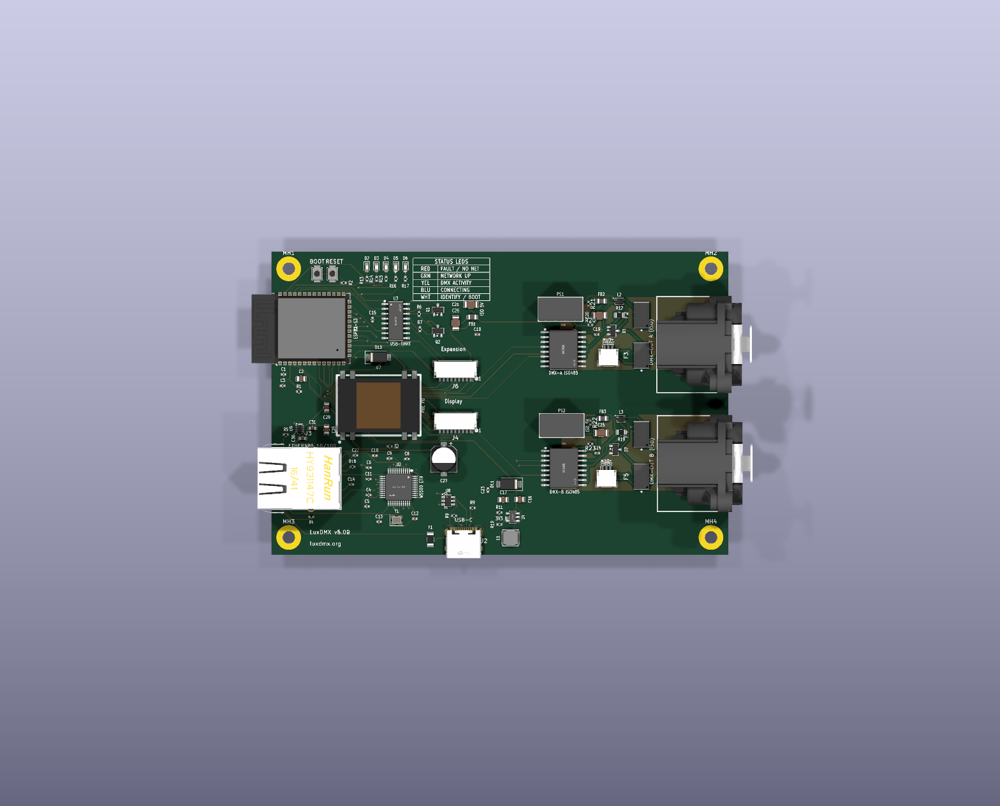
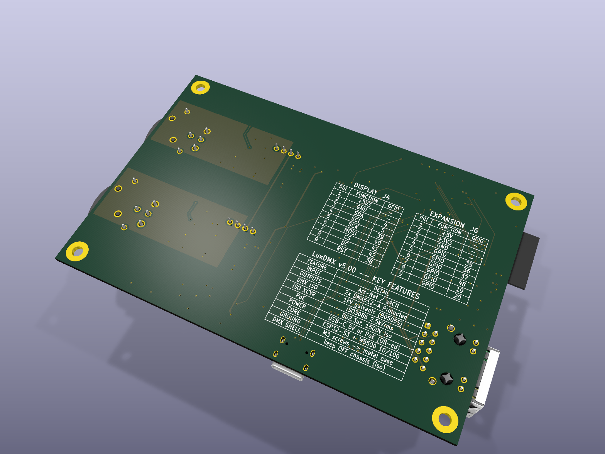

> [!NOTE]
> **v5.00 was built and works; this v5.2 spin is not built yet.** The board is on `master`,
> design-complete, and passes the full scripted validation (DRC, isolation, SPICE, Ethernet skew; see
> **VALIDATION.md**). The first physical article (**v5.00**) came up and works: rails, galvanic isolation,
> PoE standalone, both DMX universes bit-exact, RDM 64/64 on both lines. It did turn up two defects, and the
> fixes (native USB instead of the CH340 bridge, TPS2116 priority mode) plus a crystal package change are
> what make up **v5.2**. They are in the source now but have **not been on a physical board yet**, so the
> two of them are exactly what the next article has to prove. Treat this spin as a prototype: the
> firmware on a plain ESP32 + an isolated RS-485 module is still the longest-proven path (see the main
> README). The ruggedization pass (USB ESD, PTC fuse, +5V TVS, a TPS2116 priority power mux, DMX
> common-mode chokes, ferrite supply filters), plated GND mounting holes, wider power traces, and the
> DMX512-A "Protected" series-TBU front end are all in.

# LuxDMX v5.2 — hardware

A compact, open-source **Art-Net / sACN → galvanically-isolated DMX512 gateway**, built around
an ESP32-S3 with **both** WiFi *and* wired Ethernet. Designed entirely as code (SKiDL netlist) and
routed by a fully-scripted, placement-driven pipeline — so the board regenerates itself from your
component placement, isolation barrier and all.



<p align="center">
  
  
</p>

---

## What problem does it solve?

Lighting consoles and media servers speak **Art-Net** or **sACN (E1.31)** over a network. Fixtures —
dimmers, moving heads, hazers, LED bars — speak **DMX512** over an isolated RS-485 bus. LuxDMX sits
between them: it receives Art-Net/sACN over WiFi or Ethernet and emits a clean, **opto-isolated DMX512**
signal. It's the box that lets you drive a rack of conventional stage gear from QLab, a grandMA, or any
Art-Net source — without dragging a laptop and a USB-DMX dongle around backstage.

The whole device runs on a single ESP32-S3, fits on a board you can hold in your palm, and costs a few
dollars to fabricate at JLCPCB.

---

## Headline design decisions (the "why")

| Decision | Why |
|---|---|
| **ESP32-S3** as the MCU | Plenty of GPIO, fast dual-core, native USB, mature Arduino/IDF support, and cheap. The **N8R2** brings 8 MB flash + **2 MB PSRAM**, and because that PSRAM is **quad**, it leaves **GPIO35–37** free for the expansion header. Only the **octal**-PSRAM parts (R8 and up) wire GPIO33–37 to the memory and lose them. |
| **W5500 SPI Ethernet** (not the ESP's RMII) | The S3 has **no built-in Ethernet MAC** (unlike the original ESP32), so RMII/LAN8720 is physically impossible. The W5500 is a self-contained TCP/IP-offload Ethernet controller on SPI — the *only* practical wired-Ethernet path for the S3. Wired Ethernet matters: a packed venue's 2.4 GHz band is hostile, and a show can't drop frames. |
| **Galvanically-isolated DMX** | DMX runs long cables between gear sitting on different mains circuits with different ground potentials. Without isolation you get **ground loops** (noise, flicker) and, worse, **fault currents** that can destroy the gateway when something downstream shorts. Pro DMX gear is *always* isolated. We isolate both the data (ISO3086) and the power feeding it (B0505S DC-DC), so the DMX domain shares **no copper** with the logic side. |
| **USB-C** | Reversible, modern, and carries both **power and native flashing** — one cable to power and program. |
| **4-layer PCB** | A solid inner ground plane gives the W5500's Ethernet pairs a 100 Ω reference, tames EMI, and makes the dense routing actually fit. (More below.) |

---

## The components, in detail

### Brains & networking
- **U1 — ESP32-S3-WROOM-1-N8R2** *(LCSC C2913204; 8 MB flash + 2 MB quad PSRAM)* — the MCU + 2.4 GHz WiFi radio. Runs the Art-Net/sACN
  receiver, the web UI, OTA updates, and the DMX engine. The PCB antenna hangs over the left board edge
  (no copper underneath it — intentional, for radiation efficiency).
- **U2 — WIZnet W5500** *(C32843)* + **Y1 — 25 MHz crystal, 3225** *(C9006, CL = 12 pF, load caps C12/C13 = 18 pF C0G)* + **J3 — HY931147C PoE RJ45 MagJack** *(C91754)* —
  a complete 10/100 wired-Ethernet subsystem on SPI. The magjack integrates the isolation magnetics,
  the link/activity LEDs, **and an internal PoE rectifier** (Mode A + Mode B → a single rectified DC pair
  on pins 9/10 — see *Power*). (Ethernet is isolated by the magjack's transformers; the W5500's
  current-mode TX center-tap is biased to 3V3 on the chip-side tap, independent of the PoE extraction
  on the cable side.)

### Isolated DMX output — two independent universes
Each universe is a self-contained galvanic island; the two share no copper with each other or the logic side.
- **U5 / U6 — TI ISO3086DWR** *(C183095)* — the **isolated RS-485 transceivers** (one per universe). The DMX
  driver and the logic that controls it are separated by a silicon isolation barrier rated for kilovolts.
  Wired 2-wire (Y↔A, Z↔B bridged) for standard DMX512. Universe 1 on UART/port 1, universe 2 on port 2.
- **PS1 / PS2 — B0505S-1W** *(C7465127)* — the **isolated 5 V→5 V DC-DC** modules powering the *secondary*
  side of U5 / U6. Because both the data path **and** its power are isolated, each DMX connector shares no
  ground with anything else.
- **D1 / D7 — SM712 TVS** *(C404012)* + **R12 / R19 — 120 Ω termination** — per-universe surge protection
  clamped to that universe's isolated ground, and the standard RS-485 line termination.
- **F2–F5 — Bourns TBU-CA065-200-WH** *(C913221)* — a series **high-speed protector** on each DMX data line:
  the DMX512-A **"Protected"** (E1.11 Annex C) front end. It blocks a sustained fault (someone plugging mains,
  or up to ±42 V, into the XLR) in under a microsecond and self-recovers, so the SM712 only ever sees the
  sub-microsecond transient. Full breakdown in [`E1.11_COMPLIANCE.md`](E1.11_COMPLIANCE.md).
- **R20–R23 — 470 Ω fail-safe bias** — hold each idle DMX pair in the RS-485 fail-safe state (needed for RDM).
- **J1 / J5 — XLR-5** *(C368501)* — the two DMX output connectors (Neutrik NC5FAH), each living entirely on its isolated domain.
- Nets: universe 1 = `VISO`/`GNDISO`/`DMX_A`/`DMX_B`; universe 2 = `VISO2`/`GNDISO2`/`DMX2_A`/`DMX2_B`.

### Power — USB-C **or** PoE (PoE has priority)
- **PoE (802.3af):** the **J3** magjack rectifies PoE internally and outputs DC on **`VPOE+`/`VPOE-`** →
  **U7 — SDAPO DP9900M-5V** *(C5380106)*, an **isolated PD + DC-DC module** (36–57 V in, regulated 5 V out,
  1.5 kV isolation, class 0 ≈ 13 W — far more than this board's ~2–3 W). **D10 — SMAJ58A** *(C110521)* clamps
  surges on the rectified rail. The module's `-VDC` becomes board GND; its `+VDC` is the PoE 5 V source.
- **5 V source select:** **U9 — TPS2116** power mux feeds the board **`+5V`** rail from either the **PoE 5 V**
  (`+5V_POE`, on VIN1) or the **USB-C 5 V** (`+5V_USB`, through the F1 PTC, on VIN2), with no backfeed. It runs
  in **priority mode**: `MODE` is tied to VIN1, so **PoE wins whenever it is present** and the board falls back
  to USB only when PoE goes away. The **PR1 divider (R24 = 30 kΩ / R25 = 10 kΩ)** sets the VIN1 switchover
  threshold to **Vsw = 4.0 V** (VREF 1.0 V × (30 + 10) / 10). Vsw is deliberately high, because VOUT tracks VIN1
  down until the switch actually fires: at 4.0 V the `+5V` rail stays far above the ESP's ~2.8 V hang threshold
  while PoE collapses. The pass-FET drop is only ~30 mV (vs ~0.4 V for a Schottky), so `+5V` stays ≈ 4.9 V on
  USB and the B0505S / ISO3086 VCC2 rail clears its 4.5 V minimum across the whole USB range. Input caps
  **C30 / C31** (1 µF), bulk **C29** (22 µF).
  *(The v5 first article tied `MODE`/`PR1` to GND, which is the default "higher voltage wins" mode. With two
  near-equal 5 V sources that hunts, and a PoE→USB handover hung the board. Priority mode is that fix.)*
- **U4 — SY8089 buck** *(C78988)* + **L1 — 2.2 µH** — steps the muxed 5 V down to **3.3 V**. The feedback
  divider is **R10 = 45.3 kΩ / R11 = 10 kΩ → 3.318 V** (SPICE-verified). Powers everything on the logic side.

### Programming & USB — native, no bridge chip
- **J2 — USB-C** *(C165948)* — the USB data + power inlet, wired **straight to the ESP32-S3's native USB**
  (`USB_DM` → IO19, `USB_DP` → IO20). The S3's **USB-Serial-JTAG** peripheral sits in ROM, so a bare USB-C cable
  gives you the flashing port, the serial console **and** JTAG debug with **no bridge chip**. `esptool` resets
  the chip over USB by itself, so there is no auto-reset circuit either.
- **R8 / R9** (5.1 kΩ) — the USB-C **CC pulldowns (Rd)** that tell a host to supply 5 V.
  **U8 — USBLC6-2SC6** *(C7519)* — ESD clamp across the data pair. **F1** — self-healing PTC on VBUS.
- **UART0 is free** and broken out on **J6 pins 7/8** (`S3_TX` / `S3_RX`), since nothing spends it on a bridge.
  *(The v5 first article carried a **CH340C (U3)** plus a **Q1/Q2** 2-transistor auto-reset. Its collectors were
  swapped, so EN and IO0 sat on the wrong transistors: flashing needed the manual BOOT-button dance, and a tool
  asserting DTR or RTS alone could yank EN or IO0. Rather than re-wire it, the bridge and the reset circuit are
  gone entirely, 6 parts fewer and 2 fewer part numbers to source.)*

### User interface & features
- **D2–D6 — 5 status LEDs** (red/green/yellow/blue/white) wired straight to GPIOs (IO1/2/6/7/15): network
  state, DMX activity, source-conflict, identify — at-a-glance status without a screen.
- **SW1 (BOOT) / SW2 (RST)** — `B3U-1000P` tact switches *(C231329)*. BOOT doubles as the config-portal /
  factory-reset button in firmware; RST is a hard reset.
- **J4 — JST SH 1.0 mm 9-pin display header** — an **optional on-board OLED/TFT status panel** connector.
  Carries **both** I²C (SDA/SCL → for SSD1306/SH1106 mono OLEDs) **and** SPI (SCK/MOSI/CS/DC/RST → for
  SSD1351 colour OLED / ST7789 TFT) on free, non-strapping GPIOs. JST SH is tiny and uses widely-available
  pre-crimped cables. *(Optional — populate only if you want the panel.)*
- **J6 — JST SH 1.0 mm 9-pin expansion header** — six free, non-strapping GPIOs for I²C / SPI / UART / PWM /
  ADC add-ons, plus 3V3 and two grounds. Any pin muxes to whatever the S3's GPIO matrix supports, so the port
  can run an I²C bus and a SPI bus at once. *(Optional.)*

#### Both headers share one power layout — on purpose

J4 and J6 are the **same connector**, so a cable fits either one. Their power pins are therefore
**identical**, and a validator (`scripts/validate_header_parity.py`, hard gate) keeps them that way:

| pin | J4 — display | J6 — expansion |
|---|---|---|
| **1** | **+3V3** | **+3V3** |
| **2** | **GND** | **GND** |
| 3 | SDA (IO4) | IO35 |
| 4 | SCL (IO5) | IO36 |
| 5 | SCK (IO39) | IO37 |
| 6 | MOSI (IO40) | IO48 |
| 7 | CS (IO41) | TX0 (IO43) |
| 8 | DC (IO42) | RX0 (IO44) |
| 9 | RST (IO38) | GND |

Plug a cable into the wrong header and nothing dies: the module still gets correct power, and only 3V3 CMOS
signals land in the wrong places. A mis-plugged display sees GND on its RST and just sits quietly in reset.

> **⚠ v5.2 and earlier did NOT have this.** Back then J6 was `1=+5V 2=+3V3 3=GND`, so a display plugged into
> J6 got **+5V on its VCC and +3V3 on its GND** and died instantly. If you have a v5.2 board, see
> [docs/display.md → Header safety](../docs/display.md#header-safety-j4-vs-j6) before plugging anything in.
> **+5V is no longer on J6** as of v6.0 — feed 5 V loads from your own supply.

---

## Feature summary

- 🎛 **Art-Net + sACN (E1.31)** input, configurable universe(s)
- 🎚 **Two independent, separately-isolated DMX512 universes** — two XLR-5 outputs, each on its own
  isolation island (RDM-capable transceivers); drive two universes from one box
- 🌐 **Dual connectivity** — WiFi (captive-portal setup) *and* wired Ethernet (W5500)
- ⚡ **Power-over-Ethernet (802.3af)** — single Cat-5 cable for data *and* power; **or** USB-C — the TPS2116
  mux gives **PoE priority** and falls back to USB, so either works and you can hot-swap between them
- 🖥 **Optional OLED/TFT status display** (I²C or SPI, via the JST header)
- 💡 **5 status LEDs** + BOOT/RST buttons
- 🔌 **USB-C** — single-cable power + native flashing, plus **OTA** updates
- 🟢 Open hardware, JLCPCB-assemblable

---

## The 4-layer board & the isolation barrier

**Stack-up:** 4-layer, JLCPCB **JLC04161H-7628** (1.6 mm; L1–L2 prepreg 0.2104 mm, Er 4.05 — the dielectric the Ethernet pairs are impedance-tuned to). The two inner layers are
**ground-filled signal layers** — not classic "power planes". That's deliberate: as signal layers the
autorouter will happily route ground (and fine-pitch escapes) to the inner copper, while the fill still
gives every trace a solid 0.21 mm-away reference. The result: clean ~100 Ω Ethernet pairs and good EMI.

**Isolation:** three barriers, all enforced by net-based rules in [`luxdmx.kicad_dru`](luxdmx.kicad_dru):
- **DMX universe 1** (`GNDISO`/`VISO`/`DMX_A`/`DMX_B`) and **universe 2** (`GNDISO2`/`VISO2`/`DMX2_A`/`DMX2_B`)
  are each held **≥ 4 mm** from all other copper. Their barrier parts — **PS1/PS2** (B0505S, 2.5 mm pitch)
  and **U5/U6** (ISO3086) — are *courtyard-exempted* (isolation internal/rated), like the USB-C pads.
- **PoE-hot** (`VPOE+`/`VPOE-`, the magjack→module rectified rail) is held **≥ 2.5 mm** from everything else;
  the 1.5 kV PD isolation itself is internal to **U7** (DP9900M) and **J3** (magjack), so their courtyards
  are exempt. The board's only galvanic tie to the PoE line is through the module + magjack magnetics.

The inner ground planes are **carved** (keepout rule-areas) around every isolated/hot region so no inner
copper crosses any barrier — [`scripts/rebuild_iso.py`](scripts/rebuild_iso.py) regenerates this for all three domains from
the live part positions.

---

## Design-as-code & the routing pipeline

> [!CAUTION]
> **Do not run the pipeline steps casually on the committed board.** Everything in the list below that
> touches the `.kicad_pcb` (`sync_board`, `rebuild_iso`, `escape_connectors`, `autoroute_fr2`,
> `cleanup_pads`, `normalize_silk`, `widen_eth`, `tighten_poe_void`, `finish_partial`, `route_tbu`,
> `build_v3`) **rewrites** it. The board as committed carries **hand-made placement and silk edits** that
> those steps would wipe out. They are the tools for a *deliberate re-route from a new placement*, not a
> "refresh". Re-running them by reflex is how you lose a day.
>
> **Always safe** (read the board, never write it): `scripts/luxdmx.py` (writes only the netlist),
> `gen_schematic` / `gen_bom_from_board` / `gen_cpl` / `gen_gerbers` (write only outputs), and every
> `validate_*` gate.

The board is **generated, not hand-drawn**. [`scripts/luxdmx.py`](scripts/luxdmx.py) is a [SKiDL](https://github.com/devbisme/skidl)
netlist — the single source of truth for every part and connection. From a placement, the rest is scripted
and **adapts to wherever you put the parts**:

```text
0. python scripts/luxdmx.py            # SKiDL → luxdmx.net (only after editing the netlist source)
0b python scripts/sync_board.py          # add NEW/changed parts to the board, KEEPING existing placement,
                                 #   gridded in the enlarged area (scripts/build_v3.py = full from-scratch grid)
1. place / move parts in KiCad   →  save
2. python scripts/rebuild_iso.py         # regenerates inner GND planes + the two GNDISO pours + the three
                                 #   isolation keepouts (DMX1/DMX2/PoE) from LIVE positions — no hardcoded coords
3. python scripts/escape_connectors.py   # escapes the few fine-pitch connector pins to LOCKED vias
4. python scripts/autoroute_fr2.py       # Freerouting 2.2.4 routes the whole board, keeping locked escapes
5. python scripts/cleanup_pads.py        # mounting posts → NPTH, widen tight THT annular rings
```

Run everything with the **KiCad 10 bundled Python** (it ships `pcbnew`). `scripts/autoroute_fr2.py` drives
**Freerouting 2.2.4**, which needs **Java 25+**; the jar and a portable JDK live in `tools/` (git-ignored).
Locked tracks survive every re-route (KiCad exports them as DSN `(type fix)`), so connector escapes only
get done once. Move a part, re-run — done.

> **Adding the dual-universe + PoE parts to an existing board:** [`scripts/sync_board.py`](scripts/sync_board.py) is the
> incremental path — it keeps every already-placed footprint where it is, refreshes pad nets (e.g. J2's VBUS
> moving onto `+5V_USB`), swaps J3 to the PoE magjack, and drops the brand-new parts (U6/PS2/J5/D7, U7/D10,
> the new caps) in a grid on the right of the enlarged outline for you to place. Then run the normal
> 2→5 pipeline. `scripts/build_v3.py` remains the full from-scratch grid build if you'd rather re-place everything.

---

## Fabricating it at JLCPCB

Everything you upload is already generated in this folder.

### 1 — Bare PCB
1. Go to [jlcpcb.com](https://jlcpcb.com) → **Add gerber file** → upload **`luxdmx_gerbers.zip`**.
2. It auto-detects **4 layers**. Set: **Layers = 4**, Thickness **1.6 mm**, Impedance control =
   **JLC04161H-7628** stackup (the one the board's Ethernet impedance is designed for). Surface finish your choice (ENIG
   recommended for the fine-pitch parts).

### 2 — Assembly (SMT)
3. Enable **PCB Assembly**, then upload:
   - **BOM** → `luxdmx_BOM_jlcpcb.csv`
   - **CPL / pick-and-place** → `luxdmx_CPL.csv`
4. In the BOM matching step, confirm each LCSC part (they're all pre-filled, every line in JLC stock). The
   optional display / expansion headers **J4 / J6** (JST SH 9-pin, C160408) are in the BOM — mark them **Do
   Not Populate** if you don't want the on-board panel.
5. **Review the placement preview** — the CPL is rotation/position-corrected by `scripts/gen_cpl.py`, so parts
   should sit correctly. The ESP32-S3's antenna intentionally overhangs the left edge.

### 3 — Through-hole parts
The XLRs (J1, J5), USB-C (J2), PoE MagJack (J3), B0505S modules (PS1, PS2) and the DP9900M PoE module (U7)
are through-hole / module parts. Either add JLCPCB's through-hole assembly or hand-solder them — they're all
large, easy joints.

### Cost ballpark
4-layer, this size, 5 pcs ≈ **a few dollars** for the bare boards; SMT assembly adds the parts + a setup
fee. A complete, assembled prototype lands well under typical hobby budgets.

---

## Files

| File | What |
|---|---|
| `scripts/luxdmx.py` | **SKiDL source** — authoritative netlist (`python scripts/luxdmx.py` → `luxdmx.net`) |
| `luxdmx.kicad_pcb` / `.kicad_pro` | the board + KiCad project |
| `luxdmx.kicad_dru` | custom design rules — the two 4 mm DMX isolations, the 2.5 mm PoE isolation + exemptions |
| `scripts/sync_board.py` | **incremental** netlist→board: keep existing placement, grid the new parts (dual-universe + PoE) |
| `scripts/build_v3.py` | full from-scratch grid build (clears + re-drops every part) |
| `scripts/rebuild_iso.py` · `scripts/escape_connectors.py` · `scripts/autoroute_fr2.py` · `scripts/cleanup_pads.py` | the routing pipeline |
| `route.py` · `autoroute.py` | older Freerouting-1.9 fallbacks (no Java 25 needed) |
| `scripts/gen_bom_from_board.py` → `luxdmx_BOM_jlcpcb.csv` | JLCPCB assembly BOM |
| `scripts/gen_cpl.py` → `luxdmx_CPL.csv` / `.xlsx` | JLCPCB pick-and-place (corrected) |
| `luxdmx_gerbers.zip` | 4-layer gerbers + PTH/NPTH drill — the fab upload |
| `easyeda/` | LCSC/easyeda footprints + 3D models for the specific parts |
| `tools/` | Freerouting 2.2.4 jar + portable JDK 25 *(git-ignored — see Toolchain)* |
| `board-pcb-1.png` · `board3d-1.png` · `board3d-2.png` | layout + 3D renders |

## Status

> **Design-complete, fully validated, and the first spin is being fabricated.** Not yet bench-tested on
> real hardware, so treat this first spin as a prototype.

The v5 board (two isolated DMX universes + PoE, **119 × 79 mm**, 4 corner plated M3 mounting holes) is
**fully routed** (0 unrouted, 0 unconnected) and passes the scripted validation:

- **DRC:** 3 clearance waivers only (2× W5500 0.5 mm-pitch escapes at 0.174 mm, USB-C CC2 at 0.160 mm),
  all above JLCPCB's 0.0889 mm floor. 0 silk-over-pad, 0 courtyard overlaps, 0 dangling vias.
- **Isolation:** 0 violations of the two 4 mm DMX and the 2.5 mm PoE creepage rules (`luxdmx.kicad_dru`).
- **Power:** SPICE-verified. The TPS2116 priority mux holds +5V at ~4.9 V on USB, so the B0505S / ISO3086
  VCC2 stays above its 4.5 V minimum across the whole USB range (>= 4.6 V even at a sagging 4.7 V VBUS);
  buck output 3.318 V.
- **Ethernet:** diff-pair skew TX 0.35 mm / RX 2.14 mm, well inside the 100BASE-TX margin.

See **VALIDATION.md** for the full matrix. Open items to confirm before fab (none electrical-blocking):

- **PoE magjack pinout.** J3's pin/function map (1=RD- 2=RD+ 3=RX-CT 4=TX-CT 5=TD- 6=TD+ 9=V+ 10=V-,
  LEDs 11-14) comes from the **HY931147C datasheet** via the pulled EasyEDA model. Confirm the **TX/RX
  pair assignment** and **LED anode/cathode** against the datasheet before fab; a swapped TX/RX pair means
  no Ethernet link (W5500 has no auto-MDIX). HY931147C omits Bob-Smith termination; HanRun **HR861153C**
  (C19724782) is a pin-different drop-in that includes it for extra signal-integrity margin.
- **DP9900M LCSC SKU** — confirm the 5 V / 1.8 A part, its on-module 802.3af detection/classification and
  pin order. Min load is 100 mA; the running board draws well over that, so no bleeder is needed.
- Cosmetic silk (37 warnings, all mask-protected) to clear in a short GUI pass or waive at upload.

### Firmware support

Both board-specific firmware features ship in the released **`esp32s3dev`** build (the v5 has no
dedicated env — it is an ESP32-S3 + W5500 with a fixed pin map; flash that build and pick the
**LuxDMX v5** board template in `/config`). See [platformio.ini](../platformio.ini). Built on
**arduino-esp32 v3 / ESP-IDF 5.5**:

- [x] **W5500 SPI-Ethernet driver.** `ETH.begin(ETH_PHY_W5500, …)` registers the W5500 as an lwIP
  netif, so the existing AsyncWebServer / Art-Net / sACN / OTA stack runs over wired Ethernet
  unchanged — on **SCLK=IO12, MOSI=IO11, MISO=IO13, CS=IO10, INT=IO14, RST=IO9** (SPI3 host),
  selected by the `USE_ETH_SPI` build flag. This requires **arduino-esp32 v3** (v2.x has no
  `ETH_PHY_W5500`), which is why the whole firmware moved to the v3 framework via the
  [pioarduino](https://github.com/pioarduino/platform-espressif32) platform.
- [x] **5 discrete status LEDs.** A new `ledType=3` model drives all five LEDs simultaneously —
  <span>**R=IO1**</span> no network · **G=IO2** network up · **Y=IO6** DMX activity ·
  **B=IO7** source conflict · **W=IO15** identify. Pins are configurable in `/config`.
- [x] **Two DMX outputs** (firmware already supports `MAX_OUTPUTS = 2`). Universe 1 is on **UART/port 1**
  (TX=IO17, RX=IO18, DE=IO8); the new **universe 2** is on **UART/port 2** — wire to **TX=IO16, RX=IO21,
  DE/RTS=IO47**. Output #2 ships **disabled by default**; enable it and set those pins in `/config`
  (out#2: `port=2 tx=16 rx=21 rts=47`). All pins are runtime-configurable, so no firmware rebuild is needed.

The RJ45 MagJack's link/act LEDs are driven by the W5500 itself — no firmware needed.

> **Build caveats** (both handled, but worth knowing for a clean checkout / CI):
> - **esp_dmx 4.1.0 on ESP-IDF 5.5** — needs a small fix (the removed `uart_periph_signal[].module`
>   field, plus the older UART2 guard). Applied automatically at build time by
>   [`extra_scripts.py`](../extra_scripts.py) — no manual step.
> - **pioarduino toolchain installer** — release `55.03.39`'s Xtensa toolchain archive trips
>   `idf_tools.py` (`do_strip_container_dirs`: *"expected 1 entry, got ['package.json', …]"*), which
>   leaves the compiler uninstalled. This is an installer bug, **not** a repo issue; it needs a
>   one-time host patch (ignore the stray `package.json`) or a different platform pin. **CI on this
>   pinned release needs the same handling.**

## Toolchain

- **KiCad 10** (bundled `python` + `kicad-cli`)
- **Java 25+** — [Temurin JDK 25](https://adoptium.net/temurin/releases/?version=25) (portable zip → `tools/`)
- **Freerouting 2.2.4** — [release jar](https://github.com/freerouting/freerouting/releases/tag/v2.2.4) → `tools/`
- **SKiDL** (`pip install skidl`) to regenerate the netlist
