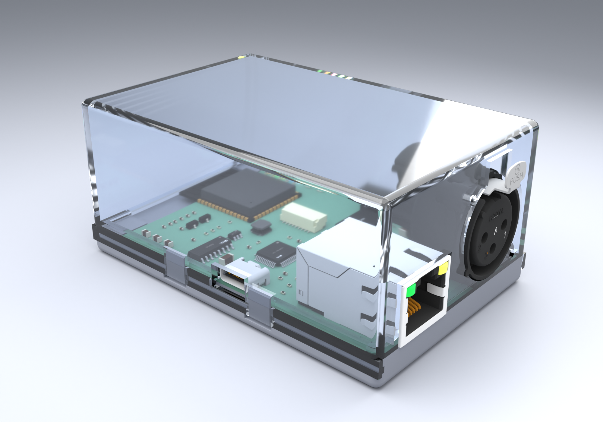
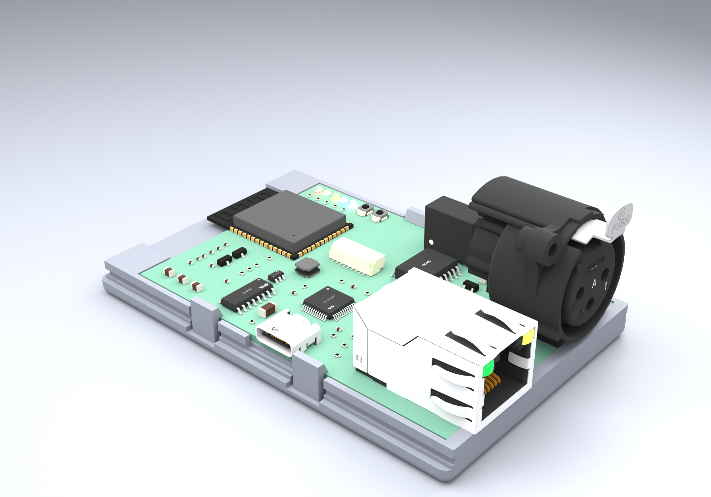
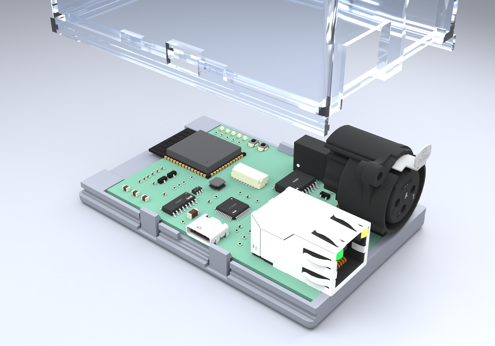
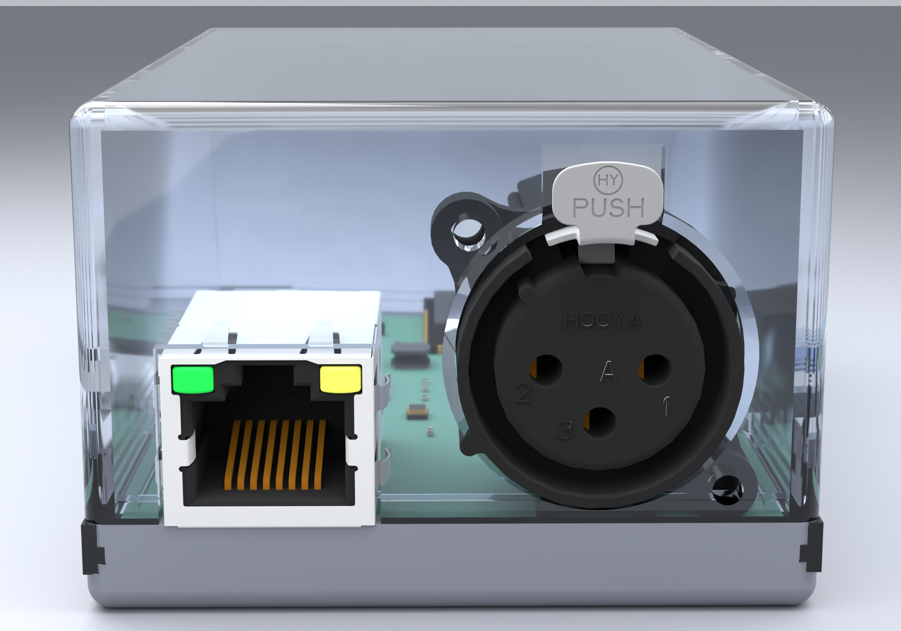
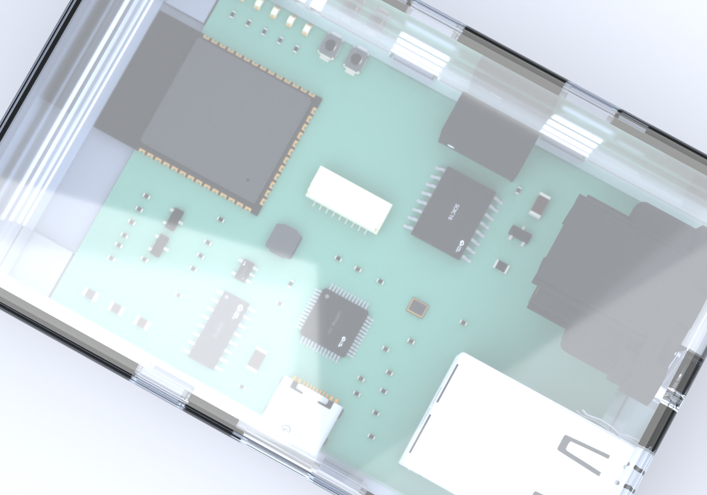

# LumiGate v3 - 3D-printable enclosure

A fully parametric, code-defined enclosure for the LumiGate v3 board, generated
with **OpenSCAD**. Every connector cut-out, LED window and the board retention
are derived from the live KiCad PCB, so the case tracks the board: re-run one
script after a board change and re-export.



| Board in the base tray | Exploded |
|---|---|
|  |  |

| Connector wall (XLR + Ethernet) | Top-down through the cover |
|---|---|
|  |  |

> **Inspect it in 3D:** open [`lumigate_case_assembly.glb`](lumigate_case_assembly.glb)
> (board + base + translucent cover, correctly aligned) in any glTF viewer -
> Windows **3D Viewer**, Blender, or drag it onto <https://gltf-viewer.donmccurdy.com>.
>
> **Handedness:** KiCad's Y axis points *down* while OpenSCAD's points *up*, so the raw
> case geometry came out as a **mirror** of the real board. The output applies one
> compensating reflection (`vflip()` in the .scad) so the printed parts match the
> populated board (USB-C on the same edge as in KiCad, XLR "PUSH" text the right way
> round). See the build protocol, §10.

---

## What it is

* **Two-part clamshell**, split at the PCB top plane:
  * **base** - shallow tray that holds and locates the PCB,
  * **cover** - deep shell carrying every wall opening and the LED windows.
* **Flush, straight exterior** - closed by a **snap-fit overlapping skirt**, no
  external screws or ears, with **all outer edges/corners rounded** (r≈2 mm).
* **Outer size** ≈ **87 × 57 × 40 mm**.
* Designed around the **real** populated-board 3D model: connector opening sizes and
  heights were **measured at the wall plane** from the KiCad GLB
  (`measure_connectors.py`), not guessed - the XLR barrel centre sits 13.0 mm above
  the PCB and the XLR tops out at 28.3 mm, so the cavity is 30 mm tall.

### Openings (positions auto-placed from the PCB, sizes measured from the GLB)

| Connector | Wall | Opening |
|---|---|---|
| XLR-3 / DMX out (J1) | right (+X) | **Ø22 mm** barrel hole (datasheet, centred +13.0 mm) + a **PUSH-latch slot** above it + **2 diagonal flange screw holes** (datasheet 19.8 mm pattern). Clean round hole - the assembly relief is off (`xlr_relief=false`); tilt the cover over the barrel. |
| Ethernet RJ45 (J3) | right (+X) | **17 × 13.8 mm** (snug to the real face) |
| USB-C (J2) | back (+Y) | 9.9 × 4.5 mm |
| 5 status LEDs (D2-D6) | **front side wall** | five **1.1 × 3.4 mm** windows + a walled **light-guide cap** over each LED that isolates its colour and channels it to its own window (`led_caps`) |
| BOOT / RST buttons | — | intentionally **not** reachable (covered) |

The **ESP32-S3 antenna end overhangs the PCB by ~6.3 mm**; the cavity is extended
on the left so the module is fully enclosed.

> **XLR note:** this specific connector (CONN-TH_XLR-328P) mounts via 2 *rear PCB
> posts* and has **no front flange screws**; its own mounting holes fall inside the
> barrel hole + assembly relief. The wall screw holes therefore use a symmetric
> flanking pattern (`xlr_screw_off`) - adjust to your panel/connector if you fit a
> different XLR.

### Drop-in assembly path

The board drops **straight down** into the base (cover off). Connectors that overhang
a board edge are checked so nothing collides on the way in: the USB-C underside sits
only +0.05 mm above the board top, so the **base back-wall top is lowered 2.5 mm**
under it (`usbc_drop`); the **left block is recessed 1.5 mm** under the ESP32 module
(`esp_drop`); and no snap clamp sits in the USB-C column. `validate_fit.py` asserts
all of this.

### Board retention (firm, but insertable)

* a **perimeter ledge** sets the board height (Z bottom stop);
* **4 cantilever snap clamps** in free edge zones snap over the board and hold it
  during assembly (before the cover);
* the cover's **perimeter hold-down lip** presses the board edge onto the ledge with
  a slight interference (`lip_press`) for a firm, rattle-free fit;
* the board drops **straight down** into the base (cover removed); all connectors
  sit above the parting plane so nothing has to thread through a closed hole.

### Closure (snap-fit, flush)

* The cover's **overlapping skirt** wraps a recessed rim on the base on 3 sides; an
  inner **snap rib** clicks into a groove in the base rim. Outer faces are flush -
  no protruding screws. Press the cover on until it clicks.
* To open: insert a thin tool into the **front pry-notches** at the seam and lever
  the cover up.
* The right wall (full of connectors) is a plain butt joint - the 3-sided snap holds
  the rigid cover down on that side too.

---

## Files

| File | Purpose |
|---|---|
| `lumigate_case.scad` | the parametric model (all tunables at the top) |
| `board_params.scad` | **auto-generated** board geometry (connector/LED positions) |
| `extract_case_params.py` | regenerate `board_params.scad` from `../lumigate.kicad_pcb` |
| `measure_connectors.py` | measure real connector sizes/heights at the wall plane (Blender, from the GLB) |
| `validate_fit.py` | cross-check the case against the live PCB (28 assertions) |
| `render_blender.py` | photoreal Cycles renders + the combined inspection GLB |
| `build.sh` | one-shot: extract → validate → export STLs → previews |
| `lumigate_case_base.stl` / `lumigate_case_cover.stl` | **printable parts** |
| `lumigate_case_assembly.glb` | **board + case combined** - open in any 3D viewer to inspect fit |
| `lumigate_case_assembly_red.glb` | same, housing **red + mostly opaque** (`render_blender.py -- redglb`) - easiest for judging cut-out fit |
| `lumigate_board.glb` | populated board 3D model (from `kicad-cli`, for renders) |

## Regenerate / export

```bash
# everything (needs python + openscad on PATH or $OPENSCAD)
./build.sh

# or by hand:
python extract_case_params.py          # PCB -> board_params.scad
python validate_fit.py                 # 28 fit checks (exit 0 = pass)
openscad -D 'part="base"'  -o lumigate_case_base.stl  lumigate_case.scad
openscad -D 'part="cover"' -o lumigate_case_cover.stl lumigate_case.scad
```

`part` can also be `assembly`, `exploded`, `base`, `cover`, `board` for preview.

### Documentation renders (optional, needs Blender + kicad-cli)

```bash
# 1. export the populated board with the board min-corner as origin
kicad-cli pcb export glb --subst-models --force \
  --user-origin=98.356145x90.065536mm -o case/lumigate_board.glb lumigate.kicad_pcb
# 2. path-trace the doc views into case/render/
blender -b -P render_blender.py
```

---

## Printing

* **Material:** PETG recommended (tougher snap clamps + better heat tolerance for a
  device that may sit in a warm rack); PLA works for indoor use.
* **Layer height:** 0.2 mm. **Walls:** 3 perimeters. **Infill:** 20-30 %.
* **Orientation:**
  * **base** - print as modelled (floor down), no supports.
  * **cover** - print **open-side-down** (ceiling on top). The XLR/RJ45 wall openings
    are bridges; enable supports for the right wall only, or rely on the chamfered
    XLR lead-in. The LED windows bridge fine.
* **No case screws** - the cover snaps on. Print the snap skirt in **PETG** for a
  durable, repeatable click; a first fit test is recommended to tune `snap_d`.
* **XLR flange:** 2 × M2 (or the connector's own screws) into the wall screw holes.

## Tuning

All knobs live at the top of `lumigate_case.scad`. The most useful:

| Parameter | Meaning |
|---|---|
| `clr` | board-to-pocket clearance (loosen if the board is tight) |
| `standoff_h` | gap under the board (room for THT pin tails; currently 3.5 mm) |
| `xlr_axis_z`, `xlr_hole_dia` | XLR barrel hole centre + diameter |
| `xlr_screw_off`, `xlr_screw_z`, `xlr_screw_dia` | XLR flange screws (offset/height/dia) |
| `xlr_push`, `xlr_push_w`, `xlr_push_top` | XLR PUSH-latch slot |
| `rj45_open_w`, `rj45_z0`, `rj45_h` | RJ45 opening size/height |
| `led_win_w`, `led_win_h`, `led_win_z0` | front-wall LED windows |
| `led_caps`, `led_div_t`, `led_cap_h`, `led_cap_back` | per-LED light-guide caps (set `led_caps=false` for plain windows) |
| `cav_h` | cavity height above the board (must exceed the tallest part) |
| `edge_r` | rounding of all outer edges/corners |
| `usbc_drop`, `esp_drop` | drop-in clearance under the overhanging USB-C / ESP32 |
| `lap_h`, `lap_t`, `snap_d`, `snap_z` | snap-fit closure (overlap + click depth) |
| `lip_press` | how hard the cover lip clamps the board (interference) |
| `clamp_catch`, `clamp_t` | snap-clamp grip / stiffness |
| `board_snaps` | set `false` to omit the board snap clamps |

After changing connector **positions** on the PCB, re-run `extract_case_params.py`.
After changing connector **heights** (different parts), re-run `measure_connectors.py`
and update the height block in `lumigate_case.scad`.
